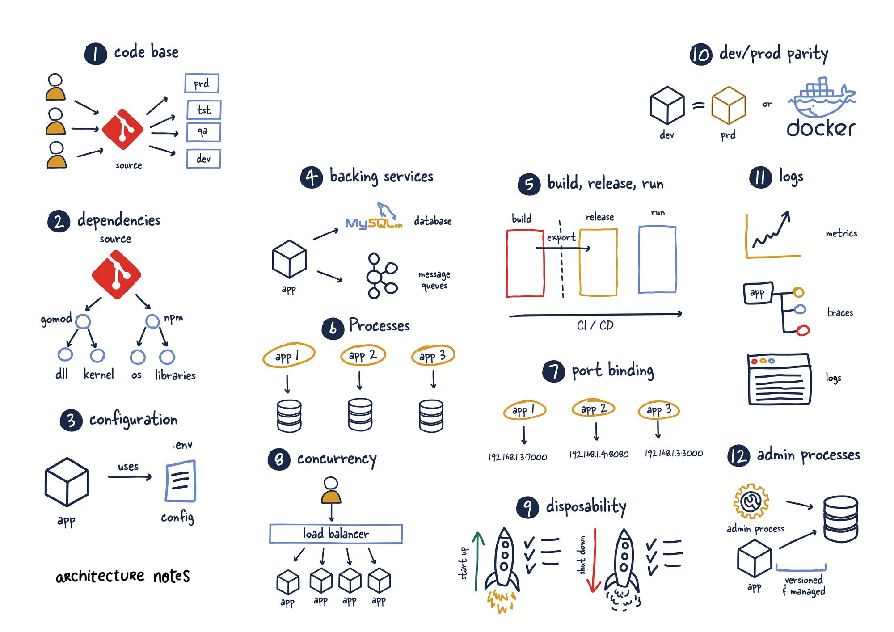

## Índice

- [Slides de teoría para DevOps - Cultura DevOps](#slides-de-teoría-para-devops-cultura-devops)
- [Slides de teoría para DevOps - CI/CD](#slides-de-teoría-para-devops-cicd)
- [Slides de teoría para 'DevOps' - Branching patterns](#slides-de-teoría-para-devops-branching-patterns)
- [Prácticas de Sistemas de Control de Versiones](#prácticas-de-sistemas-de-control-de-versiones)
- [Prácticas de Terraform para Infraestructura Docker](#prácticas-de-terraform-para-infraestructura-docker)
- [Prácticas de Jenkins](#prácticas-de-jenkins)
- [Gitflow](#gitflow)

<!-- Source: cultura.md -->
# CULTURA DEVOPS


**¿Qué es DevOps?**


## ¿Qué es DevOps?


- **Dev**elopment + **Op**erations

  - Concepción ⇾ Desarrollo ⇾ Entrega
  - Desarrolladores: innovación y agilidad
  - Sysadmin: garantías y estabilidad

- **Agilidad**: _Lean manufacturing_

  - La agilidad llega a los procesos de negocio
  - Falta incluir a los sysadmin

El foco principal de DevOps es maximizar el flujo de creación de software: desde la concepción, hasta el desarrollo y la entrega.

- Los desarrolladores quieren innovar y entregar más rápido
- Los sysadmin quieren garantizar la estabilidad de los sistemas en producción y la calidad de los cambios

La cultura DevOps  es un conjunto de prácticas que reducen las barreras entre desarrolladores y operaciones.

- Los desarrolladores están acostumbrados a procesos ágiles, como Scrum y XP, para reducir los tiempos de entrega.
- Pero los procesos ágiles ya involucran también a los equipos de negocio
- Sin embargo, falta incluir a los de operaciones en estos equipos

La cultura DevOps es como una extensión de los procesos ágiles a todos los equipos, tanto desarrolladores como negocios y operaciones.

- DevOps está muy influenciado por la tendencia al lean manufacturing


| 📙 | Definiciones |
----:|:----
**Desarrollo** |  Se refiere al proceso de crear software, donde los desarrolladores escriben y actualizan el código fuente de las aplicaciones.
**Operaciones** | Se centran en la gestión y mantenimiento de los sistemas y la infraestructura en los que se ejecuta el software. Incluye tareas como la configuración, el monitoreo y la resolución de problemas.


## ¿Qué es DevOps?

<iframe width="1000" height="684" src="https://www.youtube-nocookie.com/embed/Xrgk023l4lI" title="DevOps In 5 Minutes | What Is DevOps?| DevOps Explained | DevOps Tutorial For Beginners |Simplilearn" frameborder="0" allow="accelerometer; autoplay; clipboard-write; encrypted-media; gyroscope; picture-in-picture; web-share" allowfullscreen></iframe>


## Elementos clave para la comunicación y colaboración

- **Deployment** (despliegues) frecuentes
- Pruebas automáticas
  - TDD: _Test-driven design_
  - BDD: _Behavior-driven design_
- CI/CD: _Continuous **Integration** + Continuous **Delivery**_
- Feedback de usuarios
- Monitorización de apps/infraestructura

Para facilitar la colaboración y comunicación entre Devs y Ops hacen falta varias cosas:

- Despliegues frecuentes
- Automatizar las pruebas unitarias y de integración, con TDD y BDD.
- Prácticas de integración y entrega continuas (CI/CD)
- Recopilar el feedback de los usuarios tras cada nuevo despliegue.
- Monitorizar las aplicaciones y la infraestructura.


**¿Qué significan **integración**, **entrega** (_delivery_) y **despliegue** (_deployment_)?**


_On your marks, get set,... go!_


>[!NOTE]
>El despliegue es el "¡ya!" en "preparados, listos... ¡ya!"

La integración podría ser el "¡a sus puestos!"


| 📙 | Definiciones |
----:|:----
 ****Integración****  continua   | Llevar automáticamente los cambios de **varios desarrolladores** en el código de una aplicación a un **repositorio** compartido para cada nueva versión.
 ****Entrega****  continua  | Trasladar la aplicación de software desde el entorno de desarrollo y dejarla **disponible para** su despliegue en un entorno de producción. Incluye pruebas, empaquetado y preparación de cada _**release**_.
****Despliegue****    | Instalación de una aplicación en su entorno de **producción**, ya sea en un servidor, un conjunto de servidores, un contenedor, la nube, etc.


**¿DevOps es un nuevo rol?**


>[!NOTE]
>Muchos piensan que DevOps es un rol de TI, un híbrido entre desarrollador y administrador de sistemas.

El problema de este pensamiento es que las empresas tienden a crear un nuevo silo llamado DevOps e intentan llenarlo con superadministradores que saben mágicamente de ambas cosas.


## ¿Qué no es DevOps?

- Es una **cultura**, no un rol

  - Si fuese un rol $\Rightarrow$ nuevo núcleo aislado (silo)
  - No son superhumanos

- Responsabilidades: **desarrollo** (código), **calidad** (pruebas) y **operaciones** (sysadmin)
  - No exclusivas
  - Proceso colaborativo

Más que un rol, DevOps es un cambio cultural en la forma en que se crea software.

El objetivo no es contratar personas superhumanas, sino construir sistemas con una nueva mentalidad:

- Las necesidades de desarrollo, calidad y operaciones están interrelacionadas. Los desarrolladores ya no serán responsables solo del código, los probadores solo de las pruebas y los sysadmins solo de la operación del sistema.

- Deben formar parte de un proceso colaborativo

DevOps está más centrado en la colaboración entre equipos que en la creación de un nuevo rol.

DevOps es más una cultura, indica qué conseguir. Pero habitualmente se suele mezclar con el cómo y se convierte en un rol.


**¿Por qué DevOps?**


## Motivación

- Sistemas frágiles

  $\Leftarrow$ Falta de comunicación y herramientas

  $\Rightarrow$ Despliegues complejos y propensos a errores

- Deuda técnica

- Arquitectura poco sólida
- Requisitos no funcionales poco solventes

>[!NOTE]
>El movimiento DevOps surgió de la frustración de muchos profesionales que trabajaban con sistemas frágiles.

Frágiles porque el software se construye en silos donde los diferentes equipos no se comunican entre sí de una forma eficaz.

Debido a esta falta de comunicación, los desarrolladores no suelen disponer de entornos y herramientas para ser productivos, y el equipo de operaciones suele recibir el software como un "ahí llevas eso" (para que le des soporte).

Los despliegues son complejos y propensos a errores.

Los sistemas, cargados de deuda técnica, originan un trabajo no planificado.

Los desarrolladores se ven obligados a tomar atajos, que suelen dar lugar a una arquitectura poco sólida y un retraso en los requisitos no funcionales, como la seguridad y la mantenibilidad.


| 📙 | Definiciones |
----:|:----
 **Deuda técnica   | Decisiones tomadas durante el desarrollo de un software que, en el corto plazo, permiten un desarrollo más rápido o una solución temporal, pero que crean problemas de NFR a largo plazo
 <emph>Requisitos No Funcionales (NFR) | Aspectos que no están relacionados directamente con la funcionalidad de un sistema software, sino con características no directamente vinculados a sus funciones específicas (rendimiento, usabilidad, confiabilidad, seguridad, eficiencia, etc.)
 <emph>Arquitectura software | Estructura y diseño organizativo de un sistema de software, sobre cómo sus <emph>componentes** interactúan entre sí y cómo se organizan para lograr sus objetivos de manera efectiva. Proporciona un marco conceptual para abordar aspectos de los NFR.


## Cultura DevOps


[Definición de Donovan Brown](https://www.donovanbrown.com/post/what-is-devops)

> DevOps es la unión de personas, procesos y productos para una entrega continua de valor a los usuarios finales

- Procesos con Agilidad
- Personas en Colaboración
- Productos con Herramientas

>[!NOTE]
>¿Cuál es el proceso? Muy similar a los procesos ágiles, incluyendo los elementos clave descritos antes: CI/CD, monitorización, etc.

¿Qué hacen las personas? Colaborar, comunicarse y compartir responsabilidades.

¿Cómo se crea el producto? Usando herramientas que automaticen todos los elementos del proceso y faciliten la colaboración y la comunicación.


## CI/CD: Continous Integration / Continuous Delivery


- Continuous integration (CI)
- Continuous delivery (CD)
- Continuous deployment

Cada proceso tiene su propio **pipeline**


### Pipeline de CI


>[!NOTE]
>CI es la práctica de construir y probar las aplicaciones en cada nueva versión.


### Pipeline de CD


>[!NOTE]
>CD añade pruebas automáticas y despliegue automático al proceso de CI.

Gracias a CD, el software entregado debe funcionar siempre.

Todos los cambios que se incorporan en un build pueden formar parte de un candidato a release.

Antiguamente, los cambios pequeños solían tener que esperar a que se completaran otros muchos antes de ser empaquetados en una release. Siguiendo ese modelo, se suponía que el software era incorrecto hasta que era validado por profesionales de QA. Todas las pruebas se realizaban después del desarrollo, la responsabilidad de la calidad recaía exclusivamente en el equipo de QA.


### Continuous Deployment


>[!NOTE]
>El despliegue continuo es la práctica de desplegar automáticamente el software en producción después de cada cambio.

La entrega es manual, el despliegue es automático.


| 📙 | Definiciones |
----:|:----
**Build**   | acción de compilar y ensamblar el código fuente de una aplicación en un formato ejecutable o en un conjunto de artefactos que se pueden utilizar en un entorno de ejecución específico
**Pipeline**   | un conjunto automatizado y secuencial de procesos que permiten la ejecución de tareas específicas. Analogía de una línea de montaje de la industria de fabricación
**Staging** | entorno de prueba que replica el entorno de producción para realizar pruebas finales (con usuarios) antes del despliegue


| 📙 | Definiciones |
----:|:----
**Artefacto** | resultado del _build_. Pueden ser binarios ejecutables, bibliotecas, paquetes de instalación, etc., necesarios para ejecutar la aplicación
**Release** | una versión específica y completa de una aplicación o software que se considera lista para ser distribuida y utilizada por los usuarios finales
**Release Candidate (RC)** | _release_ con el potencial de convertirse en la versión final o lanzamiento si no se encuentran problemas significativos durante las pruebas


## Prácticas DevOps

1. Automatizar la infrastructura: **IaC**
2. Automatizar los despliegues: **Provisioning**
3. Medir, monitorizar y experimentar: **Feature flags**


### 1. Automatizar la infrastructura

- **IaC: _Infrastructure as Code_**

  - Automatizar: MV/contenedores
  - Imágenes _estándar_ (v.g. NGINX + MariaDB + Ruby)
  - Entorno de destino

- Provisioning
- Feature flags

>[!NOTE]
>IaC es el proceso de escribir el código de las etapas de aprovisionamiento y configuración de los componentes de la infraestructura, lo que ayuda a automatizar su implementación de manera repetible y consistente.

La forma de permitir el self-service provisioning es crear un conjunto estándar de imágenes de máquinas que se puedan solicitar bajo demanda. Estas imágenes representan máquinas estándar con todos los controles de seguridad, políticas y paquetes de software estándar instalados.

Por ejemplo, un desarrollador que necesira un servidor web con Ruby puede seleccionar, de entre un conjunto estándar de imágenes de máquinas, un servidor de aplicaciones NGINX, un servidor de base de datos MySQL, etc.

El desarrollador no tiene que configurar ninguno de estos entornos. En su lugar, solo tiene que solicitar una imagen y un entorno de destino. El entorno se aprovisiona automáticamente y el desarrollador puede empezar a trabajar.


#### IaC por configuración

##### Contenerización e inmutabilidad

**Máquinas virtuales** (mutables) versus **Contenedores** (inmutables)

##### Ejemplo con Docker

Dockerfile:

```dockerfile
FROM ubuntu
RUN apt-get update
RUN apt-get install -y nginx
ENTRYPOINT ["/usr/sbin/nginx","-g","daemon off;"]
EXPOSE 80
```

>[!NOTE]
>Contenerización = desplegar aplicaciones en contenedores en lugar de desplegarlas en VM.

Es importante que la IaC sea inmutable, es decir, que no se pueda modificar una vez creada. Si se necesita un cambio, se crea una nueva versión de la imagen. A diferencia de las VMs, los contenedores son inmutables, es decir, la configuración de un contenedor no puede modificarse durante su ejecución.

v.g.: Dockerfile para especificar la imagen (sistema operativo) base, middleware adicional y configuración de red y puertos. Solo contiene los ficheros y binarios necesarios para la aplicación.

Esto puede funcionar en una IaaS. Pero también en una PaaS, donde los desarrolladores pueden realizar la misma funcionalidad de autoservicio utilizando la interfaz de usuario de la PaaS.


#### IaC con tipos declarativos

- Terraform / OpenTofu
- Vagrant
- Ansible
- Azure ARM template
- Azure Bicep
- PowerShell DSC
- Puppet
- Chef
- Etc.

>[!NOTE]
>Hay lenguajes declarativos en los que es suficiente escribir el estado del sistema o la infraestructura deseada en forma de configuración y propiedades.

Este es el caso, por ejemplo, de Terraform y Vagrant de HashiCorp, Ansible, Azure ARM template, Azure Bicep, PowerShell DSC, Puppet y Chef.


**Ejemplo usando terraform** para definir un servicio de AWS con un contenedor de Docker que sirve una página web en un cluster de ECS (_Elastic Container Service_)

```hcl
provider "aws" {
  region = "West Europe" # Cambia esto según tu región de AWS
}

resource "aws_ecs_cluster" "example_cluster" {
  name = "example-cluster"
}

resource "aws_ecs_task_definition" "example_task" {
  family                   = "example-task"
  network_mode             = "bridge"
  requires_compatibilities = ["EC2"]
  ...
```


```hcl
  ...
  container_definitions = <<EOF
[
  {
    "name": "example-container",
    "image": "nginx:latest",
    "portMappings": [
      {
        "containerPort": 80,
        "hostPort": 80
      }
    ]
  }
]
EOF
}
...
```


```hcl
...
resource "aws_ecs_service" "example_service" {
  name            = "example-service"
  cluster         = aws_ecs_cluster.example_cluster.id
  task_definition = aws_ecs_task_definition.example_task.arn
  launch_type     = "EC2"
  desired_count   = 1

  network_configuration {
    # Coloca las ID de tus subredes aquí
    subnets         = ["subnet-xxxxxxxxxxxxxx", "subnet-yyyyyyyyyyyyyy"]
    # Coloca la ID de tu grupo de seguridad aquí
    security_groups = ["sg-xxxxxxxxxxxxxxxxx"]
  }
}
```


### 2. Automatizar los despliegues

- IaC: _Infrastructure as Code_

- **Provisioning**

  - Despliegues manuales engorrosos
  - No repetibles. Hay que automatizar

- Feature flags

>[!NOTE]
>En los viejos tiempos, los despliegues eran procesos manuales engorrosos que solían depender de personas específicas que conocían los pasos necesarios para desplegar un build.

El proceso no era repetible debido a la intervención manual requerida y los despliegues eran ejercicios temidos que ocurrían tarde por la noche o temprano por la mañana.

La automatización de los despliegues tiene como objetivo resolver todos estos problemas.


#### Provisioning (aprovisionamiento)

##### Opciones

- PaaS
- Recursos serverless
- Red

##### Herramientas

- terraform
- Azure ARM template, Azure CLI, Azure PowerShell
- AWS Cloud training
- Google Cloud Deployment Manager
- Etc.

>[!NOTE]
>Aprovisionamiento = creación de los recursos que forman la infraestructura.

Puede aprovisionarse un PaaS o un tipo de recurso serverless, como una app web, una Azure function o un Event Hub. Pero también puede aprovisionarse la parte de red que se gestiona, como VNet, subnets, tablas de encaminamiento o un cortafuegos de Azure.

Para las VM, solo se crea o actualiza el recurso cloud de la VM, pero no su contenido, que hay que aprovisionar.

Diversas herramientas de aprovisionamiento


#### Buenas prácticas de IaC & provisioning

Análogas al desarrollo de software:

- Automatizar todo en el código, nada manual
- Someter a SCM (_Source Control Manager_) para versionar, rastrear, fusionar y restaurar
- Guardar el código de IaC junto al de la aplicación (mismo repo)
- Código de la IaC debe ser **idempotente**
- Integrar con CI/CD

IaC requiere de prácticas análogas a la del desarrollo software:

- Todo debe estar automatizado en el código: hay que codificar y automatizar todos los pasos de aprovisionamiento y no dejar fuera pasos manuales que distorsionen la automatización de la infraestructura.

- Al igual que el código de las aplicaciones, el código de la IaC debe estar sometido a un SCM para poder versionarlo, rastrearlo, fusionarlo y restaurarlo. Mejorar visibilidad del código entre Devs y Ops.

- El código de la IaC debe guardarse junto al código de la aplicación, si es posible en el mismo repositorio. Así se asegura una mejor organización del trabajo entre desarrolladores y operaciones, que compartirán el mismo espacio de trabajo.

- Los scripts deben tener en cuenta el estado de la infraestructura cuando se ejecutan y no generar un error si el recurso que se va a crear ya existe, o si un recurso que se va a eliminar ya se ha eliminado. Los lenguajes declarativos, como Terraform, asumen este aspecto de la idempotencia de forma nativa.

Al igual que los procesos de CI/CD, la IaC es clave en la cultura DevOps. La IaC solo puede ser eficaz con herramientas adecuadas.

Para las pruebas locales de infraestructura, algunas herramientas como Vagrant pueden simular un entorno local.


### 3. Medir, monitorizar y experimentar

- IaC: _Infrastructure as Code_

- Provisioning

- **Feature flags**

  - A/B testing
  - Distintas versiones, geografías, periodos de tiempo, navegadores, dispositivos, etc.
  - Experimentos en producción

Ejemplo: supongamos que un product manager tiene la teoría de que el proceso de registro es demasiado complejo para algunos usuarios y quiere probar un nuevo formulario más sencillo. La nueva página de registro se puede querer configurar para que se muestre cada vez que se solicite, de modo que el equipo pueda comparar las métricas de los usuarios de la nueva página con las de los usuarios de la página antigua. La cultura DevOps fomenta este tipo de experimentación fail fast.

Las feature flags permiten configurar características que se pueden activar o desactivar, o que solo estén disponibles para un determinado grupo de usuarios.

Aprovechando las feature flags, podemos ejecutar experimentos como A/B testing para recopilar información y aprender sobre el sistema y sus usuarios.

- Mediante feature flags y configuraciones, se puede configurar que la página de registro se muestre de un modo que el equipo pueda comparar las métricas de los usuarios de la nueva página con las de los usuarios de la página antigua.

- Otra opción sería probar una característica en determinadas geografías, periodos de tiempo, navegadores o dispositivos.

- Las FF también se pueden utilizar para probar características en producción con una carga de trabajo real. La característica se puede habilitar para un grupo de prueba o como un lanzamiento beta para una ubicación seleccionada. Después se puede supervisar de cerca y desactivarla una vez que se haya recopilado suficiente información o si se hay problemas.


| 📙 | Definiciones |
----:|:----
**IaC** | práctica en la que la infraestructura de sistemas, redes y otros recursos tecnológicos se gestiona y **aprovisiona** utilizando código y archivos de configuración en lugar de realizar configuraciones manuales o a través de interfaces gráficas
**Provisioning** |  proceso de preparar y configurar de manera automática los recursos de infraestructura necesarios para ejecutar una aplicación o servicio
**Feature flags** |  técnica de desarrollo de software que permite habilitar o deshabilitar características específicas de una aplicación durante o después del despliegue




## Metodología 12-Factor App

- Guia para apps SaaS modernas: portables, escalables, mantenibles.
- Define principios para codebase, configuración, dependencias y procesos.
- https://12factor.net/


### 12 factores para apps SaaS modernas

<div class="cols">
<div>

1. **Codebase**: una base de codigo por app, versionada.
2. **Dependencies**: declarar y aislar dependencias explícitamente.
3. **Config**: configuración fuera del codigo, via variables de entorno.
4. **Backing services**: tratar servicios externos como recursos adjuntos.
5. **Build, release, run**: separar etapas de build y ejecución.
6. **Processes**: ejecutar como procesos stateless, sin compartir estado.

</div>
<div>

7. **Port binding**: exponer servicios por un puerto propio.
8. **Concurrency**: escalar por procesos, no por hilos internos.
9. **Disposability**: inicio rápido y apagado limpio.
10. **Dev/prod parity**: entornos dev y prod lo más parecidos posible.
11. **Logs**: logs como flujo de eventos, no archivos locales.
12. **Admin processes**: tareas admin como procesos puntuales.

</div>
</div>


## Metodología <br> 12-Factor App

Las herramientas de DevOps y CI/CD (Docker, K8s, etc.) no son solo utilidades aisladas, sino piezas necesarias para cumplir un estándar de arquitectura moderna (SaaS) robusta y escalable.

*   **Factor I (Codebase)**: **Git** y **GitHub/GitLab** como la base del flujo de trabajo y el control de versiones.
*   **Factor III (Config)**: Herramientas como **Ansible** y **Terraform** permiten tratar la IaC y gestionar configuraciones declarativas, alineándose con el mandato de separar la configuración del código.
*   **Factor V (Build, Release, Run)**: Herramientas como **Jenkins**, **CircleCI** y **GitHub Actions** automatizan la separación estricta entre las etapas de construcción, lanzamiento y ejecución que exige el Factor V.
*   **Factor VIII (Concurrency)**: **Kubernetes** como la herramienta para gestionar "pods" y escalar automáticamente, lo cual responde al Factor VIII (Concurrencia mediante el modelo de procesos).
*   **Factor IX (Disposability)**: La capacidad de Kubernetes para recuperar contenedores cuando "las cosas van mal" o realizar "rolling updates" soporta el principio de Desechabilidad (Disposability) de los procesos.
*   **Factor X (Dev/prod parity)**: **Docker** como la solución para "empaquetar aplicaciones y dependencias en una unidad estandarizada", eliminando el problema de "funciona en mi máquina". Esto es la realización directa del Factor X (Paridad entre desarrollo y producción).
*   **Factor XI (Logs)**: El stack **ELK** (Elasticsearch, Logstash, Kibana) y **Prometheus** pueden transformar el "caos de los logs" en datos visualizables y centralizados, cumpliendo con el principio de tratar los logs como flujos de eventos (*event streams*) en lugar de archivos estáticos.
<!-- Source: cicd.md -->
# INTEGRACIÓN Y ENTREGA CONTINUAS


## Integración Continua


**_I've never lost a game,_**
**_I just ran out of time._**

**&emsp; Michael Jordan**

>[!NOTE]
>CI sigue el principio de que si algo cuesta mucho esfuerzo, se debe hacer más a menudo para que sea menos doloroso.


| 📙 | Conceptos básicos |
----:|:----
**Control de versiones** | git, cvs, subversion, mercurial, etc.
**Repo** | `uca-gii/construccion` alojado en github
**Mainline** | estado actual del repositorio
**Working copy** | copia local del repositorio
**Check out** | clonar el repositorio en local

¡Cuidado! A diferencia de otros SCV antiguos, hacer `checkout` en git es cambiar de rama o restaurar los ficheros de un _working tree_.


**¿Cómo funciona CI en la práctica?**


## Ejemplo de CI a escala

Desarrollo de una nueva característica o _feature_...

### Check-out

Hacer **check-out** de una **working copy** en un **repositorio**

```bash
$ git clone https://github.com/sistemas-sw/construccion
Clonando en 'construccion'...
remote: Enumerating objects: 688, done.
remote: Counting objects: 100% (104/104), done.
remote: Compressing objects: 100% (74/74), done.
remote: Total 688 (delta 45), reused 84 (delta 29), pack-reused 584
Recibiendo objetos: 100% (688/688), 39.75 MiB | 22.49 MiB/s, listo.
Resolviendo deltas: 100% (296/296), listo.
```


Cambiarse al repo con la _working copy_ **local**

```bash
$ tree -d construccion
construccion/
├── docs
├── marp
└── slides
    ├── devops
    │   ├── docker
    │   │   ├── docs
    │   │   └── img
    │   ├── img
    │   ├── jenkins
    │   │   ├── entregable
    │   │   └── img
    │   ├── scv
    │   │   └── img
    │   └── terraform
    │       └── img
    ├── implementacion
    │   └── img
    └── marp
$ cd construccion
```


### Entorno de construcción

Preparar el entorno de construcción:

```bash
$ cd marp
$ npm install --save @marp-team/marp-core

added 304 packages, and audited 305 packages in 3s

34 packages are looking for funding
  run `npm fund` for details

found 0 vulnerabilities
```


### Construcción (_build_)

Construir en local (debería automatizarse):

```bash
$ cd ..
$ mkdir ./html/img
$ cp -R slides/devops/img/ ./html/img/
$ marp --allow-local-files --config-file ./marp/marp-engine.js \
    --html slides/devops/cultura.md \
    -o ./html/cultura.html
[  INFO ] Converting 1 markdown...
[  INFO ] slides/devops/cultura.md => html/cultura.html
$ open ./html/cultura.html
```


Ignorar el _build_ (carpeta `html/`) al sincronizar el repo:

```bash
$ cat .gitignore
...
# Ignorar la carpeta html/
html/*.html
html/img/*.png
html/img/*.gif
**/html
...
```


### Desarrollo y pruebas

A partir de ahora:

- Modificar _source code_ (ficheros `.md`) para hacer una tarea.
- Hacer tests de que el cambio funciona.
- `git add`, `git commit` y `git push` para subir los cambios al repositorio.

Con git:

- El _index_ guarda una instantánea del contenido del _working tree_.
- Hacer _commit_ es grabar los cambios en el repositorio (local).
- Hacer _push_: es subir al repo global


### Colaboración con otros

Si alguien modifica algo...

```bash
$ git pull
remote: Enumerating objects: 20, done.
remote: Counting objects: 100% (20/20), done.
remote: Compressing objects: 100% (6/6), done.
remote: Total 15 (delta 9), reused 15 (delta 9), pack-reused 0
Desempaquetando objetos: 100% (15/15), 3.03 KiB | 344.00 KiB/s, listo.
Desde https://github.com/sistemas-sw/construccion
   23141b5..7cc4304  master     -> origin/master
Actualizando 23141b5..7cc4304
Fast-forward
 slides/devops/cicd.md    | 194 ++++++++++++++++++------------------------------
 slides/devops/cultura.md | 184 ++++++++++++++++++-------------------------
 2 files changed, 118 insertions(+), 260 deletions(-)
```


### Intregración

Aún no hemos acabado... Hay que hacer un build (manual o automático) en un servidor de integración común (v.g. Jenkins, Github Actions).

- Si hay un conflicto entre dos desarrolladores, se suele detectar cuando el segundo hace un build sobre su copia de trabajo. Hay que arreglarlo lo antes posible.
- El repo debe quedar en todo momento con un software estable, funcional y con pocos errores.
- No hay que alejarse mucho de esa base estable pues llevaría mucho tiempo integrarse con ella.

Martin Fowler: [Building a feature with CI](https://martinfowler.com/articles/continuousIntegration.html#BuildingAFeatureWithContinuousIntegration)


## Beneficios de CI

Abordar problemas del desarrollo:

- Software complejo
- Cambios inesperados e incompatibles
- Desarrollo en equipo

Ventajas:

- Retroalimentación rápida
- Lotes pequeños
- Calidad y productividad

Un sistema software es algo muy complejo. Un cambio aparentemente sencillo en un fichero puede tener efectos no deseados en el sistema. Cuando muchos desarrolladores trabajan en un grupo de sistemas relacionados, coordinar los cambios es difícil, porque los cambios de diferentes desarrolladores pueden ser incompatibles.

Las prácticas de integración continua (CI) sirven para abordar estos problemas.

- CI propone crear ciclos de retroalimentación rápidos para garantizar que los desarrolladores trabajen en lotes pequeños.
- CI permite a los equipos producir software de calidad, reducir el coste de desarrollo y mantenimiento, y aumentar la productividad.


## Prácticas de CI

- Un solo repositorio de código fuente
- Automatizar la construcción (build)
- Hacer el build self-testing
- Todos deben hacer commit al trunk todos los días
- Cada commit a la _mainline_ debe originar un build en un servidor de integración
- Arreglar inmediatamente los builds fallidos
- Mantener rápidos los build
- Etc.

Martin Fowler: [Practices of CI](https://martinfowler.com/articles/continuousIntegration.html#PracticesOfContinuousIntegration)


### Un solo repositorio


- SCM, CVS, configuration management,...
  - Todo en el **monorepo**...
  - ...menos los productos del build
- Instalar SO, [IDE, SGBD] y... checkout!
- Minimizar número de ramas

- SCM, CVS, configuration management,...

- Poner en el repo todo lo necesario para hacer un build desde cero: código, test scripts, properties files, database schema, install scripts, third party libraries,... incluso compiladores (!)

- No poner en el repo los productos de un build, solo los scripts para hacerlo

- Antes de hacer un checkout para el build desde cero, quizá solo debería tener que instalarse un SO, un entorno de desarrollo (!) y un SGBD. A veces ni eso.

- Minimizar el número de ramas


### Automatizar los _build_

- Build tools: make, GNU Autotools, Apache ant, mvn, gradle, dotnet msbuild, Ruby rake, etc.
- Dependencias: Apache ivy, maven, npm, yarn, pip, conda, NuGet, cargo, etc.

No depender de los IDEs para hacer builds


### Hacer el build self-testing


- ¿Hacer TDD o XP?
- Suite de tests automatizados
- XUnit, UI tests (Selenium), APIs (Appium), Mocking (mockito), etc.
- SAST (SonarQube, ESLint, etc.)

- No es imprescindible hacer TDD o XP

- Pero hay que tener una suite de tests automatizados. Si falla uno, debe fallar el build

- Empezar con XUnit y seguir con pruebas de interfaz de usuario (Selenium), APIs (Appium), mocking (Mockito), etc.

- Integrar el análisis estático de código (SonarQube, ESLint)


### Todos deben hacer commit al trunk todos los días


- Encontrar problemas pronto
- Frecuentes merge de ramas en el trunk
- Diff debugging tras detectar fallos al ejecutar el build:
  [`git bisect`](https://git-scm.com/docs/git-bisect)

- Para arreglar pronto los problemas, hay que encontrarlos pronto. Hacer commit frecuentes ayuda.

- Si se trabaja en una rama, hay que hacer merge con frecuencia con el trunk

- También se detectan conflictos al ejecutar el build: hacer diff debugging (hacer checkout de código entre un par de fechas, averiguar cuándo se introdujo el cambio que provoca el fallo y hacer diff para ver qué ha cambiado)


#### Búsqueda binaria de bugs en _commits_ (inicio)


>[!NOTE]
>Primero hay que proporcionarle un commit bueno y uno malo

Mensaje que dice cuántos pasos quedan hasta encontrar el commit malo

Bisecting: X revisions left to test after this (roughly Y steps)


#### Búsqueda binaria de bugs en _commits_ (repetir pasos)


`$ git bisect reset`

Repetir en cada paso indicando si el bug aún persiste
- Si el bug persiste, git bisect bad
- Si el bug desaparece, git bisect good

Cuando se completan todos los pasos, git muestra el mensaje con el SHA del primer commit malo

Tras encontrar el commit que introdujo el bug, se puede resetear el git bisect


### 1 commit de _mainline_ $\Rightarrow$ 1 build en servidor de integración


- Update y build local... ¡no siempre se hace!
- Pues en mi máquina me funciona...
- Build en máquina compartida (manual vs. servidor de integración)
- Servidores de CI: Jenkins, Gitlab CI/CD, Teamcity, Bamboo, GitHub Actions, Azure DevOps services, CircleCI, Semaphore, etc.

>[!NOTE]
>Alguien puede no hacer un update y build local antes de hacer commit. Los desarrolladores pueden tener configuraciones diferentes en sus máquinas, así que hay que hacer los build en una máquina compartida

En el build manual el desarrollador se conecta y lanza el build.
El servidor de integración monitoriza el repositorio, lanza el build cuando hay un commit y notifica al desarrollador

Servidores de CI (algunos solo disponibles en la nube)


**¿_Nightly builds_ es hacer integración continua?**

>[!NOTE]
>Nightly builds no es hacer CI


### Arreglar inmediatamente los builds fallidos


- Prioridad 1
- Un par de personas basta
- Técnica rápida: revertir el commit más reciente que ha roto el build y debug en local
- Técnica para evitar romper la mainline: crear _working copy_ desde _head_ y hacer _commits_ en una rama **pending-head** diferente

>[!NOTE]
>Prioridad 1:  arreglar un build que falla

No todo el mundo tiene que dejar de hacer lo que está haciendo para arreglarlo. Con un par de personas suele ser suficiente. Para poder hacer esto hay que seguir un workflow que lo permita.

Manera rápida: revertir el commit más reciente que ha roto el build y hacer debug en local

Técnica pending-head para evitar romper el mainline: crear una working copy que se actualiza desde el head verdadero (para mantenerse sincronizado) pero hacer commits en una rama diferente pending-head.


### Mantener rápidos los build


- ¿1 hora es mucho? ¿10 minutos?
- Testing: cuello de botella
- _Build pipeline_ o _Staged build_
- Ejemplo: 2-stage pipeline
  **1ª etapa** rápida (compilación y pruebas unitarias sin la BD) $\rightarrow$  1er. _commit build_
  **2ª etapa** lenta (pruebas de integración con la BD real) $\rightarrow$  build secundario $\rightarrow$ si falla, añadir tests al commit build

>[!NOTE]
>El cuello de botella más habitual es el testing (en particular, si involucran servicios externos como bases de datos): mocking!

Deployment pipeline, aka build pipeline / staged build

Ejemplo two-stage pipeline: 1º rápida (compilación y pruebas unitarias sin la BD), 2º lenta (pruebas de integración con la BD real). El primer commit build se hace tras la 1ª etapa. Si falla el build secundario tras la 2ª etapa, es un síntoma de que hacen falta más tests en los commit builds.


### Otras prácticas de CI...

- Testear en un clon del entorno de producción
- Hacer que sea fácil para cualquiera obtener el ejecutable más reciente
- Todos pueden ver lo que está pasando
- Automatizar el despliegue


## Trunk-Based Development (TBD)


La CI también incluye dos prácticas más, según Kent Beck y la comunidad XP:

1. TBD: los desarrolladores trabajan sobre el trunk (= master, main o mainline) en pequeños lotes y fusionan su trabajo regularmente en un trunk compartido, al menos una vez al día, en lugar de trabajar en ramas de features de larga duración.

2. TDD: La creación de suites de pruebas unitarias automatizadas mantenibles es compleja. Una manera de resolver este problema es practicar el TDD. Los desarrolladores escriben pruebas automatizadas que inicialmente fallan, antes de implementar el código que hace que las pruebas pasen.


### Timeline no TBD


[TBD vs no TBD](https://dora.dev/devops-capabilities/technical/trunk-based-development/)


## Controversia de CI

- Prácticas de CI son controvertidas
  - Dividir _features_ grandes en pasos pequeños
  - Lleva más tiempo completar las _features_ grandes

- Si los cambios son pequeños
  - Desarrollo + Entrega más rápidos y estables
  - Las ramas son de corta duración
  - Los desarrolladores reciben comentarios periódicos sobre el impacto de su trabajo en el sistema en conjunto
  - Más fácil y rápido detectar, clasificar y solucionar problemas

CI es el paso previo a la CD

Las prácticas de CI se consideran a veces controvertidas.

- Requiere que los desarrolladores dividan las características grandes y otros cambios en pasos incrementales más pequeños que se puedan integrar con frecuencia en el trunk. Esto es un cambio para los desarrolladores que no están acostumbrados a trabajar de esta manera.
- Además, cuando los equipos cambian a usar pasos pequeños, puede llevar más tiempo completar las características grandes.

Cuando los cambios son en lotes pequeños (y autocontenidos):

- El proceso de CI da como resultado un desarrollo y entrega más rápidos y estables
- Las ramas en las que viven los cambios son de corta duración
- También garantiza que los desarrolladores reciban comentarios periódicos sobre el impacto de su trabajo en el sistema en su conjunto, tanto de otros desarrolladores, probadores y clientes, como de las pruebas automatizadas de rendimiento y seguridad.
- Esto hace más fácil y rápido detectar, clasificar y solucionar problemas.

A pesar de las objeciones, ayudar a los equipos de desarrollo de software a implementar la CI debería ser la prioridad número uno para comenzar el viaje hacia la CD.


## Entrega Continua


**_Lo entregó todo al fuego,_**
**_que no hace distinción_**

**&emsp; Plutarco**


## Entrega Continua


Se hace CD cuando:

- Software desplegable en cualquier momento
- Equipo prioriza mantener el software desplegable
- Tras un cambio, cualquiera puede saber rápidamente si el sistema está listo para producción
- Se puede desplegar con un click cualquier versión del software en cualquier entorno


### Beneficios de CD

- Despliegues con riesgo reducido
- Progreso creíble: ¿quién garantiza el _done_? ¿que esté en producción? ¿que lo digan los desarrolladores?
- Feedback de los usuarios: reduce el riesgo de construir algo inútil

Cuanto antes te des cuenta...


#### Cuanto antes te des cuenta, mejor


### Cómo implementar CD

- Automatizar el build, las pruebas y el despliegue
- Trunk-based development
  - nº ramas activas < 3
  - ramas y forks con vida corta (< 1 día)
  - pocos locks del código (merge conflicts, freezes, etc.)
- Shift-left de la seguridad
- **Arquitectura poco acoplada**
- Dejar a cada equipo elegir sus herramientas
- Control de versiones de configuraciones y scripts de despliegue
- **Gestión de cambios en la base de datos**: _fixtures_

>[!NOTE]
>Arquitectura poco acoplada: permite a los equipos probar y desplegar sus aplicaciones de forma independiente, sin necesidad de orquestación con otros servicios. Permite trabajar de forma independiente sin depender de otros equipos para obtener soporte y servicios.

Gestión de cambios en la base de datos: almacenar los cambios de la BD como scripts en el control de versiones (y gestionar estos cambios de la misma manera que los cambios de la aplicación en producción)


### Errores comunes al implementar CD

- Creer que CD implica hacer despliegues frecuentes
- No hacer cambios en las capacidades técnicas necesarias para hacer CD
- Centrarse solo en herramientas y patrones (v.g. deployment pipeline)
- No hacer CD porque no se puede hacer CDEP


### Transformación


>[!NOTE]
>Al principio de la curva de transformación se logran victorias rápidas.

En una etapa inicial de mejora, la automatización ayuda a progresar de un bajo rendimiento a un rendimiento medio.

En el punto más bajo de la curva, la automatización aumenta los requisitos de prueba, que se tratan manualmente. La gran cantidad de deuda técnica bloquea el progreso.

Al salir de la curva, la deuda técnica y el incremento de complejidad ralentizan el trabajo, provocando añadir controles manuales y más capas de procesos tras cada cambio.

Sólo en la parte alta de la curva, el trabajo de mejora realizado logra un rendimiento alto.
<!-- Source: branching.md -->
# BRANCHING PATTERNS


## SCV: Source Code Versioning


**VCS: Version Control Systems** &nbsp; &nbsp; &nbsp; &nbsp; &nbsp; &nbsp; **SCM: Source Code Management**

¿Para qué sirven?

- Rastrear cambios y restaurar versiones anteriores del software
- Gestionar y coordinar el código fuente en equipos de desarrollo de software
- Seguimiento de varias líneas de trabajo y ayudar a fusionar líneas

>[!NOTE]
>El código fuente es un activo vital para cualquier equipo de desarrollo de software. Las herramientas de gestión de código fuente sirven para rastrear cambios, lo que facilita la recreación de versiones anteriores del software y ver cómo se desarrolla con el tiempo.

También sirven para coordinar a un equipo de programadores que trabajan en un código base común. Al registrar los cambios que cada desarrollador realiza, estos sistemas pueden hacer un seguimiento de múltiples líneas de trabajo al mismo tiempo y ayudar a los desarrolladores a fusionar estas líneas de trabajo.


### SCV centralizado o distribuido


**¿Git es descentralidado o centralizado?**


### ¿Git descentralizado?


Repo central con la **verdad**

- **origin** centraliza pull/push

¿Hacer pull de otros repos?

- Subequipos: Alice & Bob, Alice & David, David & Clair
- Alice define _remotes_ `bob` y `david`, etc.


### Git: repositorios remotos

| 📙 | Definiciones |
----:|:----
**fork** |  Una copia de un repositorio en el que se puede trabajar de forma independiente (te haces propietario)
**clone** | Copia de un repo remoto (**origin**) en la máquina local, para trabajar independientemente (pero no eres propietario)
**origin** | Nombre para referirse al repositorio remoto del que se clonó un repo local
**upstream** | Nombre para referirse al repositorio original desde el que se forkeó un repo


## Workflow y **branching patterns**

- Patrones para ayudar a manejar la división del desarrollo en líneas de trabajo que se dividen y fusionan (split/merge) en ramas (branch)
- No son estándares definitivos
- Dependen de la estructura social del equipo y sus prácticas habituales

>[!NOTE]
>Se han desarrollado varios patrones para ayudar a manejar la división del desarrollo en líneas de trabajo que se dividen y fusionan en el flujo de trabajo (workflow) de los equipos de desarrollo de software.

Estos patrones no son estándares definitivos. El flujo de trabajo del desarrollo de software depende en gran medida del contexto, especialmente de la estructura social del equipo y otras prácticas que el equipo siga.


### Patrones de workflow habituales

- [GitHub flow](https://docs.github.com/es/get-started/quickstart/github-flow): para todo (no sólo desarrollo)
- [Git Flow](https://nvie.com/posts/a-successful-git-branching-model/): para desarrollo [web], centrado en _releases_
  - [Git Flow considered harmful](https://www.endoflineblog.com/gitflow-considered-harmful)
- [OneFlow](https://www.endoflineblog.com/oneflow-a-git-branching-model-and-workflow): ramas de vida corta
- [Gitlab flow](https://about.gitlab.com/topics/version-control/what-is-gitlab-flow/): menos _tagging_ y _merging_


## Conceptos de branching

**source branching** = crear una copia del código fuente para registrar en ella todos los cambios de forma independiente

- ¿Qué es un **commit**?
- ¿Qué es **staging**?
- ¿Qué es una **rama**?
- ¿Qué es un **head**?
- ¿Qué es un **fork**?

>[!NOTE]
>Git permite cambiar la historia a base de commits. Otros SCV no.

Git representa los commits como snapshots, no como diffs. Eso hace que sea más rápido, pero ocupa más espacio.

Staging es añadir ficheros al próximo commit.


| 📙 | Definiciones |
----:|:----
**commit** | Conjunto de cambios en el código fuente que se registra en el repositorio
**branch** | Una secuencia de commits
**head** | Último commit de una rama
**staging** | Preparar los cambios para el próximo commit

¡Cuidado! Confusión terminológica sobre qué es una rama

- ¿Cuando se clona un repo, se crea una nueva rama?
- Distintos DVCS: Mercurial _branch_ $\neq$ Git _branch_ $\approx$ Mercurial _bookmark_

>[!NOTE]
>En Mercurial, cada rama requiere su propio directorio
En Git, cada rama es un puntero a un commit, todo dentro de un único directorio

En Mercurial, cambiar de rama es cambiar de directorio
En Git, cambiar de rama es cambiar el contenido del directorio (haciendo checkout)

Mercurial tiene named branches (permanentes) para ramas dentro de un mismo directorio
En Git las ramas son temporales y se borran cuando se fusionan


| 📙 | Definiciones |
----:|:----
**branching** | Crear una copia del código fuente para registrar en ella todos los cambios en el código de forma independiente
**merge** | Integrar los cambios de una rama en otra
**codeline** | Secuencia particular de versiones de una base de código (_codebase_)
**clone** | Clonar un repo es hacer un _checkout_ de una rama en una nueva _codeline_
**mainline** | Una rama única compartida por todos que sirve como estado actual del producto

En cada commit, pasar pruebas automáticas para asegurar que la rama no tiene defectos


### Codeline

- Cada desarrollador tiene (en cuanto hace cambios locales) al menos una **codeline personal** en la _working copy_ de su equipo local
- En un DVCS como git...
  - ...cuando se clona un repo git, se hace un checkout de main y se actualiza algo, se obtiene una **codeline nueva**, aunque no se hagan commits
  - ...obtenemos ramas adicionales cada vez que clonamos un repositorio; las ramas pueden ser **locales** o **remotas**


### Merge vs rebase vs cherry-pick


### Tutorial recomendado

JJ Merelo: [Aprende Git](https://github.com/JJ/aprende-git)


## Patrones habituales de Workflow


### 1. Git Flow

Más estructurado y utiliza diferentes tipos de ramas para diversas etapas del desarrollo.
No es muy adecuado para hacer CD o CDEP.

1. La rama `develop` es la base para nuevas características.
2. Se crean ramas `feature` de características y se fusionan de nuevo en `develop`.
3. Se crean ramas `release` para preparar las versiones a entregar.
4. Una vez probadas, las ramas se fusionan en `master` y `develop`.
5. Las ramas `hotfix` corrigen problemas en producción y se fusionan en `master` y `develop`.
6. Cuando los cambios en `develop` son estables, se fusionan en `master` y se le asigna una _tag_ con el número de _release_.

Alex Hyett: [Comparativa GitHub flow vs GitFlow](https://www.alexhyett.com/git-flow-github-flow/)


### 2. GitHub Flow

Enfoque sencillo para CD/CDEP. No para características complejas con muchos desarrolladores en paralelo.
Despliegues deben estar automatizados.

1. Una rama `main` o `master` como rama principal.
2. Se trabaja en ramas aparte para nuevas características.
3. Las correcciones rápidas se tratan como características.
4. Se crean _pull requests_ para discutir y revisar los cambios.
5. Una vez aprobados, los cambios se fusionan en la rama `main`.
6. Todo en la rama `main` está listo para ser desplegado.

Scott Chacon: [GitHub Flow](https://scottchacon.com/2011/08/31/github-flow/)


#### Git Flow vs GitHub Flow

|                         | Git Flow                                      | GitHub Flow                            |
| ----------------------- | ---------------------------------------------| ---------------------------------------|
| **Adaptabilidad**       | Puede ser excesivo para proyectos pequeños   | Más simple y adaptable para proyectos ágiles     |
| **Releases**            | Varias versiones en producción               | Una versión en producción              |
| **Colaboración**        | Énfasis en separación de roles               | Colaboración más sencilla y continua   |
| **Despliegue**          | Potencialmente más lento (muchas ramas)      | Más rápido (CI se hace en main)        |
| **Automatización**      | Se beneficia de herramientas específicas     | Requiere despliegue automático         |


### 3. GitLab Flow

Versión simplificada y más orientada a la entrega continua

1. Se trabaja con ramas `feature` y `fix` para nuevas características y correcciones de errores.
2. Se crean _merge requests_ para revisar y discutir los cambios.
3. Una vez aprobados, se fusionan en `main`.
4. Se crean ramas `production` y `stable` para producción.
5. Define un conjunto de [buenas prácticas](https://about.gitlab.com/topics/version-control/what-are-gitlab-flow-best-practices/).

NOTA: Los merge requests se llaman _pull requests_ en git


### Ejercicio recomendado

[Tutorial de `git-flow`](https://github.com/uca-virtualizacion/devops/blob/main/gitflow.md)


## Tipos de patrones

Martin Fowler: [Patterns for managing source code branching](https://martinfowler.com/articles/branching-patterns.html)

- Patrones de **integración**: cómo combinar el trabajo de varios desarrolladores
- Patrones de **entrega**: cómo llevar una _codebase_ a producción
- Otros patrones de base
  - [Source branching](https://martinfowler.com/articles/branching-patterns.html#source-branching)
  - [Mainline](https://martinfowler.com/articles/branching-patterns.html#mainline)
  - [Healthy branch](https://martinfowler.com/articles/branching-patterns.html#healthy-branch)


## Patrones de integración


## Patrones de integración

- [Mainline integration](https://martinfowler.com/articles/branching-patterns.html#mainline-integration): Los desarrolladores integran su trabajo haciendo _pull_ de la mainline, fusionando y haciendo _push_ a la mainline que debe quedar saludable.
- [Feature branching](https://martinfowler.com/articles/branching-patterns.html#feature-branching): Una rama propia para todo el trabajo de cada característica e integrarla en la mainline al completar la característica.
- [Continuous integration](https://martinfowler.com/articles/branching-patterns.html#continuous-integration): Los desarrolladores integran su trabajo en la mainline tan pronto como tienen un commit saludable que compartir (normalmente < 1 día).
- [Pre-integration review](https://martinfowler.com/articles/branching-patterns.html#reviewed-commits): pull/merge requests

Martin Fowler: _Patterns for managing source code branching_
[Integration patterns](https://martinfowler.com/articles/branching-patterns.html#integration-patterns)

En GitHub Flow:

- los desarrolladores trabajan con Feature branching

- la Mainline integration usa PR (Pre-integration review)

- no hay Continuous integration


### Mainline integration

Checkout:


- Pull + push
- Mainline: _healthy branch_
- Conflictos semánticos: _self-testing code_


### Mainline integration

Update:


- Pull + push
- Mainline: _healthy branch_
- Conflictos semánticos: _self-testing code_


### Mainline integration

Pull:


- Pull + push
- Mainline: _healthy branch_
- Conflictos semánticos: _self-testing code_


### Mainline integration

Merge:


- Pull + push
- Mainline: _healthy branch_
- Conflictos semánticos: _self-testing code_


### Mainline integration

Integrate:


- Pull + push
- Mainline: _healthy branch_
- Conflictos semánticos: _self-testing code_


**¿Cuál debe ser la frecuencia de integración?**


[Frecuencia de integración](https://martinfowler.com/articles/branching-patterns.html#integration-frequency)


**Cantidad de trabajo**

>[!NOTE]
>M1 es un push de algún otro desarrollador

El merge final de violeta es más complicado


[Frecuencia de integración](https://martinfowler.com/articles/branching-patterns.html#integration-frequency)


**Riesgo de conflictos**

¿Cuándo se detecta un posible conflicto en 1er. commit?

- baja frecuencia: merge final `S1` y `V1`
- alta frecuencia: primer merge


### Feature branching

Branch:


### Feature branching

Pull:


- Llegan otros commits a la mainline

>[!NOTE]
>Hacer pull "de vez en cuando". ¿Cada cuánto?


### Feature branching

Integrate:


- Mainline integration


**¿Es compatible el _feature branching_ con la integración continua?**


[Feature branching y CI](https://martinfowler.com/articles/branching-patterns.html#ComparingFeatureBranchingAndContinuousIntegration)

- Depende de la frecuencia de integración
- Depende del tiempo que se tarda en completar una característica
- Continuous integration (CI)
  - Todos los commits de una característica van juntos
  - El código de cada característica siempre está en el producto
  - Feature flags para switch on/off
- Feature branching
  - No obliga a mantener ramas saludables
  - Puede disuadir de hacer refactoring (que introducen conflictos)


[Feature Branching y Open Source](https://martinfowler.com/articles/branching-patterns.html#FeatureBranchingAndOpenSource)

En proyectos open-source:

- Una o pocas personas como mantenedores y programadores
- Un grupo más grande de contribuidores (desconocidos para el mantenedor)
- Calidad de código discutible
- Incertidumbre total sobre el tiempo que dedicarán los contribuidores y su eficacia

En proyectos comerciales:

- Un equipo de personas conocidas y comprometidas a tiempo completo
- Expectativas fiables de la calidad del código y la capacidad de entrega
- Empleados remunerados y mayor control sobre el tiempo dedicado, estándares de codificación y hábitos del grupo


**En proyectos open source, ¿qué se adapta mejor, _feature branching_ o CI?**

>[!NOTE]
>Una estrategia de branching para equipos comerciales no tiene por qué ser la misma que en el mundo open-source.

CI es casi imposible para los contribuidores ocasionales al open-source, pero es una alternativa realista para el trabajo comercial.


## Patrones de entrega continua


Martin Fowler: _Patterns for managing source code branching_
[The path from mainline to production release](https://martinfowler.com/articles/branching-patterns.html#path-to-production)


## Entrega desde la _mainline_

- [Release branch](https://martinfowler.com/articles/branching-patterns.html#release-branch): Una rama que solo acepta los commits ya aceptados para una versión estable del producto, lista para su release
- [Maturity branch](https://martinfowler.com/articles/branching-patterns.html#maturity-branch): Una rama cuyo head marca la versión para producción de la codebase
- [Environment branch](https://martinfowler.com/articles/branching-patterns.html#environment-branch): Contiene los commits necesarios para reconfigurar el producto para un entorno nuevo de ejecución
- [Hotfix branch](https://martinfowler.com/articles/branching-patterns.html#hotfix-branch):  Cada rama que captura el trabajo necesario para corregir un defecto urgente de producción
- [Release train](https://martinfowler.com/articles/branching-patterns.html#release-train): Releases a intervalos regulares; desarrolladores eligen la suya
- [Release-ready mainline](https://martinfowler.com/articles/branching-patterns.html#release-ready-mainline): Mantener la mainline lo suficientemente saludable como para que el head pueda ir directamente a producción


### Release branch


- [Release branch](https://martinfowler.com/articles/branching-patterns.html#release-branch): única
- Maturity branch
- Environment branch
- Hotfix branch
- Release train
- Release-ready mainline

>[!NOTE]
>Las nuevas features no se añaden a la release, sino a la mainline

Los desarrolladores solo se preocupan de la release para arreglar defectos urgentes (hotfixes)

Los hotfixes se aplican a la release y se fusionan en la mainline (¡Recordarlo!)

Release: explícita en Git Flow; no necesaria en GitHub Flow


### Release branch


- [Release branch](https://martinfowler.com/articles/branching-patterns.html#release-branch): múltiples
- Maturity branch
- Environment branch
- Hotfix branch
- Release train
- Release-ready mainline

>[!NOTE]
>Algunos productos tendrán muchas versiones presentes en producción.

El software que se ejecuta en el equipo de los clientes solo se actualizará cuando el cliente lo desee.

Muchos clientes son reacios a actualizar por nuevas características.

Pero siguen queriendo correcciones de errores, especialmente si implican problemas de seguridad.

Se mantienen abiertas varias ramas para cada release y se aplican los hotfixes según sea necesario.

Hotfix: explícita en Git Flow; no necesaria en GitHub Flow


### Hotfix branch


- Release branch
- Maturity branch
- Environment branch
- [Hotfix branch](https://martinfowler.com/articles/branching-patterns.html#hotfix-branch)
- Release train
- Release-ready mainline

>[!NOTE]
>Aplicar hotfix primero a producción y luego a la mainline
También a la release branch si hay una abierta


### Hotfix branch


- Release branch
- Maturity branch
- Environment branch
- [Hotfix branch](https://martinfowler.com/articles/branching-patterns.html#hotfix-branch): con release branch
- Release train
- Release-ready mainline

>[!NOTE]
>Si el equipo usa release branches, los cambios del hotfix se puede hacer en la release branch y se hace una nueva release.

Esto convierte la antigua release branch en una hotfix branch.


### Hotfix branch


- Release branch
- Maturity branch
- Environment branch
- [Hotfix branch](https://martinfowler.com/articles/branching-patterns.html#hotfix-branch): desde mainline
- Release train
- Release-ready mainline

>[!NOTE]
>Si se hace CD, se pueden lanzar hotfixes directamente desde la mainline.
Se lanza la hotfix desde el último commit, no desde del último released.

La nueva release se etiqueta como 2.2.1, ya que si un equipo trabaja así es probable que M4 y M5 no incluyan nuevas características. Si lo hacen, entonces el hotfix se incluirá en una release 2.3.

No permitir commits en la mainline hasta que el hotfix esté completado.


### Maturity branch


- Release branch
- [Maturity branch](https://martinfowler.com/articles/branching-patterns.html#maturity-branch)
- Environment branch
- Hotfix branch
- Release train
- Release-ready mainline

>[!NOTE]
>Los de QA quieren conocer la versión última del producto

Una vez que el codebase llegue a un cierto nivel de preparación, se copia a una rama específica: v.g. production

A veces basta con usar bien el tagging en vez de una maturity branch separada

En Git Flow, la rama master es la maturity branch para producción


### Environment branch


- Release branch
- Maturity branch
- [Environment branch](https://martinfowler.com/articles/branching-patterns.html#environment-branch)
- Hotfix branch
- Release train
- Release-ready mainline

>[!NOTE]
>Cambios en una URL, en la configuración de acceso a la BD, ubicación del sistema de mensajería, etc.


### Release train


- Release branch
- Maturity branch
- Environment branch
- Hotfix branch
- [Release train](https://martinfowler.com/articles/branching-patterns.html#release-train): múltiples
- Release-ready mainline

Release train:
- variación: trenes futuros
- releases regulares desde la mainline


### Release train


- Release branch
- Maturity branch
- Environment branch
- Hotfix branch
- [Release train](https://martinfowler.com/articles/branching-patterns.html#release-train): trenes futuros
- Release-ready mainline

Release train:
- variación: trenes futuros
- releases regulares desde la mainline


### Release train


- Release branch
- Maturity branch
- Environment branch
- Hotfix branch
- [Release train](https://martinfowler.com/articles/branching-patterns.html#release-train): desde mainline
- Release-ready mainline

Release train:
- variación: trenes futuros
- releases regulares desde la mainline


### Release-ready mainline


- Release branch
- Maturity branch
- Environment branch
- Hotfix branch
- Release train
- [Release-ready mainline](https://martinfowler.com/articles/branching-patterns.html#release-ready-mainline)

- En GitFlow hay release branches, luego no hay una release-ready mainline;
- En GitHub Flow solo hay una versión en producción, que se integra como Release-ready mainline
<!-- Source: scv/scv-01.md -->
# Sistema de Control de Versiones (SCV)


## SCV

### ¿Qué es un Sistema de Control de Versiones (SCV)?

Un SCV, en inglés *Version Control System* (VCS), registra los cambios realizados en un conjunto de archivos a lo largo del tiempo.

Permite recuperar versiones específicas de esos archivos, útil para el trabajo colaborativo y para mantener un historial de cambios.

### Repositorio

Lugar donde se almacenan los archivos de un proyecto, junto con el historial de cambios.

Puede estar ubicado localmente en la máquina del usuario o de forma remota en un servidor.


## SCV: Source Code Versioning


**VCS: Version Control Systems** &nbsp; &nbsp; &nbsp; &nbsp; &nbsp; &nbsp; **SCM: Source Code Management**

¿Para qué sirven?

- Rastrear cambios y restaurar versiones anteriores del software
- Gestionar y coordinar el código fuente en equipos de desarrollo de software
- Seguimiento de varias líneas de trabajo y ayudar a fusionar líneas

>[!NOTE]
>El código fuente es un activo vital para cualquier equipo de desarrollo de software. Las herramientas de gestión de código fuente sirven para rastrear cambios, lo que facilita la recreación de versiones anteriores del software y ver cómo se desarrolla con el tiempo.

También sirven para coordinar a un equipo de programadores que trabajan en un código base común. Al registrar los cambios que cada desarrollador realiza, estos sistemas pueden hacer un seguimiento de múltiples líneas de trabajo al mismo tiempo y ayudar a los desarrolladores a fusionar estas líneas de trabajo.


## Herramientas SCV

- **Subversion (SVN)**: sistema **centralizado** de control de versiones
  - Un solo repositorio central que almacena todas las versiones
  - Los usuarios deben estar conectados al repositorio central para trabajar

- **Git**: sistema **distribuido** de control de versiones
  - Cada usuario tiene una copia completa del repositorio
  - Los usuarios pueden trabajar de forma independiente sin necesidad de una conexión constante a un servidor central

Git fue creado por Linus Torvalds en 2005 y se ha convertido en uno de los SCV más populares y ampliamente utilizados en la comunidad de desarrollo de software.


## Plataformas en la nube

Alojamiento de repositorios (y más cosas) en la nube como GitHub, GitLab y Bitbucket.

Permiten a los desarrolladores alojar y colaborar en proyectos de código abierto y repositorios públicos o privados de forma remota.

  


## GitHub


- Forja donde alojar proyectos software
- Origen en 2008 y adquirido por Microsoft en 2019
- Basado en el SCV distribuido `git`

### Servicios de GitHub

- Code hosting
- Version control
- Releases
- Issues, labels & milestones
- Actions & workflows
- Etc.


## Instalación de Git

### Linux

```bash
sudo apt update
sudo apt install git
```

### Windows

Descarga e instala Git desde el sitio web oficial [Git Download](https://git-scm.com/downloads)

### Mac

Descarga e instala Git desde el sitio web oficial [Git for Mac](https://git-scm.com/download/mac) o usando brew:

```bash
brew install git
```


## Trabajando con repositorios

### Inicializar un repositorio local

En caso de que no exista un repositorio local, podemos crear uno con:

```bash
git init
```

- Se creará un nuevo repositorio de Git en ese directorio
- Se crea un directorio oculto llamado `.git` que contiene todos los archivos necesarios para el repositorio

Sin embargo, en la mayoría de los casos, clonaremos un repositorio remoto.


### Clonar un repositorio remoto

Al clonar un repositorio remoto, se crea una copia del repositorio en nuestro equipo que debemos sincronizar manualmente.

```bash
git clone <repo>
```

Los repositorios tendrán sus propios permisos de lectura y escritura.

Si son privados, necesitareis autenticaros para poder clonarlos.

Vamos a usar un repositorio público de Github:

```bash
  git clone https://github.com/sistemas-sw/iiss-git-<curso_actual>.git
```

Donde `<curso_actual>` es el curso actual (por ejemplo, `24-25`).


### Actualizar un repositorio local

Creamos un archivo de texto usando nuestro identificador UCA como nombre `uxxxxxxxx.txt`.

Para agregar el archivo al repositorio local, usamos el comando `git add`:

```bash
git add <file>
```

Podemos añadir todos los archivos y directorios nuevos o modificados con:

```bash
git add .
```

Podemos comprobar el estado del repositorio local usando el comando `git status`:

- Archivos nuevos o modificados aparecerán en rojo
- Archivos añadidos al repositorio aparecerán en verde


### Actualizar cambios

Para confirmar los cambios en el repositorio local, usamos el comando `git commit`:

```bash
git commit -m "Mensaje"
```

- El mensaje debe ser descriptivo y debe indicar los cambios realizados
- Al ejecutar `git commit`, se crea un nuevo commit en el repositorio local
- Cada commit tiene un identificador único que se puede usar para identificarlo


### Sincronizar cambios

Para subir los cambios al repositorio remoto, usamos el comando `git push` (debemos tener permisos de escritura en el repositorio remoto):

```bash
git push
```

Si queremos actualizar nuestro repositorio local con los cambios del repositorio remoto:

```bash
git pull
```


### Comprobar cambios

Para ver las diferencias entre el repositorio local y el repositorio remoto:

```bash
git diff
git diff <file>
```

Para ver el historial de cambios realizados en el repositorio local:

```bash
git log
git log <file>
```

Para ver el historial de cambios realizados en el repositorio remoto:

```bash
git log origin/main
git log origin/main <file>
```


### Deshacer cambios

Para deshacer los cambios realizados en un archivo:

```bash
git checkout <file>
```

Para deshacer los cambios realizados en todos los archivos:

```bash
git checkout .
```

Si queremos deshacer los cambios realizados en un archivo que hemos añadido al repositorio:

```bash
git reset HEAD <file>
```

HEAD hace referencia al último commit realizado.


## Trabajando con ramas

Una rama es una línea de desarrollo independiente que permite trabajar en un conjunto de cambios sin afectar al resto del proyecto.

Las ramas se pueden fusionar entre sí para combinar los cambios realizados en cada una de ellas.


[Ejemplo de ramas en un repositorio de Git](https://www.atlassian.com/git/tutorials/using-branches)


### Crear ramas (i)

Una rama se crea a partir de otra rama existente


- `git branch` muestra las ramas existentes
- Podemos ver la rama actual con `git branch` y con `git status`.


### Crear ramas (ii)

Para crear una nueva rama a partir de la rama actual:

```bash
git branch <nombre_de_la_rama>
```

Para crear una nueva rama a partir de la rama actual y cambiar a ella:

```bash
git checkout -b <nombre_de_la_rama>
```


### Checkout y push de ramas

Cambiar de rama:

```bash
git checkout <nombre_de_la_rama>
```

Subir una rama al repositorio remoto:

```bash
git push origin <nombre_de_la_rama>
```


### Eliminar ramas

Eliminar una rama del repositorio local (seguirá existiendo en el repositorio remoto):

```bash
git branch -d <nombre_de_la_rama>
```

Eliminar una rama del repositorio remoto (seguirá existiendo en el repositorio local):

```bash
git push origin --delete <nombre_de_la_rama>
```


### Stash de ramas

Guardar/esconder los cambios realizados en la rama actual para poder cambiar de rama sin tener que hacer un commit

`git stash` - guardar los cambios realizados en la rama actual

`git stash pop` - recuperar los cambios guardados

`git stash list` - ver los cambios guardados

`git stash drop` - eliminar los cambios guardados


### Fusionar ramas (i)

Siempre que se fusionan dos ramas, se crea en la rama actual un nuevo commit que contiene los cambios de ambas ramas:


[Ejemplo de fusión de ramas en un repositorio de Git](https://www.atlassian.com/es/git/tutorials/using-branches/git-merge)


### Fusionar ramas (ii)

Para fusionar una rama con la rama actual:

```bash
git merge <nombre_de_la_rama>
```

- Si no hay conflictos, se fusionarán automáticamente
- Si hay conflictos, se mostrará un mensaje de error y habrá que resolverlos manualmente

Para resolver conflictos, se editan los archivos que los contienen y se añaden al repositorio con `git add`.

Una vez resueltos los conflictos, se puede fusionar la rama con la rama actual.


### Ejemplo de conflicto entre ramas

1. Crear una rama nueva llamada `prueba1` a partir de la rama actual y cambiar a ella
2. Editar el archivo `uxxxxxxxx.txt` y añadir una línea con el texto `prueba1`
3. Añadir el archivo al repositorio local y hacer un commit
4. Cambiar a la rama `main`
5. Editar el archivo `uxxxxxxxx.txt` y añadir una línea con el texto `main`
6. Añadir el archivo al repositorio local y hacer un commit
7. Fusionar la rama `prueba1` con la rama `main`


### Solucionar conflictos entre ramas

Podemos ver los conflictos con `git status`.

Para solucionar el conflicto, editamos el archivo `uxxxxxxxx.txt` y dejamos el contenido que queramos.

También podemos solucionar el conflicto aceptando el contenido de una de las ramas con:

```bash
git checkout --ours <file>
```

```bash
git checkout --theirs <file>
```

Donde `ours` es la rama actual y `theirs` es la rama que estamos fusionando.


### Rebase de ramas (i)

Rebase soluciona el mismo problema que la fusión de ramas, pero de forma muy distinta:

- `merge` crea un nuevo commit que contiene los cambios de ambas ramas
- `rebase` mueve los commits de una rama a otra


[Ejemplo de rebase de ramas en un repositorio de Git](https://www.atlassian.com/es/git/tutorials/merging-vs-rebasing)


### Merge vs rebase vs cherry-pick


### Rebase de ramas (ii)

Para hacer un rebase de una rama con la rama actual:

```bash
git rebase <nombre_de_la_rama>
```


### Rebase de ramas (iii)

1. Crear una rama llamada `feature_rebase` a partir de la rama actual y cambiar a ella
2. Crea un archivo `feature_rebase.txt`
3. Añadir el archivo al repositorio local y hacer un commit
4. Cambiar a la rama `main`
5. Añadir un archivo `main.txt`
6. Añadir el archivo al repositorio local y hacer un commit
7. Cambiar a la rama `feature_rebase`
8. Hacer un rebase de la rama `feature_rebase` con la rama `main`
9. Comprobar el historial de cambios con `git log`


### Rebase de ramas (iv)

- Rebase actualiza el historial de cambios de una rama con el historial de cambios de otra rama.
- Es muy útil para mantener el historial de cambios de una rama "limpio" y ordenado.

**Suele usarse en ramas de desarrollo que se fusionan con la rama principal del proyecto.**

Rebase es una operación muy potente, pero también muy peligrosa:

- Si se hace mal, puede provocar que se pierdan commits
- Siempre que se haga un rebase, se debe hacer en una rama que no se haya compartido con nadie


## Archivos especiales de git

Archivo `.gitignore`

- Indica los archivos y directorios que no queremos añadir al repositorio
- Para añadir una excepción a un archivo o directorio ignorado, se puede forzar su inclusión con `!`
- Para añadir un archivo o directorio ignorado, se puede forzar su inclusión con `git add -f`

Archivo `.gitkeep`:

- Git no permite añadir directorios vacíos al repositorio
- Para añadir un directorio vacío, se crea un archivo `.gitkeep` dentro del directorio


## Otras herramientas para trabajar con Git

Herramientas con interfaz gráfica:

- [SourceTree](https://www.sourcetreeapp.com/)
- [Git for Windows](https://gitforwindows.org/)
- [GitHub Desktop](https://desktop.github.com/)
- [Git Extensions](https://gitextensions.github.io/)
- [TortoiseGit](https://tortoisegit.org/)

Los IDEs más populares (VS Code, JetBrains', etc.) tienen integración con Git


### Vocabulario git (1)

| 📙 | Repositorios |
----:|:----
**fork** |  Una copia de un repositorio en el que se puede trabajar de forma independiente (te haces propietario)
**clone** | Copia de un repo remoto (**origin**) en la máquina local, para trabajar independientemente (pero no eres propietario)
**origin** | Nombre para referirse al repositorio remoto del que se clonó un repo local
**upstream** | Nombre para referirse al repositorio original desde el que se forkeó un repo
**commit** | Conjunto de cambios en el código fuente que se registra en el repo
**checkout** | Cambiar de rama activa en el repo local


### Vocabulario git (2)

| 📙 | Ramas |
----:|:----
**branch** | Una secuencia de commits
**head** | Último commit de una rama
**stage** | Cambios preparados para el próximo commit
**push/pull ** | Sincronizar commits con/desde el repositorio remoto/local
**merge ** | Fusionar una rama con otra
**rebase ** | Mover commits de una rama a otra
**stash ** | Dejar a un lado (guardar) los cambios en la rama actual


## Tarea

1. Crear un repositorio en GitHub
2. Clonar el repositorio en local
3. Añadir cambios a la rama `main` añadiendo un directorio vacío y un archivo `.gitignore` para ignorar todos los archivos markdown excepto el `README.md` y el `LICENSE.md`
4. Crea una rama `feature` y añade cambios a esa rama
5. Crear dos ramas desde main, añadir cambios, fusionarlas en main y eliminarlas. Una de las ramas debe contener conflictos a resolver
6. Hacer rebase de la rama `feature` con la rama `main`
7. Añadir un cambio más a la rama `feature`
8. Fusionar la rama `feature` con la rama `main`
9. Subir los cambios al repositorio remoto
10. Eliminar la rama `feature`


### Tutorial recomendado

JJ Merelo: [Aprende Git](https://github.com/JJ/aprende-git)
<!-- Source: terraform/terraform-01.md -->
# Terraform para Infraestructura Docker


## Introducción a Terraform (I)

Terraform es una herramienta de código abierto que permite automatizar la implementación y gestión de infraestructura como código (IaC).

IaC es una metodología que permite definir y administrar la infraestructura de una aplicación utilizando archivos de configuración en lugar de configuraciones manuales.

- Automatización: automatiza la creación, configuración y gestión de recursos de infraestructura, lo que ahorra tiempo y reduce errores

- Declarativo: se decribe el estado de la infraestructura en lugar de escribir scripts

- Multiplataforma: compatible con una variedad de proveedores de nube y tecnologías: AWS, Azure, Google Cloud, Kubernetes, Docker...

- Colaboración y Replicabilidad: archivos de configuración legibles y versionables


## Introducción a Terraform (II)


- Creación de los archivos Terraform (IaC)
- Plan: Vista previa de los cambios que Terraform realizará para que coincidan con tu configuración
- Apply: Se aplican los cambios planificados


## Introducción a Terraform (III)

### Uso de Terraform para Infraestructura Docker

Terraform permite crear y gestionar una infraestructura Docker completa: contenedores, imágenes, redes y volúmenes.

En esta práctica, se utilizará Terraform para crear y gestionar una infraestructura Docker.


## Instalación de Terraform (I)

https://developer.hashicorp.com/terraform/downloads

### Instalación (Linux)

```bash
sudo apt update
sudo apt install terraform
```

### Instalación (MacOS)

```bash
brew tap hashicorp/tap
brew install hashicorp/tap/terraform
```


## Instalación de Terraform (II)

https://developer.hashicorp.com/terraform/downloads

### Instalación (Windows)

Instalación con [chocolatey](https://developer.hashicorp.com/terraform/tutorials/aws-get-started/install-cli).

```shell
choco install terraform
```


## Creación de Infraestructura Docker con Terraform (I)

Primero, crea un directorio de trabajo para tus prácticas de Terraform.

```bash
mkdir mi_proyecto_terraform
cd mi_proyecto_terraform
```

Dentro del directorio de trabajo, inicializa un proyecto Terraform con el siguiente comando:

```bash
terraform init
```


## Creación de Infraestructura Docker con Terraform (II)

El comando `terraform init` se utiliza para inicializar un directorio de trabajo de Terraform. Cuando ejecutas este comando, Terraform realiza varias tareas importantes:

- Descarga de **proveedores**: Terraform identifica y descarga los proveedores de recursos específicos que se utilizarán en tu configuración. Por ejemplo, si estás creando una infraestructura Docker, Terraform descargará el proveedor de Docker.

- Inicialización del **estado**: El estado es un archivo que almacena información sobre la infraestructura gestionada.

- Validación de la **configuración**: Terraform verifica la sintaxis y la validez de tus archivos de configuración.


## Creación de Infraestructura Docker con Terraform (III)

### Estado de Terraform

El estado de Terraform almacena información sobre la infraestructura que estás gestionando, incluidos los recursos que Terraform ha creado y su estado actual.

- Permite comprender la diferencia entre la infraestructura deseada y la existente
- Se almacena de forma segura y puede ser compartido entre miembros del equipo
- Puede contener información sensible, como contraseñas o claves secretas

A continuación se muestra un ejemplo de estado de Terraform:
- Información sobre el recurso `docker_container` llamado `my_container`
- Incluye la imagen utilizada
- Incluye los puertos mapeados


### Ejemplo de Estado de Terraform

```plaintext
# terraform.tfstate
{
  "version": 4,
  "terraform_version": "1.0.5",
  "serial": 1,
  "lineage": "4d4a0f63-80d7-4b48-9a92-09c4909d5e6b",
  "outputs": {},
  "resources": [
    {
      "module": "",
      "mode": "managed",
      "type": "docker_container",
      "name": "my_container",
      "provider": "provider[docker]",
      "instances": [
        {
          "schema_version": 2,
          "attributes": {
            "command": null,
            "image": "nginx:latest",
            "name": "mi-contenedor",
            "networking_type": "bridge,container:mi-contenedor",
            "ports": [
              {
                "external": 8080,
                "internal": 80,
                "ip": "0.0.0.0",
                "type": "tcp"
              }
            ],
            "volumes": []
          },
          "private": "hidden sensitive data"
        }
      ]
    }
  ]
}
```


## Creación de archivos de configuración (I)


### Ejemplo de configuración `nginx.tf`

```ruby
terraform {
  required_providers {
    docker = {
      source = "kreuzwerker/docker"
      version = "~> 3.0.1"
    }
  }
}

provider "docker" {}
# Para Windows, añadir:  host = "npipe:////.//pipe//docker_engine"

resource "docker_image" "nginx" {
  name         = "nginx:latest"
  keep_locally = false
}

resource "docker_container" "nginx" {
  image = docker_image.nginx.image_id
  name  = "practica_terraform"
  ports {
    internal = 80
    external = 8000
  }
}
```


## Creación de archivos de configuración (II)

```ruby
terraform {
  required_providers {
    docker = {
      source = "kreuzwerker/docker"
      version = "~> 3.0.1"
    }
  }
}
```

- El bloque `terraform` define la configuración de Terraform. En este caso, hemos especificado el proveedor de Docker que se utilizará y su versión (igual o superior a 3.0.1 pero inferior a 4.0.0).
- Terraform instala los proveedores del Registro de Terraform ([Terraform Registry](https://registry.terraform.io/)) de forma predeterminada


## Creación de archivos de configuración (III)

```ruby
provider "docker" {}
# Para Windows, añadir:  host = "npipe:////.//pipe//docker_engine"
```

- El bloque `provider` especifica la configuración del proveedor Docker. En este caso, no se especifica ninguna configuración adicional


## Creación de archivos de configuración (IV)

```ruby
resource "docker_image" "nginx" {
  name         = "nginx:latest"
  keep_locally = false
}
```

- El bloque `resource` crea una imagen Docker a partir de otra imagen indicada (en este caso _nginx_). La imagen se descargará automáticamente si no existe localmente
- El prefijo del tipo se relaciona con el nombre del proveedor. Terraform gestiona el recurso `docker_image` con el proveedor docker.
- El tipo y el nombre del recurso forman un ID único para el recurso (`docker_image.nginx`).


## Creación de archivos de configuración (V)

```ruby
resource "docker_container" "nginx" {
  image = docker_image.nginx.image_id
  name  = "practicas"
  ports {
    internal = 80
    external = 8000
  }
}
```

- Los bloques de recursos contienen argumentos para configurar los recursos. El bloque `docker_container` crea un contenedor Docker utilizando la imagen anterior
- Además, realiza un mapeo de puertos para exponer el puerto `80` interno como el puerto `8000` externamente

Ejecutar `terraform init` para inicializar el directorio de trabajo con la nueva configuración.


## Formateo y validación

Es recomendable utilizar un formato consistente en los archivos de configuración.

El comando `terraform fmt` actualiza automáticamente las configuraciones en el directorio actual para mejorar la legibilidad y la consistencia.

```bash
terraform fmt
```

Terraform imprimirá los nombres de los archivos que modificó. Si no se modificó ningún archivo, no se imprimirá nada.

Puede comprobarse si la configuración es sintácticamente válida utilizando el comando:

```bash
terraform validate
```


## Planificación de la creación de la infraestructura

Antes de aplicar cambios, es una buena práctica realizar una planificación para comprender qué recursos se crearán o modificarán y cómo afectarán a la infraestructura.

La planificación da una vista previa de los cambios que Terraform realizará.

Para planificar la creación de la infraestructura, utiliza el siguiente comando:

```bash
terraform plan
```

Terraform escaneará tus archivos de configuración, evaluará la infraestructura actual y generará un plan detallado de los cambios propuestos.


## Creación de la infraestructura (I)

Para crear la infraestructura, aplica los archivos de configuración del directorio actual mediante:

```bash
terraform apply
```

- Terraform escaneará tus archivos de configuración, evaluará la infraestructura actual, generará un plan detallado de los cambios propuestos y lo aplicará.
- Esto incluirá la creación de nuevos recursos, actualizaciones de recursos existentes y la destrucción de recursos obsoletos si los hay.

La información mostrada es similar a la de `terraform plan`.


## Creación de la infraestructura (II)

```plaintext
  # docker_image.nginx will be created
  + resource "docker_image" "nginx" {
      + id           = (known after apply)
      + keep_locally = false
      + latest       = (known after apply)
      + name         = "nginx:latest"
      + output       = (known after apply)
    }

Plan: 2 to add, 0 to change, 0 to destroy.
```

- La salida con `+` indica que se creará este recurso
- Debajo, se muestran los atributos que se definirán para el recurso

Terraform solicitará confirmación antes de aplicar los cambios (`yes` para continuar).


## Creación de la infraestructura (III)

Una vez creada la infraestructura, Terraform mostrará un resumen de los recursos creados.

Podemos comprobar los contenedores creados con `docker ps` y acceder a la aplicación en http://localhost:8000.

El archivo de estado de Terraform (`terrafor.tfstate`) se habrá creado/actualizado con la información de los recursos creados.

Estado actual de la infraestructura:
```bash
terraform show
```

Listar los recursos actuales:

```bash
terraform state list
```


## Modificación de la infraestructura

Modifica el archivo de configuración para cambiar el puerto externo a 8001:

```ruby
resource "docker_container" "nginx" {
  image = docker_image.nginx.image_id
  name  = "practicas"
  ports {
    internal = 80
    external = 8001
  }
}
```

Aplica los cambios con `terraform apply` y comprueba que el contenedor se ha recreado con el nuevo puerto http://localhost:8001.

- El prefijo `-`/`+` significa que Terraform destruirá y volverá a crear el recurso
- Terraform puede actualizar algunos atributos (prefijo `~`), pero cambiar el puerto de un contenedor requiere recrearlo


## Destrucción de la infraestructura

Cuando ya no necesites ciertos recursos o quieras eliminar completamente la infraestructura, puedes utilizar el siguiente comando para destruirla:

```bash
terraform destroy
```

Se mostrará un plan de destrucción similar al de `terraform plan` y se solicitará confirmación antes de aplicar los cambios.

Tras confirmar, se eliminarán los recursos de la infraestructura.

En el caso de Docker, los contenedores se eliminarán y las imágenes se eliminarán si no se utilizan en otros contenedores.


## Aplicación de Variables de Entorno (I)

Las variables de Terraform permiten escribir configuraciones dinámicas y flexibles.

Las variables se pueden definir con un bloque `variable` en el mismo archivo de configuración (`nginx.tf`) o en un archivo separado `variables.tf`:

```ruby
variable "container_name" {
  description = "Value of the name for the Docker container"
  type        = string
  default     = "NginxContainer"
}
```

- El nombre de la variable es `container_name`
- La descripción es opcional, pero es una buena práctica incluirla
- El tipo de variable es `string`
- El valor predeterminado es `NginxContainer`


## Aplicación de Variables de Entorno (II)

Para utilizar la variable en el archivo de configuración, se utiliza la sintaxis `${var.container_name}`:

```ruby
resource "docker_container" "nginx" {
  image = docker_image.nginx.image_id
  name  = "${var.container_name}"
  ports {
    internal = 80
    external = 8001
  }
}
```

Aplica los cambios con `terraform apply` y comprueba que el contenedor se ha recreado con el nuevo nombre.


## Aplicación de Variables de Entorno (III)

Si lo que queremos es añadir variables de entorno al contenedor Docker, podemos utilizar el atributo `env`:

```ruby
resource "docker_container" "nginx" {
  image = docker_image.nginx.image_id
  name  = "${var.container_name}"
  ports {
    internal = 80
    external = 8001
  }
  env = [
    "MY_ENV_VAR=my_env_value"
  ]
}
```


## Volúmenes de Docker

Para añadir un volumen de Docker, usa el recurso docker_volume en la configuración:

```ruby
resource "docker_volume" "my_volume" {
  name = "my_volume"
}
```

Para utilizar el volumen en un contenedor, se utiliza el bloque `volumes`:

```ruby
resource "docker_container" "nginx" {
  ...
  volumes {
    volume_name = docker_volume.my_volume.name
    container_path = "/usr/share/nginx/html"
  }
}
```

Cada volumen se define indicando el nombre del volumen y la ruta de montaje dentro del contenedor.


## Redes de Docker

Para añadir una red de Docker, usa el recurso docker_network en la configuración:

```ruby
resource "docker_network" "my_network" {
  name = "my_network"
}
```

Para utilizar la red en un contenedor, se utiliza el bloque `networks_advanced`:

```ruby
resource "docker_container" "nginx" {
  ...
  networks_advanced {
    name = docker_network.my_network.name
  }
}
```


## Tarea Entregable

1. Crea una infraestructura Docker personalizada utilizando Terraform.
2. La infraestructura debe contener un contenedor con una aplicación Wordpress y otro contenedor con una base de datos MariaDB.
3. Deben estar conectados a una red Docker.
4. Debe existir un volumen para almacenar los datos de la base de datos y que no se eliminen al destruir la infraestructura.
5. Deben usarse variables de entorno para configurar la aplicación Wordpress.
6. Debe existir un archivo de configuración `variables.tf` con las variables de entorno.
<!-- Source: jenkins/jenkins-01.md -->
# CI/CD con Jenkins


# Integración y Entrega Continuas


## Continous Integration / Continuous Delivery


- Continuous integration (CI)
- Continuous delivery (CD)
- Continuous deployment

Cada proceso tiene su propio **pipeline**

>[!NOTE]
>Cada uno de estos procesos tiene su propio pipeline


### Pipeline de CI


>[!NOTE]
>CI es la práctica de construir y probar las aplicaciones en cada nueva versión.


### Pipeline de CD


CD añade pruebas automáticas y despliegue automático al proceso de CI.

Gracias a CD, el software entregado debe funcionar siempre.

Todos los cambios que se incorporan en un _build_ pueden formar parte de un candidato a _release_.

Antiguamente, los cambios pequeños solían tener que esperar a que se completaran otros muchos antes de ser empaquetados en una release. Siguiendo ese modelo, se suponía que el software era incorrecto hasta que era validado por profesionales de QA. Todas las pruebas se realizaban después del desarrollo, la responsabilidad de la calidad recaía exclusivamente en el equipo de QA.


### Continuous Deployment


>[!NOTE]
>El despliegue continuo es la práctica de desplegar automáticamente el software en producción después de cada cambio.

La entrega es manual, el despliegue es automático.


| 📙 | Definiciones |
----:|:----
**Build**   | compilar y ensamblar el código fuente en formato ejecutable o en un conjunto de artefactos para un entorno específico
**Pipeline**   | conjunto automatizado y secuencial de procesos para ejecutar tareas específicas
**Staging** | entorno de prueba que replica el entorno de producción para realizar pruebas finales (con usuarios) antes del despliegue
**Artefacto** | resultado del _build_. Pueden ser binarios ejecutables, bibliotecas, paquetes de instalación, etc., necesarios para ejecutar la aplicación
**Release** | una versión específica y completa de una aplicación o software que se considera lista para ser distribuida y utilizada por los usuarios finales


# Jenkins


## ¿Qué es Jenkins?

- Jenkins es un servidor de automatización de código abierto escrito en Java.

- Ayuda a automatizar el proceso de compilación, prueba e implementación de software.

- Se puede instalar a través de paquetes nativos, Docker o incluso ejecutarlo como una aplicación independiente.

- Se puede integrar con una gran cantidad de herramientas de desarrollo y pruebas a través de complementos.


## Descargar e instalar Jenkins en Docker

- Hay varias imágenes de Docker de Jenkins disponibles.

- Utiliza la imagen oficial recomendada https://hub.docker.com/r/jenkins/jenkins/ del repositorio Docker Hub. Esta imagen contiene la versión actual LTS de Jenkin

- Sin embargo, esta imagen no contiene Docker CLI, ni incluye plugins de Blue Ocean que se utilizan con frecuencia

- Vamos a realizar una instalación personalizada

Como requisito previo, debes tener instalado Docker en su sistema

https://www.jenkins.io/doc/book/installing/docker/


### Imágenes de Docker

```bash
docker pull jenkins/jenkins
docker pull docker:dind
```

- La imagen dind (Docker in Docker) es una imagen de Docker que contiene Docker
- Dind se utiliza para ejecutar comandos de Docker dentro de los nodos de Jenkins

### Red

Crear una red de tipo bridge en Docker:

```bash
docker network create jenkins
```


## Docker in Docker (dind)


Crea un contenedor hijo dentro de otro contenedor Docker

- Contenedores e imágenes disponibles en el contenedor hijo
- Acceso [privilegiado](https://docs.docker.com/engine/reference/run/#runtime-privilege-and-linux-capabilities) al host (¡seguridad!)


### Instalación dind:

```bash
docker run --privileged -d --name dind-test docker:dind
docker exec -it dind-test /bin/sh
docker pull ubuntu
docker images
mkdir test && cd test
vi Dockerfile
docker build -t test-image .
```

**Dockerfile**:

```Dockerfile
FROM ubuntu:18.04
RUN apt-get update && \
    apt-get -qy full-upgrade && \
    apt-get install -qy curl && \
    apt-get install -qy curl && \
    curl -sSL https://get.docker.com/ | sh
```


### Docker in Docker (macOS y Linux) (comando)

Para ejecutar comandos de Docker dentro de los nodos de Jenkins, ejecuta la imagen de Docker `docker:dind` utilizando el siguiente comando:

```bash
docker run --name jenkins-docker --rm --detach \
  --privileged --network jenkins --network-alias docker \
  --env DOCKER_TLS_CERTDIR=/certs \
  --volume jenkins-docker-certs:/certs/client \
  --volume jenkins-data:/var/jenkins_home \
  --publish 2376:2376 \
  docker:dind --storage-driver overlay2
```


### Docker in Docker (Windows) (comando)

En Windows, ejecuta el siguiente comando para ejecutar la imagen de Docker `docker:dind`:

```bash
docker run --name jenkins-docker --rm --detach ^
  --privileged --network jenkins --network-alias docker ^
  --env DOCKER_TLS_CERTDIR=/certs ^
  --volume jenkins-docker-certs:/certs/client ^
  --volume jenkins-data:/var/jenkins_home ^
  --publish 2376:2376 ^
  docker:dind
```


### Docker in Docker

```bash
docker run --name jenkins-docker # Nombre del contenedor
  --rm # Elimina el contenedor cuando se para
  -d # Ejecuta el contenedor en segundo plano
  --privileged # Otorga privilegios necesarios para Dind
  --network jenkins # Conecta el contenedor a la red jenkins
  --network-alias docker
  # Contenedor de Dind disponible como el nombre de host 'docker'
  --env DOCKER_TLS_CERTDIR=/certs # Habilita TLS dentro del contenedor
  -v jenkins-docker-certs:/certs/client # Certificados TLS
  -v jenkins-data:/var/jenkins_home # Datos de Jenkins
  -p 2376:2376 # Puertos
  docker:dind # Imagen de Docker
  --storage-driver overlay2 # Controlador de almacenamiento a utilizar
```


### Dockerfile

Personaliza la imagen oficial de Jenkins de Docker usando un Dockerfile:

```bash
FROM jenkins/jenkins
USER root
RUN apt-get update && apt-get install -y lsb-release
RUN curl -fsSLo /usr/share/keyrings/docker-archive-keyring.asc \
  https://download.docker.com/linux/debian/gpg
RUN echo "deb [arch=$(dpkg --print-architecture) \
  signed-by=/usr/share/keyrings/docker-archive-keyring.asc] \
  https://download.docker.com/linux/debian \
  $(lsb_release -cs) stable" > /etc/apt/sources.list.d/docker.list
RUN apt-get update && apt-get install -y docker-ce-cli
USER jenkins
RUN jenkins-plugin-cli --plugins "blueocean docker-workflow"
```


### Construir imagen

Construye una nueva imagen de Docker a partir de este Dockerfile y asigna a la imagen un nombre significativo como `myjenkins-blueocean`:

```bash
docker build -t myjenkins-blueocean .
```


## Ejecutar Jenkins

Ejecuta la imagen de Jenkins personalizada con el siguiente comando:

```bash
docker run --name jenkins-blueocean --restart=on-failure --detach \
  --network jenkins --env DOCKER_HOST=tcp://docker:2376 \
  --env DOCKER_CERT_PATH=/certs/client --env DOCKER_TLS_VERIFY=1 \
  --publish 8080:8080 --publish 50000:50000 \
  --volume jenkins-data:/var/jenkins_home \
  --volume jenkins-docker-certs:/certs/client:ro \
  myjenkins-blueocean
```

Opcionalmente, puede añadirse `--env JAVA_OPTS="-Dorg.jenkinsci.plugins.durabletask.BourneShellScript.LAUNCH_DIAGNOSTICS=true" \` justo antes de la última línea para que Jenkins muestre los logs de los scripts.


### Ejecutar Jenkins (explicación)

```bash
docker run
  --name jenkins-blueocean # Nombre del contenedor
  --restart=on-failure # Reinicia el contenedor si falla
  -d # Ejecuta el contenedor en segundo plano
  --network jenkins # Conecta el contenedor a la red jenkins
  --env DOCKER_HOST=tcp://docker:2376 # Dirección del host de Docker
  --env DOCKER_CERT_PATH=/certs/client # Ruta certificados TLS
  --env DOCKER_TLS_VERIFY=1 # Habilita verificación de TLS
  -p 8080:8080 -p 50000:50000 # Puertos
  -v jenkins-data:/var/jenkins_home # Datos de Jenkins
  -v jenkins-docker-certs:/certs/client:ro # Certificados TLS
  myjenkins-blueocean # Especifica la imagen de Docker a utilizar
```


## Accediendo al contenedor de Docker

Para acceder al contenedor de Docker, usa `docker exec` junto con el nombre del contenedor de Docker y `bash`:

```bash
docker exec -it jenkins-blueocean bash
```

Para acceder a los logs del contenedor de Docker, usa `docker logs`:

```bash
docker logs jenkins-blueocean
```

En caso de haber usado otro nombre para el contenedor, sustituye `jenkins-blueocean` por el nombre que hayas usado.


## Asistente de configuración

Después de instalar y ejecutar Jenkins podemos a un asistente de configuración a través de la interfaz web:

http://localhost:8080

Este asistente te guía para:
  - Desbloquear Jenkins
  - Instalar plugins
  - Crear el primer usuario administrador


## Crear un Pipeline (I)

Un pipeline es un conjunto de pasos que Jenkins ejecuta para compilar, probar y entregar software.

Un pipeline se define en un archivo de texto llamado `Jenkinsfile`.

1. Haz clic en **Nueva tarea** en el menú de la izquierda

2. Introduce un nombre para la tarea y selecciona **Pipeline**

3. Haz clic en **OK**


## Crear un Pipeline (II)

1. En la sección **Definición de Pipeline**, selecciona **Pipeline script**

2. Introduce el siguiente código en el editor:

```groovy
  pipeline { // Declaración de pipeline
      agent any // Agente que ejecuta el pipeline
      stages { // Declaración de etapas
          stage('Stage 1') { // Declaración de etapa
              steps { // Declaración de pasos
                  echo 'Hello world!' // Paso
              }
          }
      }
  }
```

3. Haz clic en **Guardar**


## Ejecutar un Pipeline

1. Haz clic en **Construir ahora** en el menú de la izquierda

2. Haz clic en el número de compilación en la columna **Construcciones**

3. En la sección, **Console Output**, podemos ver la salida del pipeline

Debido a que personalizamos la imagen de Jenkins, también podemos usar la interfaz **Open Blue Ocean** (menú de la izquierda).


## Jenkinsfile

- Contiene la definición de un pipeline
- Está escrito en el lenguaje de programación Groovy
- Se puede almacenar en un repositorio de código fuente como GitHub y Bitbucket

```groovy
pipeline {
    agent {
        // Agente que ejecuta el pipeline (puede ser de Jenkins o de Docker)
    }
    environment {
        // Variables de entorno
    }
    stages {
        // Declaración de etapas
    }
}
```


### Agentes (Jenkins)

```groovy
pipeline {
    agent {
        label 'label' // Nombre del agente de Jenkins
    }
}
```

Podemos ver los agentes de Jenkins disponibles en **Administrar Jenkins** > **Administrar nodos**.

También podemos indicar que el pipeline se ejecute en cualquier agente disponible:

```groovy
pipeline {
    agent any
}
```


### Agentes (Docker)

```groovy
pipeline {
    agent {
        docker {
            image 'image'
            args 'args'
        }
    }
}
```

- `image` es el nombre de la imagen de Docker.
- `args` son los argumentos que se pasan a la imagen de Docker.

También se puede usar un archivo Dockerfile que se encuentre en el repositorio:

```groovy
pipeline {
    agent { dockerfile true }
}
```


### Variables de entorno

Las variables de entorno se definen de la siguiente manera:

```groovy

pipeline {
    environment {
        key = 'value'
    }
}
```

- `key` es el nombre de la variable de entorno
- `value` es el valor de la variable de entorno


### Etapas

```groovy
pipeline {
    stages {
        stage('Stage 1') {
            steps {
                // Pasos de la etapa
            }
        }
    }
}
```

- Una etapa es una colección de pasos
  - Las etapas se ejecutan secuencialmente
  - Aunque hay opciones para ejecutarlas en paralelo
- Un paso es una acción que se ejecuta en un agente
  - Los pasos se ejecutan secuencialmente
  - Se usa `sh` para ejecutar comandos de shell


## Pipeline from SCM

Escribir y mantener pipelines complejas dentro del área de texto del Script en la página de configuración de la Pipeline en la interfaz clásica de Jenkins puede ser complicado.

La alternativa para facilitar este proceso es escribir tu Jenkinsfile en un IDE y luego subirlo al control de código fuente.


### Crear Pipeline from SCM

1. Crea una nueva pipeline y selecciona **Pipeline script from SCM** en la sección **Definición de Pipeline**
2. En **SCM**, selecciona **Git**
3. En **Repository URL**, introduce la URL del repo y las credenciales:

   - **Kind**: Username with password
   - **Username**: nombre de usuario del repositorio
   - **Password**: Token de Acceso Personal (PAT)
   - **ID**: Nombre de la credencial

4. En **Script Path**, introduce el path del archivo Jenkinsfile
5. Haz clic en **Guardar**


## Pipeline para desplegar aplicación React

Vamos a crear un pipeline para desplegar una aplicación React en un contenedor Docker:
https://www.jenkins.io/doc/tutorials/build-a-node-js-and-react-app-with-npm/

Como requisito previo, debes publicar dos puertos adicionales en el contenedor Dind para Jenkins (jenkins-docker):

`--publish 3000:3000 --publish 5000:5000`


### Ejemplo: Pipeline para desplegar aplicación React (I)

1. Crear fork del repositorio que contiene la aplicación: https://github.com/jenkins-docs/simple-node-js-react-npm-app
2. Clonamos el repositorio en nuestro equipo
3. Creamos un archivo `Jenkinsfile` en el directorio raíz del repositorio
4. Creamos un pipeline en Jenkins con la opción **Pipeline script from SCM** y la siguiente configuración:
   - **SCM**: Git
   - **Repository URL**: URL del repositorio
   - **Credentials**: No indicar credenciales (el repositorio será público)
   - **Script Path**: Jenkinsfile
   - **Branches to build**: */master


### Ejemplo: Pipeline para desplegar aplicación React (II)

Incluimos el siguiente código en el archivo `Jenkinsfile` y lo subimos al repositorio.

```groovy
pipeline {
    agent {
        docker {
            image 'node:20.10.0-alpine3.18' // Imagen de Docker
            args '-p 3000:3000' // Puertos
        }
    }
    stages {
        stage('Build') {
            steps {
                sh 'npm install' // Instalar dependencias
            }
        }
    }
}
```


### Ejemplo: Pipeline para desplegar aplicación React (III)

Volvamos a Jenkins y ejecutemos el pipeline.

1. Haz clic en **Construir ahora** en el menú de la izquierda
2. Puedes ver el progreso del pipeline en la interfaz de usuario de Jenkins

Es posible que debas esperar varios minutos para que se complete esta primera ejecución

Después de clonar tu repositorio local, `Jenkins`:

- Coloca el proyecto en la cola para ejecutarse en el agente
- Descarga la imagen Docker de Node y la ejecuta en un contenedor

Una vez finalizada la ejecución, podemos ver el resultado en la interfaz de Jenkins.


### Ejemplo: Pipeline para desplegar aplicación React (IV)

Actualizamos el archivo `Jenkinsfile`:

```groovy
  stage('Test') {
      steps {
          sh './jenkins/scripts/test.sh'
      }
  }
```

- El Pipeline debe quedar lo más ordenado posible
- Los pasos de scripting de construcción más complejos se pueden colocar en archivos separados
- Esto facilita el mantenimiento del Pipeline, especialmente si adquiere más complejidad

Podemos volver a Jenkins y ejecutar el pipeline.


### Ejemplo: Pipeline para desplegar aplicación React (V)

Actualizamos el archivo `Jenkinsfile` con una etapa de Entrega/Despliegue:

```groovy
  stage('Deliver') {
      steps {
          sh './jenkins/scripts/deliver.sh'
          input message: 'Finished using the web site? (Click "Proceed" to continue)'
          sh './jenkins/scripts/kill.sh'
      }
  }
```

- El script `deliver.sh` entrega y despliega la aplicación en un contenedor Docker (más detalles dentro del script)
- `input message` detiene la ejecución y solicita respuesta al usuario


### Ejemplo: Pipeline para desplegar aplicación React (VI)

Finalmente, volvemos a ejecutar el pipeline y vemos el resultado en la interfaz de Jenkins.

Si accedemos a http://localhost:3000, podemos ver la aplicación React desplegada:


- Si accedemos al contenedor de Jenkins, podemos ver los archivos generados por el pipeline en el directorio `/var/jenkins_home/workspace/<nombre-del-pipeline>`
- Además, con el comando `docker ps` podemos ver el contenedor creado durante la ejecución del pipeline
<!-- Source: gitflow.md -->
# Gitflow

`gitflow` is an auxiliary tool that facilitates the job of working with GitFlow by providing some useful commands.

## Installation

- To install it on [macOS](https://github.com/nvie/gitflow/wiki/Mac-OS-X):

  `brew install git-flow`

- For [Windows](https://github.com/nvie/gitflow/wiki/Windows), GitFlow commands come with [Git SCM](https://git-scm.com/download/win).

  `winget install --id Git.Git -e --source winget`

- For Ubuntu Linux users:

  `apt-get install git-flow`

- [Other Linux](https://github.com/nvie/gitflow/wiki/Linux) distributions

To create, browse and manage an example git repository on GitHub, we'll use the [GitHub CLI](https://github.com/cli/cli) command `gh`. You can install it for [MacOS](https://github.com/cli/cli#macos), [Linux](https://github.com/cli/cli#linux--bsd) or [Windows](https://github.com/cli/cli#windows).

After installig `gh`, you can login to your GitHub account with the command:

```bash
gh auth login
```

This will open a browser window to authenticate you with GitHub and provide it with a one-time token generated by `gh`.

## Main branches

The first step is to understand the roles of the `develop` and `master` branches and how they communicate with the versions of your code. These branches are the most important ones and the key to GitFlow.


GitFlow works primarily with two main branches:

- The `master` branch (in blue) stores all the released features until the date, receives the incoming new features from the develop (and only from it), as well as the hotfix changes.

- The `develop` branch (in orange), which has as the only role receiving the changes from the feature branches and centralizing them before any further merge. It’s here where the teams usually customize the agile process with steps like validations, code review, definitions of done, etc.

## Creating the GitHub Example Repo

Start with the creation of a new GitHub repo to hold the workflow example. For this, go to your GitHub account, create a new repo, and fill it with the following options:

```bash
gh repo create st-git-flow --private --description "A repo to test the Gitflow workflow"
```

Next, create a new folder on your local computer with the same repository name (`st-git-flow``) and then navigate to the folder via the command line.

```bash
mkdir st-git-flow
cd st-git-flow
```

Then, run the following commands, substituting your repository URL:

```bash
echo "# Hello World, GitFlow!" >> index.md
git init
git add .
git commit -m "first commit"
git branch -M master
git remote add origin https://github.com/XXXXXX/st-git-flow.git
git push -u origin master
```

- The first command creates a new Markdown file, with a hello world message. After that, you initialize the Git repo, adding all the files as Git files, and committing.
- The two last commands take care of adding the remote origin and pushing the master branch to the remote repo.

The remote origin can be seen right after the repo creation:

```bash
gh repo view
```

Now’s time to run the git flow init command.

```bash
git flow init
```

When it finishes, this is the output you may see (`ST` is the prefix chosen for the tags):

```text
Which branch should be used for bringing forth production releases?
   - master
Branch name for production releases: [master]
Branch name for "next release" development: [develop]

How to name your supporting branch prefixes?
Feature branches? [feature/]
Release branches? [release/]
Hotfix branches? [hotfix/]
Support branches? [support/]
Version tag prefix? [] ST
```

It creates the master and develop branches, and asks for the respective names of each feature, release, hotfix, and support branches. You can leave them as they are, and press enter until the end except for the version tag prefix.

In order to compare Git Flow to Git, we’ll provide the equivalent Git commands. The equivalent Git command to achieve this is:

>[!NOTE]
>`$ git checkout -b develop master`


Whenever a developer is going to start a new feature, the `feature` branch must be created from the `develop`. This is the branch that hosts the _next release_ development.

Some team’s Git administrators even block the possibility of generating new branches from the master branch for security reasons. However, `gitflow` doesn’t push the develop branch to the remote origin. This is something you must do manually:

```bash
git push -u origin develop
```

This is the output:

```text
Total 0 (delta 0), reused 0 (delta 0), pack-reused 0
remote:
remote: Create a pull request for 'develop' on GitHub by visiting:
remote:      https://github.com/XXXXXX/st-git-flow/pull/new/develop
remote:
To https://github.com/XXXXXX/st-git-flow.git
 * [new branch]      develop -> develop
branch 'develop' set up to track 'origin/develop'.
```

## The Feature Branches

Pay attention to the two new feature branches below:


There’s no right due date for a task; it can take one day or two months to complete. It’s up to the team to decide the maximum time they’re going to need for any feature.

Feature #2, for example, was started before #1, and finished first, too. Not just this, it has finished in the middle of task #1. For GitFlow, it doesn’t matter how many features you’re developing at the same time; the flow guarantees that they’ll get to the `develop` and, in the next release, to the `master`.

If you merge feature #2, for example, and some breaking changes were introduced (i.e., if it adds code that conflicts with the code being developed in feature #1), then feature #1’s merge will fail.

In this type of situation, which is very common by the way, it’s normal to have the developers talking to each other when merge fixing, to analyze if what one has done is going to break the code of the other.

Create your first feature branch with this command:

```bash
git flow feature start ST-TASK01
```

And this is the result:

```text
Switched to a new branch 'feature/ST-TASK01'

Summary of actions:
- A new branch 'feature/ST-TASK01' was created, based on 'develop'
- You are now on branch 'feature/ST-TASK01'

Now, start committing on your feature. When done, use:

     git flow feature finish ST-TASK01
```

Without `gitflow`, this would be the command to achieve the same:

>[!NOTE]
>`$ git checkout -b feature/ST-TASK01 develop`


It’s also a best practice to use tag prefixes in your feature branch names, in order to identify them among the others. Some tracking tools (like Confluence's Jira), use that information to keep track of the correlated branches of your repositories.

Since you’re on the branch, you may perform all the needed code changes, and commit them. Update the index.md file, for example, with the following content:

```text
# Hello World, GitFlow!
- This is my `task-01` commit.
```

The feature changes are within a new list in which each bullet point contains the respective task id. This way, it’s going to be easier to track the changes history.

Commit the changes:

```bash
git add .
git commit -m "Updating my feature branch st-task01"
```

Remember, however, that your commits are only local. You must explicitly tell `gitflow` to publish the branch to the remote origin. For this, you just run the command:

```bash
git flow feature publish ST-TASK01
```

Output:

```text
Enumerating objects: 5, done.
Counting objects: 100% (5/5), done.
Delta compression using up to 12 threads
Compressing objects: 100% (2/2), done.
Writing objects: 100% (3/3), 327 bytes | 327.00 KiB/s, done.
Total 3 (delta 0), reused 0 (delta 0), pack-reused 0
remote:
remote: Create a pull request for 'feature/ST-TASK01' on GitHub by visiting:
remote:      https://github.com/XXXXXX/st-git-flow/pull/new/feature/ST-TASK01
remote:
To https://github.com/XXXXXX/st-git-flow.git
 * [new branch]      feature/ST-TASK01 -> feature/ST-TASK01
Already on 'feature/ST-TASK01'
Your branch is up to date with 'origin/feature/ST-TASK01'.

Summary of actions:
- A new remote branch 'feature/ST-TASK01' was created
- The local branch 'feature/ST-TASK01' was configured to track the remote branch
- You are now on branch 'feature/ST-TASK01'
```

Without `gitflow`, you’d have to run the following:

>[!NOTE]
>`$ git checkout feature/ST-TASK01`
`$ git push origin feature/ST-TASK01`


Now, your branch is live. You can check it directly in the GitHub repo:

```bash
gh browse -b feature/ST-TASK01
```

You can even see a GitHub warning at the top of the page stating that a new branch was recently pushed. It also enables the option to create a new pull request, which is not necessary.

Once you’re done with the feature development, you might merge it to the develop branch, or do it via `gitflow`:

```bash
git flow feature finish ST-TASK01
```

These are the list of actions taken by this command:

```text
Switched to branch 'develop'
Your branch is up to date with 'origin/develop'.
Updating 121bbb1..6a14536
Fast-forward
 index.md | 1 +
 1 file changed, 1 insertion(+)
Deleted branch feature/ST-TASK01 (was 6a14536).

Summary of actions:
- The feature branch 'feature/ST-TASK01' was merged into 'develop'
- Feature branch 'feature/ST-TASK01' has been removed
- You are now on branch 'develop'
```

And these are the equivalent vanilla Git commands to achieve the same result:

>[!NOTE]
>`$ git checkout develop`
`$ git merge --no-ff feature/MYFEATURE`
`$ git branch -d feature/MYFEATURE`


The `-no-ff` flag prevents the git merge command from performing a fast-forward if Git detects that your HEAD falls short of the commit being merged for security reasons.

Now you have the code merged onto the develop branch. This, however, is not remote yet. GitFlow works basically at a local level; all the decisions to send the changes over the remote repositories depend on you.

Run the command to push things up:

```bash
git push origin --all
```

This command pushes everything that changed locally (branches, tags, etc.) to the remote origin. You’ll make use of it a bit in order to guarantee the `gitflow` changes are always in sync with the remote.

You may now go to GitHub and check the develop contents:

```bash
gh browse -b develop
```

## The Release Branches

The release branch is the branch you’ll create from the develop when you and your team are ready to publish a release.


After a release branch is created, no more features can be added to it (and this must be a rigorous policy within your team). Of course, things like bug and hot fixes, docs and urgent changes can be discussed and carefully added. It’s up to the team defining the boundaries.

When everything’s ready, the branch is merged into the `master`, and a tag is generated. Usually, this process is automated to avoid human errors. The numbering you’re using for the versions also takes place here.

After that, the `develop` should also receive the release contents, because some important changes (like bug and hot fixes) may be needed by the feature branches. Again, automation would be useful here.

This is an important step of the workflow because many factors can delay the release process, for example, if your company depends on a shipping calendar or the approval of another team. This way, you _release_ the develop branch so the developers may continue to work in the features, while the release code is safe.

This code creates the first release branch:

```bash
git flow release start 0.1.0
```

And here’s the result:

```text
Switched to a new branch 'release/0.1.0'

Summary of actions:
- A new branch 'release/0.1.0' was created, based on 'develop'
- You are now on branch 'release/0.1.0'

Follow-up actions:
- Bump the version number now!
- Start committing last-minute fixes in preparing your release
- When done, run:

     git flow release finish '0.1.0'
```

Without `gitflow`, you’d have to run the following command to create the same release branch:

>[!NOTE]
>`$ git checkout -b release/0.1.0 develop`


Next, update the Markdown file with the following:

```text
# Hello World, GitFlow!
- This is my `task-01` commit.
- Our project is going to be released. Version 0.1.0
```

Then, commit the changes:

```bash
git add .
git commit -m "Adding release version"
```

And publish the branch to the remote origin:

```bash
git flow release publish '0.1.0'
```

Output:

```text
Enumerating objects: 5, done.
Counting objects: 100% (5/5), done.
Delta compression using up to 12 threads
Compressing objects: 100% (2/2), done.
Writing objects: 100% (3/3), 363 bytes | 363.00 KiB/s, done.
Total 3 (delta 0), reused 0 (delta 0), pack-reused 0
remote:
remote: Create a pull request for 'release/0.1.0' on GitHub by visiting:
remote:      https://github.com/XXXXXX/st-git-flow/pull/new/release/0.1.0
remote:
To https://github.com/XXXXXX/st-git-flow.git
 * [new branch]      release/0.1.0 -> release/0.1.0
Already on 'release/0.1.0'
Your branch is up to date with 'origin/release/0.1.0'.

Summary of actions:
- A new remote branch 'release/0.1.0' was created
- The local branch 'release/0.1.0' was configured to track the remote branch
- You are now on branch 'release/0.1.0'
```

Here are the equivalent commands for vanilla Git:

>[!NOTE]
>`$ git checkout release/0.1.0`
`$ git push origin release/0.1.0`


This remotely updates the list of branches as well as the warning messages:

```bash
gh browse -b release/0.1.0
```

Finally, release it with the command below (first read the **Note** below):

```bash
git flow release finish '0.1.0'
```

> [!NOTE]
> The `gitflow` release command will prompt 3 editor windows for you to add two merge messages (to `master` and to `develop`) and a tag message. You can choose the editor (e.g. `nano`) by setting the environment variable `export GIT_EDITOR=nano`.

- Content for the 1st editor window (merge to `master`):

```text
Merge branch 'release/0.1.0' to master
# Please enter a commit message to explain why this merge is necessary,
# especially if it merges an updated upstream into a topic branch.
#
# Lines starting with '#' will be ignored, and an empty message aborts
# the commit.
```

- Content for the 2nd editor window (tag message):

```text
Tag message for ST0.1.0
#
# Write a message for tag:
#   ST0.1.0
# Lines starting with '#' will be ignored.
```

- Content for the 3st editor window (merge to `develop`):

```text
Merge branch 'release/0.1.0' to develop
# ...
```

If you don't do it, your default editor is `vim`. After writing each releasing messsage, save it through the shortcut `:x!` ↵ (you first need to press ␛ to lose focus on the typing before entering the shortcut).

The release finish command does a lot. Without the power of `gitflow`, you’d have to go through all these Git commands to get to the same result:

>[!NOTE]
>`$ git checkout master`
`$ git merge --no-ff release/0.1.0`
`$ git tag -a 0.1.0`
`$ git checkout develop`
`$ git merge --no-ff release/0.1.0`
`$ git branch -d release/0.1.0`


This would be the output:

```text
Switched to branch 'master'
Your branch is up to date with 'origin/master'.
Merge made by the 'ort' strategy.
 index.md | 2 ++
 1 file changed, 2 insertions(+)
Switched to branch 'develop'
Your branch is up to date with 'origin/develop'.
Merge made by the 'ort' strategy.
 index.md | 1 +
 1 file changed, 1 insertion(+)
Deleted branch release/0.1.0 (was 6328e0a).

Summary of actions:
- Latest objects have been fetched from 'origin'
- Release branch has been merged into 'master'
- The release was tagged 'ST0.1.0'
- Release branch has been back-merged into 'develop'
- Release branch 'release/0.1.0' has been deleted
```

Here, some interesting things are happening. First, due to `gitflow`’s local nature, you must push the changes manually to the remote.

The release branch had changes that were merged onto the master; `gitflow` also back-merges the same commits against the develop branch. Plus, a new tag was generated: ST0.1.0. You must push all these updates through the following command:

```bash
git push origin --all
git push origin --tags
```

The tags work as snapshots of your code repo. Whenever you want to consult for a specific spot in time, check the respective tag out.

Another tip would be about the GitHub commits history. If you enter the develop branch at `https://github.com/<user>/st-git-flow/commits/develop`, for example, and click in the link with the number of commits, you can refer to all the changes until now. Enter each commit, and you may see the change’s diff.

## The Hotfix Branches

Every big company can have emergencies and need urgent fixes. With a bunch of people working in the same code while others try to fix a code snippet to ship to production quickly, the whole scenario can get messy.


Hotfix branches come to the rescue by allowing the teams to create a new temporary branch upon the master. When done with fixes, you must merge the branch into `master` again, the `develop` branch, and the `release` branch (if there is any).

That’s why it’s important to always merge a release branch into the develop, because you can’t track all the changes, especially if you’re working with many and large teams.

This is the command to create the first hotfix branch:

```bash
git flow hotfix start ST-TASK01
```

And here you have the output:

```text
Switched to a new branch 'hotfix/ST-TASK01'

Summary of actions:
- A new branch 'hotfix/ST-TASK01' was created, based on 'master'
- You are now on branch 'hotfix/ST-TASK01'

Follow-up actions:
- Bump the version number now!
- Start committing your hot fixes
- When done, run:

     git flow hotfix finish 'ST-TASK01'
```

The equivalent non-`gitflow` command would be:

>[!NOTE]
>`$ git checkout -b hotfix/ST-TASK01 master`


Now, change something in the Markdown file:

```text
# Hello World, GitFlow!
- This is my `task-01` commit.
- Our project is going to be released. Version 0.1.0
- This is my `hotfix` commit.
```

And, again, commit the changes:

```bash
git add .
git commit -m "hotfix changes"
```

Then, send it to the remote origin by running:

```bash
git flow hotfix finish ST-TASK01
```

> [!NOTE]
> You have to write two merge messages (to `master` and to `develop` branches) and a tag message in the opening editor.

- Merge message into `master`:

```text
Merge branch 'hotfix/ST-TASK01'
```

- Tag message:

```text
Tag message for the hotfix 'hotfix/ST-TASK01'
#
# Write a message for tag:
#   STST-TASK01
# Lines starting with '#' will be ignored.
```

- Back-merge message into `develop`:

```text
Merge branch 'hotfix/ST-TASK01' into develop
```

Notice that it’s not necessary to inform the full name of a branch. If it is a hotfix branch, `gitflow` understands that by the current command you’re issuing.

The output is:

```text
Switched to branch 'master'
Your branch is up to date with 'origin/master'.
Merge made by the 'ort' strategy.
 index.md | 3 ++-
 1 file changed, 2 insertions(+), 1 deletion(-)
Switched to branch 'develop'
Your branch is up to date with 'origin/develop'.
Merge made by the 'ort' strategy.
 index.md | 3 ++-
 1 file changed, 2 insertions(+), 1 deletion(-)
Deleted branch hotfix/ST-TASK01 (was 4fc4c0e).

Summary of actions:
- Latest objects have been fetched from 'origin'
- Hotfix branch has been merged into 'master'
- The hotfix was tagged 'STST-TASK01'
- Hotfix branch has been back-merged into 'develop'
- Hotfix branch 'hotfix/ST-TASK01' has been deleted
```

The `gitflow`’s hotfix command is another example of a great shortcut command. It does a lot. These are the Git equivalent commands:

>[!NOTE]
>`$ git checkout master`
`$ git merge --no-ff hotfix/ST-TASK01`
`$ git tag -a ST-TASK01`
`$ git checkout develop`
`$ git merge --no-ff hotfix/ST-TASK01`
`$ git branch -d hotfix/ST-TASK01`


Again, push the master, develop and the tags to the remote origin:

```bash
git push origin --all
git push origin --tags
```

Finally check how the final `index.md` will look.
