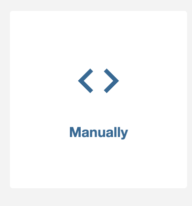
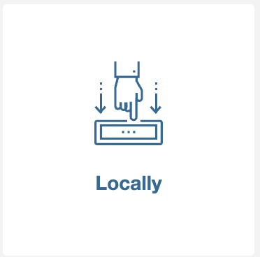
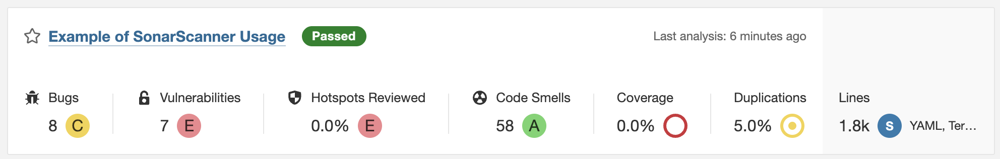
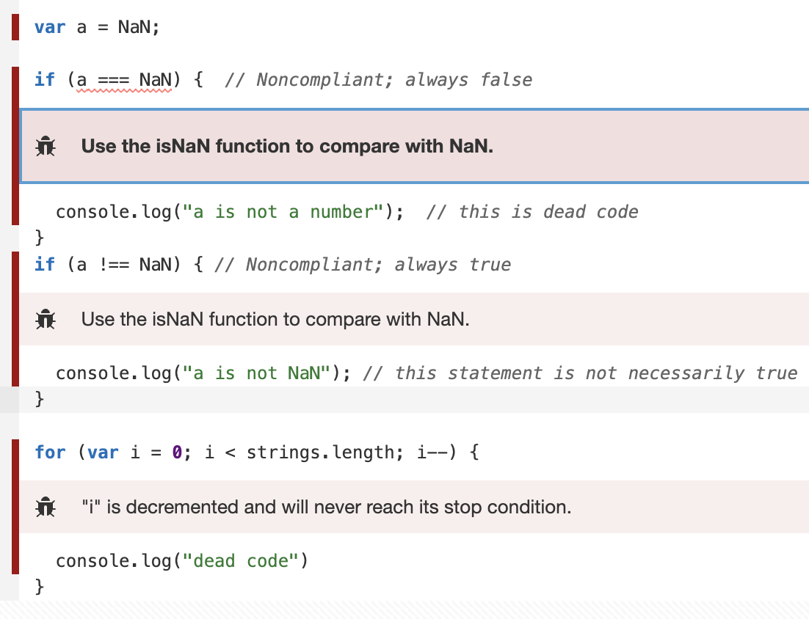
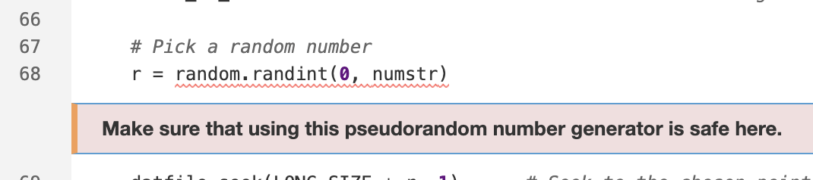
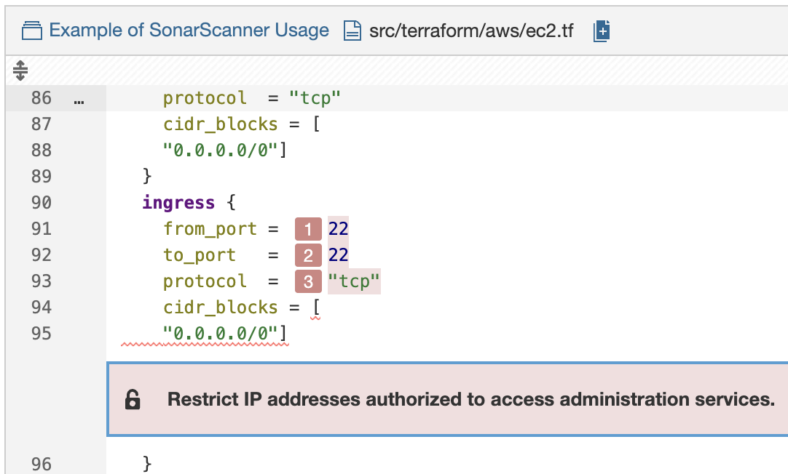
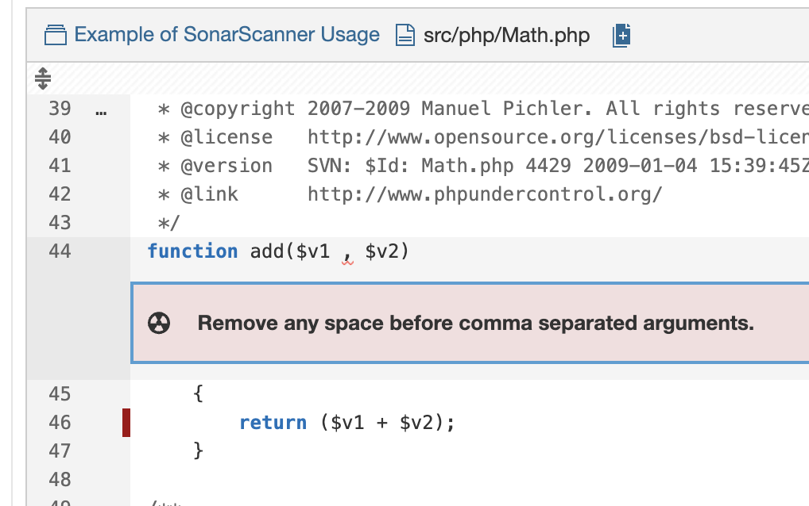

<!-- size: 16:9 -->
<!-- theme: default -->

<!-- paginate: skip -->
<!-- headingDivider: 1 -->

<style>
h1 {
  text-align: center;
  color: #005877;
}
h2 {
  color: #E87B00;
}
h3 {
  color: #005877;
}

img[alt~="center"] {
  display: block;
  margin: 0 auto;
}
img[alt~="float"] {
  display: float;
  margin: 8px 5px 0 5px;
}
emph {
  color: #E87B00;
}
.cols {
  display: grid;
  grid-template-columns: repeat(2, 1fr);
  gap: 1rem;
}
.cols > div {
  align-self: start;
}
</style>

# Static Code Analysis con SonarQube


---

<!-- paginate: true -->

## Objetivos de la sesión

- Entender qué es el análisis estático
- Ver qué aporta SonarQube
- Desplegar SonarQube con Docker Compose
- Analizar manualmente un proyecto de ejemplo
- Identificar hallazgos típicos en la interfaz

---

## ¿Qué es el análisis estático?

Es el análisis del código fuente <emph>sin ejecutar la aplicación</emph>.

Permite detectar automáticamente:

- bugs potenciales
- duplicación
- code smells
- problemas de seguridad
- complejidad excesiva

---

## Utilidad del análisis estático

- Detección temprana de problemas
- Revisiones más objetivas
- Reducir deuda técnica (relacionado con refactorización y estimación de esfuerzo)
- Mejorar mantenibilidad (facilitar cambios futuros)
- Tener feedback automático sobre el código

**No sustituye al diseño ni a la revisión manual**, pero es un complemento valioso.

---

## ¿Qué es SonarQube?

Plataforma de software libre de inspección continua de código:

- Analiza proyectos de distintos lenguajes
- Centraliza métricas e incidencias
- Se puede usar en local o integrado en CI
- Puede actuar como **quality gate** (condición automática para aceptar o rechazar un análisis). Ejemplos:
  - no introducir bugs nuevos
  - no introducir vulnerabilidades nuevas
  - mantener duplicación por debajo de un umbral

---

## Qué evalúa SonarQube

- **Maintainability** (Mantenibilidad)
- **Reliability** (Fiabilidad)
- **Security** (Seguridad)

También muestra métricas como:

- duplicación
- complejidad
- deuda técnica estimada
- cobertura, si se aporta

---

## Tipos de hallazgos

| Tipo | Idea general |
| ----: | :---- |
| Bug | posible fallo en tiempo de ejecución |
| Vulnerability | problema de seguridad confirmado |
| Security Hotspot | punto sensible que requiere revisión |
| Code Smell | problema de mantenibilidad |

---

## Mantenibilidad, fiabilidad y seguridad

<div class="cols">
<div>

### Maintainability

- code smells
- deuda técnica
- dificultad para cambiar

</div>
<div>

### Reliability / Security

- bugs potenciales
- vulnerabilidades
- hotspots de seguridad

</div>
</div>

---

## Instalación y análisis manual

1. Montar SonarQube en local
2. Crear un proyecto manualmente
3. Lanzar un escaneo manual sobre un repositorio
4. Interpretar los resultados

---

## Docker Compose del ejemplo

Usaremos un `docker-compose.yml` sencillo para montar SonarQube y su base de datos:

- servicio `sonarqube` (imagen https://hub.docker.com/_/sonarqube)
- servicio `db` con PostgreSQL
- volúmenes para persistencia
- red compartida para escaneo posterior

---

## `docker-compose.yml`: servicio `sonarqube`

```yaml
services:
  sonarqube:
    image: sonarqube:lts-community
    container_name: sonarqube
    depends_on:
      - db
    ports:
      - "9000:9000"
    environment:
      SONAR_JDBC_URL: jdbc:postgresql://db:5432/sonarqube
      SONAR_JDBC_USERNAME: sonarqube
      SONAR_JDBC_PASSWORD: sonarqube
```

* El puerto `9000` permite acceder a la interfaz web.
* SonarQube necesita PostgreSQL para guardar su estado.

---

## `docker-compose.yml`: servicio `sonarqube` (volúmenes y red)

```yaml
services:
  sonarqube:
    ...
    volumes:
      - sonarqube_data:/opt/sonarqube/data
      - sonarqube_logs:/opt/sonarqube/logs
      - sonarqube_extensions:/opt/sonarqube/extensions
    networks:
      - sonarqube_network
```

* Los volúmenes aseguran que no perdemos datos al reiniciar.
* La red compartida facilitará la comunicación con el scanner.

---

## `docker-compose.yml`: servicio `db`

```yaml
services:
  sonarqube:
    ...
  db:
    image: postgres:15
    container_name: sonarqube_db
    environment:
      POSTGRES_USER: sonarqube
      POSTGRES_PASSWORD: sonarqube
      POSTGRES_DB: sonarqube
    volumes:
      - postgresql:/var/lib/postgresql/data
    networks:
      - sonarqube_network
```

* PostgreSQL se configura con un usuario y base de datos específicos para SonarQube.
* También se monta un volumen para persistencia.

---

## `docker-compose.yml`: persistencia de datos y red

```yaml
volumes:
  sonarqube_data:
  sonarqube_logs:
  sonarqube_extensions:
  postgresql:

networks:
  sonarqube_network:
    name: sonarqube_network
```

* Definimos los volúmenes para SonarQube y PostgreSQL.
* Creamos una red personalizada para que los servicios se comuniquen por nombre.

---

## Primer acceso a SonarQube

```bash
docker compose up -d
```

Después accedemos a http://localhost:9000.

- usuario inicial: `admin`
- contraseña inicial: `admin`
- al entrar, SonarQube obliga a cambiar la contraseña

Tras esto ya podemos crear proyectos y tokens.

---

## Crear proyecto manualmente

<div class="cols">
<div>

1. `projects` > `Create project` (`Manually`)
2. Elegir nombre, clave del proyecto y rama principal
3. Elegir cómo analizaremos el proyecto (en este caso, `Locally`)
4. Crear token de análisis


</div>
<div>




</div>
</div>

---

## Escaneo manual con `sonar-scanner-cli`

Hay dos piezas distintas:

- **SonarQube servidor**: interfaz web y motor que guarda y muestra resultados
- **scanner**: proceso aparte que lee el código y envía el análisis al servidor

El escaneo puede lanzarse con un contenedor Docker del scanner. Ventajas:

- no hay que instalar el scanner en el host
- el entorno es reproducible
- basta con montar el proyecto y pasar parámetros

Se separan porque **SonarQube no analiza por sí solo los repositorios**: **necesita** que un **scanner externo** le mande el código y los metadatos del análisis.

---

## Repositorio de ejemplo para escanear

Usaremos ejemplos del repositorio:

https://github.com/SonarSource/sonar-scanning-examples

Por ejemplo, uno de los directorios preparados para `sonar-scanner`, como base para hacer pruebas rápidas de análisis.

```bash
docker run --rm \
  --network sonarqube_network \
  -e SONAR_HOST_URL="http://sonarqube:9000" \
  -e SONAR_TOKEN="<SONAR_PROJECT_TOKEN>" \
  -v "${PWD}:/usr/src" \
  sonarsource/sonar-scanner-cli \
  -Dsonar.projectKey=<SONAR_PROJECT_KEY> \
  -Dsonar.sources=/usr/src
```

---


## Resultados del análisis



<!--
- `Bugs`: fallos potenciales de fiabilidad.
- `Vulnerabilities`: problemas de seguridad confirmados.
- `Hotspots Reviewed`: puntos sensibles de seguridad ya revisados manualmente.
- `Code Smells`: problemas de mantenibilidad y deuda técnica.
- `Coverage`: porcentaje de código cubierto por tests.
- `Duplications`: porcentaje de código duplicado detectado.
- `Lines`: número de líneas de código analizadas.-->
- Los colores resumen el estado general: verde suele indicar buen estado; amarillo, naranja o rojo indican peor situación o mayor severidad.
- Las letras (`A`, `B`, `C`, etc.) son ratings: `A` es la mejor valoración y cuanto más se aleja de `A`, peor es la calidad en esa dimensión.

---

## Ejemplo de bug potencial



`Bugs`: fallos potenciales de fiabilidad.

---

## Ejemplo de security hotspot



`Security Hotspots`: puntos sensibles de seguridad que requieren revisión manual.

No implica automáticamente una vulnerabilidad confirmada, pero sí un punto a revisar.

---

## Ejemplo de vulnerability



`Vulnerabilities`: problemas de seguridad confirmados.

---

## Ejemplo de code smell



No es necesariamente un bug, pero sí una señal de mala mantenibilidad.

---

## Cómo interpretar los resultados

La idea no es “poner todo en verde” a cualquier precio.

Nos interesa:

- entender qué problema señala la herramienta
- decidir si es relevante
- refactorizar cuando aporte valor real

---

## Errores frecuentes

| Problema | Causa habitual |
| ----: | :---- |
| No carga SonarQube | el contenedor aún no ha terminado de arrancar |
| El scanner no conecta | red incorrecta o URL errónea |
| Error de autenticación | token inválido o ausente |
| No aparece el proyecto | `sonar.projectKey` no coincide o el análisis falla |
| Resultados poco útiles | se analiza el directorio equivocado |

---

## SonarQube en un flujo CI

La integración habitual en CI sigue esta idea:

1. desarrollador hace push o abre una PR
2. el pipeline compila y ejecuta tests
3. el scanner lanza el análisis contra SonarQube
4. SonarQube calcula el resultado y el quality gate
5. el pipeline decide si el cambio puede aceptarse

De este modo, SonarQube pasa de ser una herramienta manual a formar parte del proceso automático de revisión.


# Ejercicio

Una vez completado el montaje y el escaneo manual, el siguiente paso será integrarlo con GitHub en un flujo CI.

Objetivo del ejercicio:

- automatizar el análisis en cada push o pull request
- usar SonarQube como apoyo al code review
- estudiar si conviene bloquear merges con quality gate

