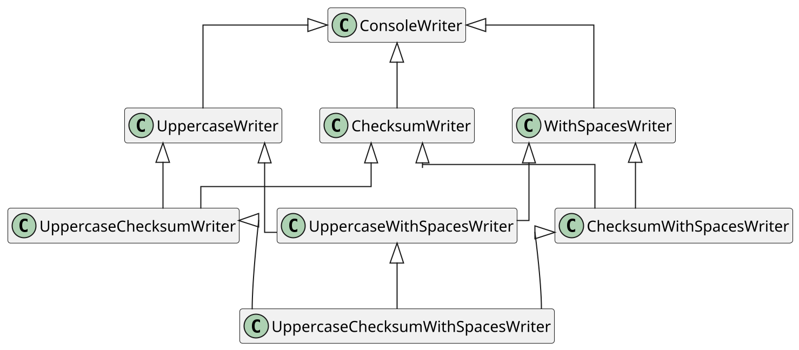
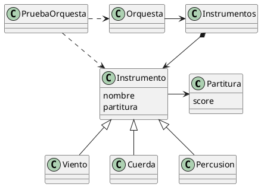
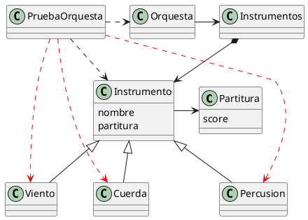

# IMPLEMENTACIÓN DE SISTEMAS SOFTWARE

## Índice

- [Programación con objetos](#programación-con-objetos)
- [Delegación](#delegación)
- [Inyección de Dependencias](#inyección-de-dependencias)
- [Refactoring y duplicación de código](#refactoring-y-duplicación-de-código)
- [Ortogonalidad y dependencias](#ortogonalidad-y-dependencias)
- [Programación con aspectos](#programación-con-aspectos)
- [Tratamiento de errores](#tratamiento-de-errores)
- [Programación funcional y streams](#programación-funcional-y-streams)
- [Programación asertiva y contratos](#programación-asertiva-y-contratos)
- [Programación asíncrona y eventos](#programación-asíncrona-y-eventos)

<!-- Source: oop.md -->
# PROGRAMACIÓN CON OBJETOS


¿Cuál es la ventaja principal de la **Orientación a Objetos**?


**Ocultar** la implementación


¿Cómo consigue la OO ocultar la implementación?


## Principios básicos de la construcción de software (OO)

- **Abstracción**: diferenciar el *qué* y el *cómo*
- **Modularidad**: componentes, módulos (en OO, clases y objetos), interfaces, etc.
- $\bigtriangleup$ **cohesión**: módulos auto-contenidos, independientes y con un único propósito
- $\bigtriangledown$ **acoplamiento**: reducir las dependencias entre módulos


## Versión inicial: Lista v0.1

En relación a los principios de _alta cohesión_ y _bajo acoplamiento_, criticar la implementación siguiente en Java de un TAD Lista:

```java
  public abstract class List<T> {
    public void addFirst(T value) { ... };
    public void removeFirst() { ... };
    public void addLast(T value) { ... };
    public void removeLast() { ... };
    public T first() { ... };
    public T last() { ... };
    public boolean isEmpty() { ... };
    public int length() { ... };
    public List<T> clone() { ... };
    public boolean isEqualTo(List<T>) { ... };
    public abstract void traverse();
    // etc...
  }
```


## Abstracción

- La clase abstracta `List<T>` diferencia entre el *qué* y el *cómo*
- Qué hace la lista vs. cómo se almacenan los elementos

## Cohesión

> Cohesion refers to the degree to which the elements inside a module belong together
>
> --- E. Yourdon & L. Constantine. **Structured Design: Fundamentals of a Discipline of Computer Program and Systems Design.** Prentice Hall, 2nd edition, 1986.

## Discusión sobre la implementación

[v0.1](#versión-inicial-lista-v01) • [críticas](#críticas-a-lista-v01) $\rightarrow$ [v0.2](#implementación-alternativa-lista-v02) • [críticas](#críticas-a-lista-v02) $\rightarrow$ [v0.3](#implementación-alternativa-lista-v03) • [críticas](#críticas-a-lista-v03) $\rightarrow$ [v0.4](#implementación-alternativa-lista-v04) $\rightarrow$ [resumen](#resumen-de-problemas)


### Críticas a Lista v0.1

- `List<T>` aglutina más de una responsabilidad: almacenar y recorrer. La implementación no parece cohesionada.
- El método `traverse()` proporciona una interfaz a los métodos que implementen el recorrido de la lista ¿para hacer qué?
- ¿Y si hay distintas implementaciones de `traverse()`? Si implementamos varias versiones de la lista, introducimos más dependencias (acoplamiento)

#### Problemáticas de Lista v0.1

- **Cohesión** baja
- **Variabilidad** no bien tratada $\rightarrow$ poca **flexibilidad**


## Implementación alternativa: Lista v0.2

Hay que crear nuevos tipos de recorrido. Ampliamos la interfaz...

<div class="cols">
<div>

```java
public interface List<T> {
  public void addFirst(T value);
  public void removeFirst();
  public void addLast(T value);
  public void removeLast();
  public T first();
  public T last();
  public boolean isEmpty();
  public int length();
  public List<T> clone();
  public boolean isEqualTo(List<T>);
  ...
```

</div>
<div>

```java
  ...
  public void traverseForward();
  public void traverseBackWard();
  public void traverseEvens(); //pares
  public void traverseOdds();  //impares
}
```

</div>
</div>


### Críticas a Lista v0.2

- Si hay que cambiar la operación básica que hace `traverse()` con cada elemento (imprimir, sumar, etc.), ¿cuántos métodos hay que cambiar? Hay muchas dependencias
- Cuanto más variedad de recorridos (la interfaz es mayor), menos flexibilidad para los cambios. Implementación poco flexible

#### Problemáticas de Lista v0.2

- **Acoplamiento** excesivo: muchas **dependencias** (provocadas por el exceso de herencia)
- **Flexibilidad** escasa


## Implementación alternativa: Lista v0.3

Delegar funcionalidad hacia las subclases (vía **herencia**).

Criticar la implementación:

```java
  class ListForward<T> extends List<T> {
    //...
    public void traverse() { // recorrer hacia adelante };
  }
  class ListBackward<T> extends List<T> {
    //...
    public void traverse() { // recorrer hacia atras};
  }
```


### Críticas a Lista v0.3

- ¿Hay que especializar de nuevo para cada tipo de operación que hace `traverse()` con cada elemento individual (imprimir, sumar, etc.)?
- ¿Y si hay que especializar de nuevo el recorrido: sólo los pares, sólo los impares, etc.?

#### Problemáticas de Lista v0.3

- **Acoplamiento** elevado: Si hay que crear nuevos tipos de recorrido, se abusará de la herencia para crear _estructuras_ complejas
- **Variabilidad** no está bien tratada: poca **flexibilidad**, baja **reutilización**


¿Cómo se resuelve esto en las bibliotecas típicas que conocéis
(v.g. C++ STL, Java Collections, etc.)?

>[!NOTE]
><details>
><summary>Bibliotecas</summary>
>Iteradores
></details>


## Implementación alternativa: Lista v0.4

**Delegar** hacia otra clase

<div class="cols">
<div>

```java
public interface List<T> {
  void addFirst(T value);
  void removeFirst();
  void addLast(T value);
  void removeLast();
  T first();
  T last();
  boolean isEmpty();
  int length();
  List<T> clone();
  boolean isEqualTo(List<T>);
  Iterator<T> iterator();
}
```

</div>
<div>

```java
public interface Iterator<E> {
  boolean hasNext();
  E next();
  void remove();
}
```

</div>
</div>


### Ventajas de Lista v0.4

- Mayor   **cohesión**: Las responsabilidades están ahora separadas: `List` almacena, `Iterator` recorre. `List` está más cohesionada
- Para hacer `List` más cohesionada, se ha tenido que introducir una **dependencia** (acoplamiento)
- Uso de **delegación** (o _composición_) en lugar de la herencia: la responsabilidad de recorrer se ha delegado hacia otro sitio


## Resumen de problemas

| Problema | desde v0.1 ... | ... hasta v0.4 |
|:----------|:------|:------|
| **Cohesión** | Baja: `List<T>` aglutina almacenamiento y recorrido | Alta: `List<T>` solo almacena; `Iterator<T>` recorre |
| **Variabilidad** | No tratada: difícil cambiar la forma de recorrer | Fácil crear nuevos `Iterator` sin tocar `List` |
| **Flexibilidad** | Poca: cambios en recorrido afectan a `List` | Mayor: Cambios aislados en `Iterator` |
| **Acoplamiento** | Alto: `List` depende de cómo se recorre | Bajo: separación clara de responsabilidades |


## Ocultar la implementación

Los principios aplicados han sido:

- **Abstracción**: diferenciar el *qué* y el *cómo*
- **Cohesión** (maximizar): módulos auto-contenidos, independientes y con un
    único propósito
- **Acoplamiento** (minimizar): dependencias entre módulos
- **Modularidad**: clases, interfaces y componentes/módulos


### Alta cohesión, bajo acoplamiento

> Cuando los componentes están aislados, puedes cambiar uno sin preocuparte por el resto. Mientras no cambies las interfaces externas, no habrá problemas en el resto del sistema
>
> --- E. Yourdon & L. Constantine. **Structured Design: Fundamentals of a Discipline of Computer Program and Systems Design.** Prentice Hall, 2nd edition, 1986.

### Modularidad

Reducir el acoplamiento usando módulos o componentes con distintas responsabilidades, agrupados en bibliotecas


### Técnicas de ocultación

- **Encapsular**: agrupar en módulos y clases
- **Visibilidad**: `public`, `private`, `protected`, etc.
- **Delegación**: incrementar la cohesión extrayendo funcionalidad pensada para otros propósitos fuera de un módulo
- **Herencia**: delegar _en vertical_
- **Polimorfismo**: ocultar la implementación de un método, manteniendo la misma interfaz de la clase base
- **Interfaces**: usar interfaces bien documentadas


## Herencia

- **Reutilizar la interfaz**

  - Clase base y derivada son del mismo tipo
  - Todas las operaciones de la clase base están también disponibles en la derivada

- **Redefinir vs. reutilizar el comportamiento**

  - *Overriding* (redefinición o sobreescritura): cambio de comportamiento
  - *Overloading* (sobrecarga): cambio de interfaz

- **Herencia pura vs. extensión**

  - Herencia pura: mantiene la interfaz tal cual (relación *es-un*)
  - Extensión: amplía la interfaz con nuevas funcionalidades(relación *es-como-un*). Puede causar problemas de _casting_.


### Generalización y especialización

> When you inherit, you take an existing class and make a special version of it. In general, this means that you’re taking a general-purpose class and specializing it for a particular need. [...] it would make no sense to compose a car using a vehicle object —a car doesn’t contain a vehicle, it is a vehicle. The _is-a_ relationship is expressed with inheritance, and the _has-a_ relationship is expressed with composition.
>
> --- [Bruce Eckel](bibliografia.md#eckel)


## Polimorfismo

Fenómeno por el que, cuando se llama a una operación de un objeto del que no se sabe su tipo específico, se ejecuta el método adecuado de acuerdo con su tipo.

El polimorfismo se basa en:

- **Enlace dinámico** (_dynamic binding_): se elige el método a ejecutar en tiempo de ejecución, en función de la clase de objeto; es la implementación del *polimorfismo*


### Overriding

- En general, en un lenguaje OO es posible sobreescribir o redefinir (_override_) los métodos heredados de una superclase.
- En algunos lenguajes es obligatorio (en otros es recomendado) especificar explícitamente cuándo un método es redefinido.
- Vamos a ver ejemplos en distintos lenguajes...


#### Ejemplo 1: Override en Scala

```scala hl_lines="4"
class Complejo(real: Double, imaginaria: Double) {
  def re = real
  def im = imaginaria
  override def toString() =
    "" + re + (if (im < 0) "" else "+") + im + "i"
}
```

- Cuando se redefine un método abstracto, no es necesario `override`
- Pero si se quiere redefinir un método concreto, `override` es necesario para evitar sobreescrituras accidentales.
- En Scala, el riesgo de redefinición accidental de métodos es mayor debido a los mixins (`trait` en Scala).


### Scala Traits

Un **trait** es una forma de separar las dos principales responsabilidades de una clase: definir el **estado** de sus instancias y definir su **comportamiento**.

- Las clases y los objetos en Scala pueden extender un `trait`
- Los `trait`de Scala son similares a las `interface` de Java.

- Los `trait` no pueden instanciarse
- Los métodos definidos en una clase tienen precedencia sobre los de un `trait`
- Los `trait` no tienen estado propio, sino el del objeto o la instancia de la clase a la que se aplica


#### Ejemplo 2: Un iterador con Scala traits

```scala hl_lines="4"
trait Iterator[A] {
  def hasNext: Boolean
  def next(): A
}

class IntIterator(to: Int) extends Iterator[Int] {
  private var current = 0
  override def hasNext: Boolean = current < to
  override def next(): Int =  {
    if (hasNext) {
      val t = current
      current += 1
      t
    } else 0
  }
}

val iterator = new IntIterator(10)
println(iterator.next())  // prints 0
println(iterator.next())  // prints 1
```


¿Y en Java no hay _traits_?


### Java default methods

- Desde Java 8, las interfaces pueden incorporar [métodos por defecto](https://www.baeldung.com/java-static-default-methods) que hacen que las interfaces de Java se comporten más como un trait.
- Sirven para implementar herencia múltiple


#### Ejemplo 3: `@Override` en Java


Este ejemplo en Java es realmente la implementación de un **diseño incorrecto**,
pues hay una doble dependencia entre las clases `Real` y `Complejo`.
La frontera entre Diseño e Implementación queda aquí un poco difusa.


```java
class Real {
  double re;
  public Real(double real) {
      re = real;
  }
  public double getRe() { return re; }
  /* Probar a comentar el siguiente método y mantener el
     Override de Complejo::sum(Real other) */
  public Real sum(Real other) {
    return new Real(re + other.getRe());
  }
  /* Probar a comentar el siguiente método y mantener el
     Override de Complejo::sum(Complejo other) */
  public Complejo sum(Complejo other) {
    return new Complejo( re + other.getRe(), other.getIm() );
  }
  public String toString() {
    return String.format("%.1f", re);
  }
}
```


```java
class Complejo extends Real {
  double im;
  public Complejo(double real, double imaginaria) {
    super(real);
    im = imaginaria;
  }
  @Override
  public Complejo sum(Real other) {
    return new Complejo( re + other.getRe(), im );
  }
  @Override
  public Complejo sum(Complejo other) {
    return new Complejo( re + other.getRe(), im + other.getIm() );
  }
  public Double getIm() { return im; }
  public String toString() {
    return String.format("%.1f", re) + ((im < 0)? "" : "+") +
       String.format("%.1f", im) + "i";
  }
}
```


```java
public class Main {
  public static void main(String args[]) {
      Real r = new Real(7.6);
      Complejo c = new Complejo(1.2, 3.4);
      System.out.println("Número real: " + r);
      System.out.println("Número complejo: " + c);
      System.out.println("Número complejo: " + c.sum(r) );
      System.out.println("Número complejo: " + r.sum(c) );
  }
}
```


¿Qué sucede si no ponemos `@Override` a los métodos redefinidos?


Si no se añade `@Override`, podemos confundirnos y hacer un _overload_ accidental de un método cuando realmente queríamos redefinirlo.


#### Ejemplo 4: Override en C\#

- `DescribeCar` muestra una descripción básica de un coche y llama a `ShowDetails` para información adicional.
- Cada clase define su propia versión de `ShowDetails`
- Usamos mofificadores `new` y `override` distintos en cada clase `ConvertibleCar` y `Minivan`


```csharp
class Car
{
    public void DescribeCar()
    {
        System.Console.WriteLine("Four wheels and an engine.");
        ShowDetails();
    }

    public virtual void ShowDetails()
    {
        System.Console.WriteLine("Standard transportation.");
    }
}
```


```csharp
class ConvertibleCar : Car
{
    public new void ShowDetails()
    {
        System.Console.WriteLine("A roof that opens up.");
    }
}

class Minivan : Car
{
    public override void ShowDetails()
    {
        System.Console.WriteLine("Carries seven people.");
    }
}
```


```csharp
public static void TestCars1()
{
    System.Console.WriteLine("\nTestCars1\n----------");

    var cars = new List<Car> { new Car(), new ConvertibleCar(),
        new Minivan() };

    foreach (var car in cars)
    {
        car.DescribeCar();
        System.Console.WriteLine("----------");
    }
}
```


`TestCars` produce la salida siguiente:

```txt
TestCars1
----------
Four wheels and an engine.
Standard transportation.
----------
Four wheels and an engine.
Standard transportation.
----------
Four wheels and an engine.
Carries seven people.
----------
```

¿Los resultados son los esperados?


- El tipo del segundo objeto de la lista es `ConvertibleCar`, pero `DescribeCar` no accede a la versión de `ShowDetails` definida en `ConvertibleCar` (debido a `new`).
- El tipo del tercer objeto de la lista es `Minivar`, que redefine con `override` el método `ShowDetails` declarado en la clase base.


```csharp
public static void TestCars2()
{
    System.Console.WriteLine("\nTestCars2\n----------");
    ConvertibleCar car2 = new ConvertibleCar();
    Minivan car3 = new Minivan();
    car2.ShowDetails();
    car3.ShowDetails();
}

public static void TestCars3()
{
    System.Console.WriteLine("\nTestCars3\n----------");
    Car car2 = new ConvertibleCar();
    Car car3 = new Minivan();
    car2.ShowDetails();
    car3.ShowDetails();
}
```


Estos métodos producirían las salidas siguientes:

```txt
TestCars2
----------
A roof that opens up.
Carries seven people.

TestCars3
----------
Standard transportation.
Carries seven people.
```

- En `TextCars2`, el tipo de los objetos creados coincide con el tipo declarado.
- En `TextCars3`, el tipo de los objetos creados es una subclase de la clase del tipo declarado.


## Moldes o _casting_

- *Upcasting:* Interpretar un objeto de una clase derivada como del mismo tipo que la clase base
- *Downcasting:* Interpretar un objeto de una clase base como del mismo tipo que una clase derivada suya


### Ejemplo de casting: Aventura v0.1

```java
public class PersonajeDeAccion {
  public void luchar() {}
}

public class Heroe extends PersonajeDeAccion {
  public void luchar() {}
  public void volar() {}
}

public class Creador {
  PersonajeDeAccion[] personajes() {
    PersonajeDeAccion[] x = {
      new PersonajeDeAccion(),
      new PersonajeDeAccion(),
      new Heroe(),
      new PersonajeDeAccion()
    };
    return x;
  }
}
```


```java
public class Aventura {
  public static void main(String[] args) {
    PersonajeDeAccion[] cuatroFantasticos = new Creador().personajes();
    cuatroFantasticos[1].luchar();
    cuatroFantasticos[2].luchar(); // Upcast

    // En tiempo de compilacion: metodo no encontrado:
    //! cuatroFantasticos[2].volar();
    ((Heroe)cuatroFantasticos[2]).volar(); // Downcast
    ((Heroe)cuatroFantasticos[1]).volar(); // ClassCastException
    for (PersonajeDeAccion p: cuatroFantasticos)
        p.luchar; // Sin problema
    for (PersonajeDeAccion p: cuatroFantasticos)
        p.volar; // El 0, 1 y 3 van a lanzar ClassCastException
  }
}
```


#### Críticas a Aventura v0.1

- ¿De qué tipos van a ser los personales de acción? $\rightarrow$ problema de _downcasting_
- Hay que rediseñar la solución por ser insegura


### Ejemplo de casting: Aventura v0.2

```java
interface SabeLuchar {
  void luchar();
}
interface SabeNadar {
  void nadar();
}
interface SabeVolar {
  void volar();
}
class PersonajeDeAccion {
  public void luchar() {}
}
class Heroe
    extends PersonajeDeAccion
    implements SabeLuchar,
              SabeNadar,
              SabeVolar {
  public void nadar() {}
  public void volar() {}
}
```


```java
public class Aventura {
  static void t(SabeLuchar x)
    { x.luchar(); }
  static void u(SabeNadar x)
    { x.nadar(); }
  static void v(SabeVolar x)
    { x.volar(); }
  static void w(PersonajeDeAccion x)
    { x.luchar(); }
  public static void main(String[] args)
  {
    Heroe i = new Heroe();
    t(i); // Tratar como un SabeLuchar
    u(i); // Tratar como un SabeNadar
    v(i); // Tratar como un SabeVolar
    w(i); // Tratar como un PersonajeDeAccion
  }
}
```


## Uso de la herencia

- Herencia de **interfaz** vs. herencia de **comportamiento** o **implementación**:
  - En Java, `implements` = herencia de interfaz y `extends` = herencia de interfaz + implementación
  - ¿Hay herencia sólo de comportamiento? Pista: pensar en C++

- Herencia como **tipo** vs herencia como **estructura**:
  - En herencia de tipos, cada subclase es un subtipo. Debe satisfacerse el principio de **sustitución** de Liskov (LSP, _Liskov Substitution Principle_): toda operación que funciona para un objeto de la clase $C$ también debe funcionar para un objeto de una subclase de $C$
  - Usar la herencia como una forma de estructurar programas es **erróneo**, pues provoca que no se satisfaga la propiedad LSP.


¿El polimorfismo está ligado siempre a la herencia?


## Polimorfismo paramétrico

- **Genéricos**
  - Ada
  - C++ generics
  - Java _templates_ (desde JDK 1.5)
  - Scala
  - etc.

- Diferencias entre lenguajes:
  - En C++, los genéricos permiten meta-programación en tiempo de compilación
  - En Java, las plantillas son wrappers que _moldean_ objetos (_syntactic sugar_)


## Usos incorrectos de la herencia


### Mal Ejemplo 1 (Java): herencia como estructura

```java
class Account {
  float balance;
  float getBalance() { return balance; }
  void transferIn (float amount) { balance -= amount; }
}

class VerboseAccount extends Account {
  void verboseTransferIn (float amount) {
    super.transferIn(amount);
    System.out.println("Balance: "+balance);
  };
}

class AccountWithFee extends VerboseAccount {
  float fee = 1;
  void transferIn (float amount) { super.verboseTransferIn(amount-fee); }
}
```


- Todos los objetos $a$ de la clase `Account` deben cumplir que si $b=a.getBalance()$ antes de ejecutar $a.transferIn(s)$ y  $b'=a.getBalance()$ después de ejecutar $a.transferIn(s)$, entonces $b+s=b'$.
- Sin embargo, con la estructura `AccountWithFee` < `VerboseAccount` < `Account`, un objeto de tipo `AccountWithFee` no funciona bien cuando se contempla como un objeto `Account`. Considérese la siguiente secuencia:

```java
void f(Account a) {
  float before = a.getBalance();
  a.transferIn(10);
  float after = a.getBalance();
  // Suppose a is of type AccountWithFee:
  //   before + 10 != after    !!
  //   before + 10-1 = after
}
```


### Mal Ejemplo 2 (Scala): herencia de implementación

```scala
abstract class Writer {
  def print(str: String): Unit
}

class ConsoleWriter extends Writer {
  override def print(str: String) = println(str)
}

class UppercaseWriter extends ConsoleWriter {
  override def print(str: String) =
    super.print(str.toUpperCase())
}

object Test {
   def main(args: Array[String]) {
        val writer = new UppercaseWriter
        writer.print("abc")
   }
}
```


Ahora hay que añadir un nuevo comportamiento:

```scala
class WithSpacesWriter extends ConsoleWriter {
  override def print(str: String) =
    super.print(str.split("").mkString(" "))
}
```

```scala
object Test {
   def main(args: Array[String]) {
        val writer1 = new UppercaseWriter
        writer1.print("abc")

        val writer2 = new WithSpacesWriter
        writer2.print("abc")
   }
}
```


¿Y si queremos combinar ambas formas de imprimir?

```scala
class UppercaseWithSpacesWriter extends UppercaseWriter {
  override def print(str: String) =
    super.print(str.split("").mkString(" "))
}

class WithSpacesUppercaseWriter extends WithSpacesWriter {
  override def print(str: String) =
    super.print(str.toUpperCase())
}
```


```scala
object Test {
   def main(args: Array[String]) {
        val writer1 = new UppercaseWriter
        writer1.print("abc")

        val writer2 = new WithSpacesWriter
        writer2.print("abc")

        val writer3 = new WithSpacesUppercaseWriter
        writer3.print("abc")

        val writer4 = new UppercaseWithSpacesWriter
        writer4.print("abc")
   }
}
```


¿Y si aparece una nueva forma de imprimir?

```scala
class ChecksumWriter extends ConsoleWriter {
  override def print(str: String) = {
    super.print(MessageDigest.getInstance("MD5").
                digest(str.getBytes("UTF-8")).
                map("%02x".format(_)).
                mkString("[","","] ") +
                str )
  }
}
```


#### Ejemplo: Herencia fuera de control


<details>
<summary>PlantUML source</summary>



</details>


¡Mal uso de la herencia!


### Ejemplo 2 (Scala): herencia de interfaz (traits)

```scala
abstract class Writer {
  def print(str: String): Unit
}

class ConsoleWriter extends Writer {
  override def print(str: String) = println(str)
}

trait Uppercase extends Writer {
  abstract override def print(str: String) =
    super.print(str.toUpperCase())
}

trait WithSpaces extends Writer {
  abstract override def print(str: String) =
    super.print(str.split("").mkString(" "))
}
```


```scala
object Test {
   def main(args: Array[String]) {
        val writer1 = new ConsoleWriter with Uppercase
        writer1.print("abc")
        val writer2 = new ConsoleWriter with Uppercase with WithSpaces
        writer2.print("abc")
   }
}
```

Genera la salida:

```txt
ABC
A B C
```


### Stackable traits

- En Scala, los `trait` normales son como interfaces, se enlazan en tiempo de ejecución (no tienen acceso a `super`).
- Se pueden redefinir [_stackable traits_](https://www.artima.com/articles/scalas-stackable-trait-pattern) con `abstract override` para dar acceso a `super`
- `abstract` no es necesario si se redefine un método no abstracto, que ya tiene una implementación
- En diseño, son una implementación del patrón _Decorator_ pero por composición de clases en vez de por composición de objetos


## Implementación y diseño


### Ejemplo 3 (C#): rectángulos versión 0.1

Geométricamente, un cuadrado es un rectángulo, así que usamos herencia pura (*es-un*):

<div class="cols">
<div>

```csharp
public class Rectangle {
  private Point topLeft;
  private double width;
  private double height;

  public double Width {
    get { return width; }
    set { width = value; }
  }

  public double Height {
    get { return height; }
    set { height = value; }
  }
}
```

</div>
<div>

```csharp
public class Square: Rectangle {
   ...
}
```

</div>
</div>


### Problema: cuadrados como rectángulos

- Matemáticamente, un cuadrado puede **ser-un** rectángulo.
- Pero en Informática un objeto `Square` **no es-un** objeto `Rectangle`
  - Un `Square` no tiene propiedades `height`y `width`.
- Pero supongamos que no nos importa el desperdicio de memoria.
  - `Square` heredará los métodos accesores de `Rectangle`.
- Así que hacemos lo siguiente...


### Ejemplo: rectángulos versión 0.2

```csharp
public class Square: Rectangle {
  public new double Width
  {
    set {
      base.Width = value;
      base.Height = value;
    }
  }
  public new double Height
  {
    set {
      base.Height = value;
      base.Width = value;
    }
  }
}
```

Nota: [Diferencia entre `new` y `override` en C#](https://docs.microsoft.com/en-us/dotnet/csharp/programming-guide/classes-and-structs/knowing-when-to-use-override-and-new-keywords)


- El comportamiento de un objeto `Square` no es consistente con el de un objeto `Rectangle`:

  ```csharp
  Square s = new Square();
  s.SetWidth(1);   // fija ambos
  s.SetHeight(2);  // fija ambos

  void f(Rectangle r)
  {
    r.SetWidth(32); // llama a Rectangle.SetWidth
  }
  ```

- ¿Qué sucede si pasamos un `Square` a la función `f`?

  ¡No cambia `Height`!

- Podría argumentarse que el error era que los métodos `Width`y `Height` no se declararon `virtual` en `Rectangle`.


### Ejemplo: rectángulos versión 0.3

Hacemos que los métodos `Width`y `Height` sean [`virtual` en C\#]((https://docs.microsoft.com/en-us/dotnet/csharp/language-reference/keywords/virtual)):

<div class="cols">
<div>

```csharp
public class Rectangle
{
  private Point topLeft;
  private double width;
  private double height;
  public virtual double Width
  {
    get { return width; }
    set { width = value; }
  }
  public virtual double Height
  {
    get { return height; }
    set { height = value; }
  }
}
```

</div>
<div>

```csharp
public class Square: Rectangle {
  public override double Width
  {
    set {
      base.Width = value;
      base.Height = value;
    }
  }
  public override double Height
  {
    set {
      base.Height = value;
      base.Width = value;
    }
  }
}
```

</div>
</div>


### Extensión y ocultación de métodos

- La [diferencia entre `new` y `override` en un método en C#](https://docs.microsoft.com/en-us/dotnet/csharp/programming-guide/classes-and-structs/knowing-when-to-use-override-and-new-keywords) es que `new` oculta la implementación de la clase base y `override` la extiende.

Sin embargo, cuando la creación de una clase derivada provoca cambios en la clase base, es síntoma de un **mal diseño**.

El principio LSP pone en evidencia que la relación **es-un** tiene que ver con el comportamiento público extrínseco, del que los clientes dependen.


Ahora parece que funcionan `Square` y `Rectangle`, que matemáticamente quedan bien definidos.

Pero consideremos esto:

```csharp
void g(Rectangle r)
{
  r.Width = 5;    // cree que es un Rectangle
  r.Height = 4;   // cree que es un Rectangle
  if(r.Area() != 20)
    throw new Exception("Bad area!");
}
```


¿Qué pasa si llamamos a `g(new Square(3))`?

El autor de `g` asumió que cambiar el ancho de un rectángulo deja intacto el alto. Si pasamos un cuadrado esto no es así.

**Violación de LSP**: Si pasamos una instancia de una clase derivada (`Square`), se altera el comportamiento definido por la clase base (`Rectangle`) de forma que `g` deja de funcionar.


¿Quién tiene la culpa?
¿Diseño o implementación?


### Diseño vs implementación

¿Quién tiene la culpa?

- ¿El autor de `g` por asumir que "en un rectángulo su ancho y alto son independientes" (_invariante_)?
- ¿El autor de `Square` por violar el invariante?
- ¿De qué clase se ha violado el invariante? ¡De `Rectangle` y no de `Square`!

Para evaluar si un diseño es apropiado, no se debe tener en cuenta la solución por sí sola, sino en términos de los _supuestos razonables_ que hagan los usuarios del diseño.
<!-- Source: delegacion.md -->
# DELEGACIÓN


## CASO PRÁCTICO: Implementación de una orquesta


### Versión inicial: Orquesta v0.1

<div class="cols">
<div>

Criticar la siguiente implementación de una orquesta.

_**Pista**:_

Minimizar el **acoplamiento** y maximizar la **cohesión**

</div>
<div>

```java
abstract class Instrumento {
  public void tocar() { }
  public static void afinarInstrumento(Instrumento i)
  {
    // Afinar en funcion del tipo de i
    if (i instanceof Viento)
      afinarViento(i);
    else if (i instanceof Cuerda)
      afinarCuerda(i);
    // Probar que esta afinado
    i.tocar();
  }
  public static void afinarViento(Viento i)
  { System.out.println("afinal soplido"); }

  public static void afinarCuerda(Cuerda i)
  { System.out.println("afinar rasgado"); }
}
```

</div>
</div>


### Orquesta v0.1 (cont.)

- Los instrumentos concretos...

<div class="cols">
<div>

```java
class Viento extends Instrumento {
  public void tocar()
  { soplar(); }

  public void afinar()
  { System.out.println("afinar soplido");}

  public void soplar()
  { System.out.println("soplar"); }
}
```

</div>
<div>

```java
class Cuerda extends Instrumento {
  public void tocar()
  { rasgar(); }

  public void afinar()
  { System.out.println("afinar rasgado"); }

  public void rasgar()
  { System.out.println("rasgar"); }
}
```

</div>
</div>


<div class="cols">
<div>

### Orquesta v0.1 (cont.)

- La orquesta...

</div>
<div>

```java
public class Orquesta {
  ArrayList<Instrumento> instrumentos;
  public Orquesta() {
    instrumentos = new ArrayList<Instrumento>(3); }
  public void tocar() {
      for (int i=0; i<instrumentos.size(); i++)
        instrumentos.get(i).tocar();
  }
  public static void main(String[] args) {
    instrumentos.add(new Viento());
    instrumentos.add(new Cuerda());
    for (int i=0; i<instrumentos.size(); i++)
        Instrumento.afinarInstrumento(
              instrumentos.get(i));
    tocar();
  }
}
```

</div>
</div>


#### Críticas a la Orquesta v0.1

- **Acoplamiento**: el abuso de métodos `static` obliga a numerosas dependencias (`Instrumento` ⇢ `Orquesta`, `Viento`, `Cuerda`) y debería ser al revés.
- **Cohesión**: la ubicación de `main` en `Orquesta` mezcla responsabilidades de la orquesta y el cliente de prueba.

#### Cambio propuesto

- Usar **polimorfismo** en lugar de métodos `static` y `instanceof`


### Implementación alternativa: Orquesta v0.2

<div class="cols">
<div>

Seguir criticando la implementación...

</div>
<div>

```java
class Orquesta {
  ArrayList<Instrumento> instrumentos;
  public Orquesta() {
      instrumentos = new ArrayList<Instrumento>(3);
  }
  public void tocar() {
      for (int i=0; i<instrumentos.size(); i++)
        instrumentos.get(i).tocar();
  }
  public void afinar(Instrumento i) {
    i.afinar();  // Metodo polimorfico
    i.tocar();   // Prueba de que esta afinado
  }
}
```

</div>
</div>


<div class="cols">
<div>

### Orquesta v0.2 (cont.)

</div>
<div>

```java
public class PruebaOrquesta {
  public static void main(String[] args) {
    Orquesta orquesta = new Orquesta();
    orquesta.instrumentos.add(new Viento());
    orquesta.instrumentos.add(new Cuerda());
    orquesta.instrumentos.add(new Percusion());
    for (int i=0; i<instrumentos.size(); i++)
        orquesta.afinar(orquesta.instrumentos.get(i));
    orquesta.tocar();
  }
}
```

</div>
</div>


<div class="cols">
<div>

### Orquesta v0.2 (cont.)

</div>
<div>

```java
abstract class Instrumento {
  public void tocar() { };
  public void afinar() { };
}

class Viento extends Instrumento {
  public void tocar() { soplar(); }
  public void afinar() { System.out.println("afinar soplido"); }
  public void soplar() { System.out.println("soplar"); }
}

class Cuerda extends Instrumento {
  public void tocar() { rasgar(); }
  public void afinar() { System.out.println("afinar rasgado"); }
  public void rasgar() { System.out.println("rasgar"); }
}

class Percusion extends Instrumento {
  public void tocar() { golpear(); }
  public void afinar() { System.out.println("afinar golpeado"); }
  public void golpear() { System.out.println("golpear"); }
}
```

</div>
</div>


#### Críticas a la Orquesta v0.2

- **Encapsulación**: visibilidad de `Orquesta::instrumentos` (en C++ sería `friend`)
- **Encapsulación**: el método `add` de `orquesta.instrumentos` expone la implementación de la colección (un `ArrayList`)
- **Flexibilidad**: la implementación `Orquesta::instrumentos` puede variar, pero no hay colección (agregado) en quien confíe `Orquesta` por delegación.

#### Cambio propuesto

- Delegar las altas/bajas de `Instrumento` en la colección (agregado) de `Orquesta`


### Implementación alternativa: Orquesta v0.3

<div class="cols">
<div>

Seguir criticando la implementación...

</div>
<div>

```java
class Orquesta {
  protected ArrayList<Instrumento> instrumentos;

  public Orquesta() {
      instrumentos = new ArrayList<Instrumento>(3);
  }
  public boolean addInstrumento(Instrumento i) {
      return instrumentos.add(i);
  }
  public boolean removeInstrumento(Instrumento i) {
      return instrumentos.remove(i);
  }
  public void tocar() {
      for (int i=0; i<instrumentos.size(); i++)
        instrumentos.get(i).tocar();
  }
  public void afinar(Instrumento i) {
    i.afinar();
    i.tocar(); // Prueba de que esta afinado
  }
}
```

</div>
</div>


<div class="cols">
<div>

### Orquesta v0.3 (cont.)

</div>
<div>

```java
public class PruebaOrquesta {
  public static void main(String[] args) {
    Orquesta orquesta = new Orquesta();
    orquesta.addInstrumento(new Viento());
    orquesta.addInstrumento(new Cuerda());
    orquesta.addInstrumento(new Percusion());
    for (int i=0; i<orquesta.instrumentos.size(); i++)
        orquesta.afinar(orquesta.instrumentos.get(i));
    orquesta.tocar();
  }
}
```

</div>
</div>


#### Críticas a la Orquesta v0.3

- **Acoplamiento**: `PruebaOrquesta` conoce la implementación basada en un `ArrayList` de la colección de instrumentos de la orquesta.
- **Variabilidad**: ¿La colección de instrumentos será siempre lineal?

#### Cambio propuesto

- Definir una __interfaz__ para iterar en la colección de instrumentos


### Implementación alternativa: Orquesta v0.4

<div class="cols">
<div>

```java
class Orquesta {
  protected List<Instrumento> instrumentos;
  public Orquesta() {
      instrumentos = new ArrayList<Instrumento>(3);
  }
  public boolean addInstrumento(Instrumento i) {
      return instrumentos.add(i);
  }
  public boolean removeInstrumento(Instrumento i) {
      return instrumentos.remove(i);
  }
  public void tocar() {
    for (Iterator<Instrumento> i =
          instrumentos.iterator();
          i.hasNext(); )
      i.next().tocar();
}
  public void afinar(Instrumento i) {
      i.afinar();
      i.tocar(); // Prueba de que esta afinado
  }
}
```

</div>
<div>

```java
public class PruebaOrquesta {
    public static void main(String[] args) {
      Orquesta orquesta = new Orquesta();
      orquesta.addInstrumento(new Viento());
      orquesta.addInstrumento(new Cuerda());
      orquesta.addInstrumento(new Percusion());
      for (Iterator<Instrumento> i =
            orquesta.instrumentos.iterator();
            i.hasNext(); )
          orquesta.afinar(i.next());
      orquesta.tocar();
    }
}
```

Seguir criticando la implementación...

</div>
</div>


#### Críticas a la Orquesta v0.4

- **Ocultación**: el atributo `instrumentos` sigue sin ser privado

#### Cambio propuesto

Usar delegación, interfaces y el __*for each*__ (disponible desde el JDK 1.5), que permite iterar sobre una colección que implemente la interfaz `Iterable`


### Implementación alternativa: Orquesta v0.5

<div class="cols">
<div>

```java
class Orquesta {
  private List<Instrumento> instrumentos;
  public Orquesta() {
      instrumentos = new ArrayList<Instrumento>(3);
  }
  public boolean addInstrumento(Instrumento i) {
      return instrumentos.add(i);
  }
  public boolean removeInstrumento(Instrumento i) {
      return instrumentos.remove(i);
  }
  public List<Instrumento> instrumentos() {
      return instrumentos;
  }
  public void tocar() {
      for (Instrumento i: instrumentos)
        i.tocar();
  }
  public void afinar(Instrumento i) {
      i.afinar();
      i.tocar(); // Prueba de que esta afinado
  }
}
```

</div>
<div>

```java
public class PruebaOrquesta {
  public static void main(String[] args) {
    Orquesta orquesta = new Orquesta();
    orquesta.addInstrumento(new Viento());
    orquesta.addInstrumento(new Cuerda());
    orquesta.addInstrumento(new Percusion());
    for (Instrumento i: orquesta.instrumentos())
        orquesta.afinar(i);
    orquesta.tocar();
  }
}
```

Seguir criticando la implementación...

</div>
</div>


#### Críticas a la Orquesta v0.5

- **Ocultación**: la interfaz del método `instrumentos()` sigue expuesta: el cliente sabe que devuelve una `List`.
- Hemos ocultado un poco la implementación de `instrumentos` (que es una `List`), pero ¿conviene saber que es una `List`? Quizá no hemos ocultado lo suficiente.

#### Cambio propuesto

- Nos quedamos sólo con lo que nos interesa de  `Orquesta`: que es una colección iterable.

- Eliminamos lo que no nos interesa: el resto de elementos de la interfaz `List` que implementan la forma **lineal** de almacenar los instrumentos.


#### Implementación alternativa: Orquesta v0.6

<div class="cols">
<div>

```java
class Orquesta implements Iterable<Instrumento> {
  private List<Instrumento> instrumentos;
  public Orquesta() {
      instrumentos = new ArrayList<Instrumento>(3);
  }
  public boolean addInstrumento(Instrumento i) {
      return instrumentos.add(i);
  }
  public boolean removeInstrumento(Instrumento i) {
      return instrumentos.remove(i);
  }
  public Iterator<Instrumento> iterator() {
      return instrumentos.iterator();
  }
  public void tocar() {
      for (Instrumento i: this)
        i.tocar();
  }
  public void afinar(Instrumento i) {
    i.afinar();
    i.tocar(); // Prueba de que esta afinado
  }
}
```

</div>
<div>

```java
  public class PruebaOrquesta {
     public static void main(String[] args) {
        Orquesta orquesta = new Orquesta();
        orquesta.addInstrumento(new Viento());
        orquesta.addInstrumento(new Cuerda());
        orquesta.addInstrumento(new Percusion());
        for (Instrumento i: orquesta)
           orquesta.afinar(i);
        orquesta.tocar();
     }
  }
```

Seguir criticando la implementación...

</div>
</div>


### Implementación alternativa: Orquesta v0.7

#### Cambio de requisitos

- Supongamos que queremos sustituir la implementación basada en una `List` por otra (quizá más eficiente) basada en un `Map`

- Consultar la interfaz de `Map`: [`java.util.Map`](http://docs.oracle.com/javase/6/docs/api/java/util/Map.html) de Java 6 o [`java.util.Map<K,V>`](https://docs.oracle.com/en/java/javase/11/docs/api/java.base/java/util/Map.html) de Java 11...

¡ `Map` no implementa `Iterable` !


#### Tensión de frontera

Existe una cierta tensión proveedor-cliente en la **frontera** de la interfaz

- Los proveedores de packages y frameworks quieren ampliar aplicabilidad
- Los clientes quieren una interfaz centrada en sus necesidades particulares

Si construimos un `Map` y lo pasamos...

- Ninguno de los receptores deberá poder borrar algo del map. Pero ¡hay un `clear()` en el `Map`!
- Algunos de los métodos de `Map` esperan un `Object`: `containsKey(Object key)`, `containsValue(Object value)`


¿La interfaz `Map` es siempre satisfactoria? ¿seguro que no va a cambiar?

<div class="cols">
<div>

JDK < 5.0:

```java
  Map sensors = new HashMap();
  sensors.put(1, new Sensor());
  sensors.put(2, new Sensor());
  ...
  Sensor s = (Sensor)sensors.get(id);
```

</div>
<div>

JDK >= 5.0:

```java
  Map<Integer,Sensor> sensors =
      new HashMap<Integer,Sensor>();
  sensors.put(1, new Sensor());
  sensors.put(2, new Sensor());
  ...
  Sensor s = sensors.get(id);
```

</div>
</div>


#### Conclusión

`Map<Integer,Sensor>` ofrece más de lo que necesitamos

```java
  public class Sensors {
    private Map sensors = new HashMap();
    public Sensor getById(String id) {
      return (Sensor) sensors.get(id);
    }
    //...
  }
```

- La interfaz `Map` queda oculta en `Sensors`
- Se filtran los métodos que no nos sirven
- Más fácil de hacer evolucionar sin impacto en el resto de la aplicación
- El casting queda confinado en la clase `Sensors`, que es más seguro


Así que proponemos este **rediseño** para la Orquesta v0.7:

```java
class Orquesta implements Iterable<Instrumento> {
  private Instrumentos instrumentos;
  public Orquesta() {
      instrumentos = new Instrumentos(3);
  }
  public boolean addInstrumento(Instrumento i) {
      return instrumentos.addInstrument(i);
  }
  public boolean removeInstrumento(Instrumento i) {
      return instrumentos.removeInstrument(i);
  }
  public Iterator<Instrumento> iterator() {
      return instrumentos.iterator();
  }
  public void tocar() {
      for (Instrumento i: instrumentos)
        i.tocar();
  }
  public void afinar(Instrumento i) {
    i.afinar();
    i.tocar(); // Prueba de que esta afinado
  }
}
```


```java
public class Instrumentos implements Iterable<Instrumento> {
  private List instrumentos;
  public Instrumentos(int numero) {
    instrumentos = new ArrayList<Instrumento>(numero);
  }
  public Iterator<Instrumento> iterator() {
      return instrumentos.iterator();
  }
  public boolean addInstrument(Instrumento i) {
    return instrumentos.add(i);
  }
  public boolean removeInstrument(Instrumento i) {
    return instrumentos.remove(i);
  }
}
```


```java
public class PruebaOrquesta {
    public static void main(String[] args) {
      Orquesta orquesta = new Orquesta();
      orquesta.addInstrumento(new Viento());
      orquesta.addInstrumento(new Cuerda());
      orquesta.addInstrumento(new Percusion());
      for (Instrumento i: orquesta)
          orquesta.afinar(i);
      orquesta.tocar();
    }
}
```

Esta implementación podemos adaptarla más fácilmente para cambiar el `List` por un `Map`, pues la responsabilidad de ser iterable queda confinada en `Instrumentos`, que desacopla `Orquesta` y la implementación elegida (`List`, `Map`, etc.) para la colección de instrumentos.

Esto ya es más **diseño** que implementación (separación de responsabilidades)...


### Resumen (sin versiones intermedias)

- Reducir **acoplamiento**: Evitar tipos `static` y uso de `instanceof`) en `afinarInstrumento(...)` ➞ usar polimorfismo en `Instrumento::afinar()`
- Mejorar **cohesión**: `main` no pertenece a `Orquesta` ➞ cliente de prueba aparte.
- **Encapsular** la colección  `instrumentos` para no exponer su implementación ➞ altas/bajas sólo vía `addInstrumento` y `removeInstrumento`
- Reducir **acoplamiento** a la implementación de la colección ➞ el cliente no debe conocer `ArrayList` o incluso `List`
- **Ocultar** las capacidades innecesarias ➞ `Orquesta` se ve como `Iterable<Instrumento>` (con saber cómo iterar es suficiente)
- Anticipar **variabilidad** real de la colección (v.g. si `List` cambia a `Map`) ➞ introducir un agregado `Instrumentos` que encapsula la estructura y filtra operaciones

>[!NOTE]
>Críticas acumuladas aplicables a la v0.1 para llegar a la implementación final v0.7


## Delegación

Delegación _en horizontal_ hacia otras clases cuya interfaz es bien conocida

- Los objetos miembro __delegados__ son cambiables en tiempo de ejecución sin afectar al código cliente ya existente
- Alternativa más flexible que la herencia. Ejemplo: `Cola extends ArrayList` implica que una cola va a implementarse como un `ArrayList` para toda la vida, sin posibilidad de cambio en ejecución


### Composición vs. Herencia

- **Composición** (delegación _en horizontal_)
    - Útil cuando hacen falta las características de una clase existente dentro de una nueva, _pero no su interfaz_.
    - Los objetos miembro privados pueden cambiarse en tiempo de ejecución.
    - Los cambios en el objeto miembro no afectan al código del cliente.

- **Herencia** (delegación _en vertical_)
    - Útil para hacer una versión especial de una clase existente, reutilizando su interfaz.
    - La relación de herencia en los lenguajes de programación _suele ser_ __estática__ (definida en tiempo de compilación) y no __dinámica__ (que pueda cambiarse en tiempo de ejecución).


## CASO PRÁCTICO: Implementación de comparadores


### Comparadores

- Un requisito habitual es implementar formas de **comparación** entre objetos de un mismo tipo.
- El criterio de comparación más habitual es usar un **identificador**
- A veces es necesario comparar los objetos en función de otros criterios (por ejemplo, para ordenar una colección)

¿Cómo se proporcionan esos criterios?

Cada lenguaje tiene sus mecanismos de implementación...


#### Comparadores: Implementación en Java

##### Implementación por herencia

`java.lang.Comparable` es una interfaz implementada por `String`, `File`, `Date`, etc. y todas las llamadas _clases de envoltura_ del JDK (i.e. `Integer`, `Long`, etc.)

#####  Métodos de la interfaz `Comparable`

```java
// JDK 1.4
public interface Comparable {
  public int compareTo(Object o); //throws ClassCastException
}
```

```java
// JDK 1.5
public interface Comparable<T> {
  public int compareTo(T o); //throws ClassCastException
}
```


#####  Invariantes

- Anticonmutativa:

  `sgn(x.compareTo(y)) = -sgn(y.compareTo(x))`

- Transitividad:

  `(x.compareTo(y)>0 and y.compareTo(z)>0)` $\rightarrow$ `x.compareTo(z)>0`

  `x.compareTo(y)=0` $\rightarrow$ `sgn(x.compareTo(z))=sgn(y.compareTo(z))` $\forall$ `z`

- Consistencia con `equals` (no obligatoria):

  `(x.compareTo(y)=0)` $\leftarrow$ `(x.equals(y))`


####  Identificador de BankAccount: Implementación en Java ≥ 1.5

- Utilizando _templates_ (**polimorfismo paramétrico**)
- Delegar en `compareTo` y `equals` del tipo de id _envuelto_ (e.g. `String`)


```java
import java.util.*;
import java.io.*;

public final class BankAccount implements Comparable<BankAccount> {
  private final String id;
  public BankAccount (String number)  {
    this.id = number;
  }
  public String getId() { return id; }
  @Override
  public int compareTo(BankAccount other) {
    if (this == other) return 0;
    assert this.equals(other) : "compareTo inconsistent with equals.";
    return this.id.compareTo(other.getId());
  }
  @Override
  public boolean equals(Object other) {
    if (this == other) return true;
    if (!(other instanceof BankAccount)) return false;
    BankAccount that = (BankAccount)other;
    return this.id.equals(that.getId());
   }
  @Override
  public String toString() {
    return id.toString();
  }
}
```


##### Identificador de BankAccount: Implementación en Java ≤ 1.4

- No hay plantillas (polimorfismo paramétrico).
- La genericidad se consigue con `Object`. Hay que hacer casting.
- Cuidado con `Boolean` que no implementa `Comparable` en JDK 1.4


```java
import java.util.*;
import java.io.*;

public final class BankAccount implements Comparable {
  private final String id;
  public BankAccount (String number)  {
    this.id = number;
  }
  public String getId() { return id; }
  public int compareTo(Object other) {
    if (this == other) return 0;
    assert (other instanceof BankAccount) : "compareTo comparing objects of different type";
    BankAccount that = (BankAccount)other;
    assert this.equals(that) : "compareTo inconsistent with equals.";
    return this.id.compareTo(that.getId());
  }
  public boolean equals(Object other) {
    if (this == other) return true;
    if (!(other instanceof BankAccount)) return false;
    BankAccount that = (BankAccount)other;
    return this.id.equals(that.getId());
  }
  public String toString() {
      return id.toString();
  }
}
```


##### Implementación por composición/delegación

Cuando una clase hereda de una clase concreta que implementa `Comparable` y le añade un campo significativo para la comparación, no se puede construir una implementación correcta de `compareTo`. La única alternativa entonces es la composición en lugar de la herencia.

Una alternativa (no excluyente) a implementar `Comparable` es pasar un `Comparator` como parámetro (se prefiere __composición__ frente a __herencia__):


- Si `BankAccount` implementa `Comparable`:

```java
class BankAccountComparator implements java.util.Comparator<BankAccount> {
    public int compare(BankAccount o1, BankAccount o2) {
        return o1.compareTo(o2);
    }
}
```

- Si `BankAccount` no implementa `Comparable`:

```java
class BankAccountComparator implements java.util.Comparator<BankAccount> {
    public int compare(BankAccount o1, BankAccount o2) {
        return compare(o1.getId(), o2.getId());
    }
}
```


### Comparadores: Implementación en Scala

En Scala se puede implementar el equivalente a la interfaz `Comparable` de Java mediante _traits_:

```scala
object MiApp {
  def main(args: Array[String]) : Unit = {
    val f1 = new Fecha(12,4,2009)
    val f2 = new Fecha(12,4,2019)
    println(s"$f1 es posterior a $f2? ${f1>=f2}")
  }
}

trait Ord {
  def < (that: Any): Boolean
  def <=(that: Any): Boolean = (this < that) || (this == that)
  def > (that: Any): Boolean = !(this <= that)
  def >=(that: Any): Boolean = !(this < that)
}
```


```scala
class Fecha(d: Int, m: Int, a: Int) extends Ord {
  def anno = a
  def mes = m
  def dia = d
  override def toString(): String = s"$dia-$mes-$anno"
  override def equals(that: Any): Boolean =
    that.isInstanceOf[Fecha] && {
      val o = that.asInstanceOf[Fecha]
      o.dia == dia && o.mes == mes && o.anno == anno
    }
  def <(that: Any): Boolean = {
    if (!that.isInstanceOf[Fecha])
      sys.error("no se puede comparar" + that + " y una fecha")
    val o = that.asInstanceOf[Fecha]
    (anno < o.anno) ||
    (anno == o.anno && (mes < o.mes ||
                       (mes == o.mes && dia < o.dia)))
  }
}
```


## Mixins


Un __mixin__ es un módulo/clase con métodos disponibles para otros módulos/clases _sin tener que usar la herencia_

- Los mixin son un mecanismo de **reutilización de código** sin herencia
- Es una __alternativa__ a la herencia múltiple
- Incluye una __interfaz__ con métodos ya implementados
- No se heredan sino que se __incluyen__
- Un mixin es una (sub)clase, luego define un comportamiento y un __estado__
- Es una forma de implementar la __inversión de dependencias__

¿Qué lenguajes tienen mixins?


### Ruby modules

En Ruby los mixins se implementan mediante módulos (`module`).

- Un módulo no puede tener instancias (porque no es una clase)
- Un módulo puede incluirse (`include`) dentro de la definición de una clase


### Comparadores: Implementación en Ruby

Una manera de implementar un `Comparable` en ruby mediante el __módulo__ [Comparable](https://ruby-doc.org/core-2.2.3/Comparable.html):

- La clase que incluye el módulo `Comparable` tiene que implementar:

  - el método `<=>`: es un método que incluye los siguientes operadores/métodos: `<, <=, ==, >, >=, between?`
  - el atributo-criterio de comparación

- En `x <=> y`, `x` es el receptor del mensaje/método e `y` es el argumento


```ruby
class Student
  include Comparable
  attr_accessor :name, :score

  def initialize(name, score)
    @name = name
    @score = score
  end

  def <=>(other)
    @score <=> other.score
  end
end

s1 = Student.new("Peter", 100)
s2 = Student.new("Jason", 90)
s3 = Student.new("Maria", 95)

s1 > s2 #true
s1 <= s2 #false
s3.between?(s1,s2) #true
```


### Scala Traits

Un __trait__ es una forma de separar las dos principales responsabilidades de una clase: definir el __estado__ de sus instancias y definir su __comportamiento__.

- Las clases y los objetos en Scala pueden extender un `trait`
- Los `trait`de Scala son similares a las `interface` de Java.

- Los `trait` no pueden instanciarse
- Los métodos definidos en una clase tienen precedencia sobre los de un `trait`
- Los `trait` no tienen estado propio, sino el del objeto o la instancia de la clase a la que se aplica


#### Ejemplo 2: Un iterador con Scala traits

```scala hl_lines="4"
trait Iterator[A] {
  def hasNext: Boolean
  def next(): A
}

class IntIterator(to: Int) extends Iterator[Int] {
  private var current = 0
  override def hasNext: Boolean = current < to
  override def next(): Int =  {
    if (hasNext) {
      val t = current
      current += 1
      t
    } else 0
  }
}

val iterator = new IntIterator(10)
println(iterator.next())  // prints 0
println(iterator.next())  // prints 1
```


¿Un `trait` de Scala es un _mixin_?


### Ejemplo: mezcla de traits con comportamiento

```scala
trait Fighter {
    def fight(): String   //abstract
}

trait Flyer {
    def startFlying(): Unit = println("start flying")
    def stopFlying(): Unit = println("stop flying")
}

trait Swimmer {
    def startSwimming(): Unit = println("start swimming")
    def stopSwimming(): Unit = println("stop swimming")
}

class Hero(name: String) extends Fighter with Flyer {
    def fight(): String = "thump!"
}

class AmphibiousHero extends Fighter with Flyer with Swimmer {
    def fight(): String = "splash!"
}
```


```scala
object Test {
  def main(args: Array[String]): Unit = {
    val superman = new Hero("Superman")
    val aquawoman = new AmphibiousHero

    println( superman.fight() )
    superman.startFlying()
    println( aquawoman.fight() )
    aquawoman.startSwimming()

    val aquaman = new Hero("Aquaman") with Swimmer
    aquaman.startSwimming()
  }
}
```


### Scala traits como mixins

Los traits de Scala tienen una interfaz que las clases heredan (`extends`)

Entonces... una clase que extiende un trait con un comportamiento, ¿va contra el principio general de que la [herencia de comportamiento](https://en.wikipedia.org/wiki/Composition_over_inheritance#Benefits) es una mala idea?

- Odersky llama __mixin traits__ a los traits con comportamiento
- Para ser un mixin genuino, un trait debería mezclar comportamiento y no interfaces heredadas

Lectura recomendada: [Scala Mixins: The right way](http://baddotrobot.com/blog/2014/09/22/scala-mixins/)


¿Y en Java no hay _traits_?


### Java default methods

- Desde Java 8, las interfaces pueden incorporar [métodos por defecto](https://www.baeldung.com/java-static-default-methods) que hacen que las interfaces de Java se comporten más como un trait.
- Sirven para implementar herencia múltiple


¿Qué ventajas tienen las implementaciones basadas en __Composición__ frente a las basadas en __Herencia__ (estática)?


La respuesta está en la **inyección de dependencias**...
<!-- Source: inyeccion.md -->
# INYECCIÓN DE DEPENDENCIAS


## CASO PRÁCTICO: Implementación de una orquesta (2)


### Implementación de Orquesta v.08

Retocamos un poco la implementación de la orquesta para introducir partituras...

```java
public class Partitura implements Iterable<String> {
  private String score;
  public Partitura(String score) {
    this.score = score;
  }
  public Iterator<String> iterator() {
    return Arrays.stream(score.split(" ")).iterator();
  }
}

public abstract class Instrumento {
    protected String nombre;
    protected Partitura partitura = new Partitura("G D7 C D7 G");

    public abstract String tocar(String nota);
    public String afinar() { return "Afinando "+nombre; }
    public String tocarPartitura() {
      StringBuffer sb = new StringBuffer();
      partitura.forEach( nota -> sb.append(tocar(nota)) );
      return sb.toString();
      //for (String nota: partitura)
      //  tocar(nota);
    }
}
```


```java
class Orquesta implements Iterable<Instrumento> {
  private Instrumentos instrumentos;
  public Orquesta() {
      instrumentos = new Instrumentos(3);
  }
  public boolean addInstrumento(Instrumento i) {
      return instrumentos.addInstrument(i);
  }
  public boolean removeInstrumento(Instrumento i) {
      return instrumentos.removeInstrument(i);
  }
  public Iterator<Instrumento> iterator() {
      return instrumentos.iterator();
  }
  public String tocar() {
      StringBuffer sb = new StringBuffer();
      for (Instrumento i: instrumentos)
        sb.append( i.tocarPartitura() );
      return sb.toString();
  }
  public String afinar(Instrumento i) {
    StringBuffer sb = new StringBuffer();
    return sb.append( i.afinar() ).toString();
  }
}
```


```java
class Viento extends Instrumento {
    public Viento(String nombre) {
      this.nombre = nombre;
    }
    public String tocar(String nota) { soplar(nota); return nota; }
    public void soplar() { System.out.println(nombre+" soplando "+partitura); }
    public void soplar(String nota) { System.out.println(nombre+" soplando "+nota); }
}

class Cuerda extends Instrumento {
    public Cuerda(String nombre) {
      this.nombre = nombre;
    }
    public String tocar(String nota) { rasgar(nota); return nota; }
    public void rasgar() { System.out.println(nombre+" rasgando "+partitura); }
    public void rasgar(String nota) { System.out.println(nombre+" rasgando "+nota); }
}

class Percusion extends Instrumento {
    public Percusion(String nombre) {
      this.nombre = nombre;
    }
    public String tocar(String nota) { golpear(nota); return nota; }
    public void golpear() { System.out.println(nombre+ "golpeando "+partitura); }
    public void golpear(String nota) { System.out.println(nombre+" golpeando "+nota); }
}
```


```java
public class Instrumentos implements Iterable<Instrumento> {
  private List instrumentos;
  public Instrumentos(int numero) {
    instrumentos = new ArrayList<Instrumento>(numero);
  }
  public Iterator<Instrumento> iterator() {
      return instrumentos.iterator();
  }
  public boolean addInstrument(Instrumento i) {
    return instrumentos.add(i);
  }
  public boolean removeInstrument(Instrumento i) {
    return instrumentos.remove(i);
  }
}
```


### Diagrama de clases


<details>
<summary>PlantUML source</summary>



</details>


### Dependencias de instrumento

```java
public class PruebaOrquesta {
    public static void main(String[] args) {
      Orquesta orquesta = new Orquesta();
      orquesta.addInstrumento(new Viento("trompeta"));
      orquesta.addInstrumento(new Cuerda("guitarra"));
      orquesta.addInstrumento(new Percusion("tambor"));
      for (Instrumento i: orquesta)
          System.out.println ( orquesta.afinar(i) );
      orquesta.tocar();
    }
}
```

Los `new` de `PruebaOrquesta` siguen introduciendo dependencias de `PruebaOrquesta` con respecto a los tipos concretos de `Instrumento`.

Si quisiéramos probar la orquesta con otros instrumentos, tendríamos que modificar la clase cliente que utiliza la Orquesta.


#### Diagrama de clases - Dependencias


<details>
<summary>PlantUML source</summary>



</details>


Por ejemplo, si programamos **casos de prueba unitaria** con _jUnit_ (versión 3):

```java
import junit.framework.TestCase;
import junit.framework.Assert;

public class OrquestaTest extends junit.framework.TestCase {
  public void testTocar() {
      Orquesta orquesta = new Orquesta();
      orquesta.addInstrumento(new Viento("trompeta"));
      orquesta.addInstrumento(new Cuerda("guitarra"));
      orquesta.addInstrumento(new Percusion("tambor"));
      assertNotNull(orquesta.tocar());
      assertsEquals(orquesta.tocar(),"GD7CD7G");
  }
}
```


### Problemas:

- Problema con la instanciación de instrumentos
- Cada vez que se prueba `Orquesta`, también se prueban las subclases de `Instrumento`.
- No se puede pedir a la orquesta que se comporte de otra forma (por ejemplo, un conjunto diferente de instrumentos)
- Tampoco se puede cambiar la partitura que queremos probar


### Solución: inyección de dependencias

- Proporcionar a la `Orquesta` el conjunto de intrumentos de los que depende
- Proporcionar a cada `Instrumento` la partitura con la que debe ejecutar


#### Opciones:

Dependencia `Instrumento` $\dashrightarrow$ `Partitura`:

- ¿Añadir un argumento `Partitura` a los constructores de las subclases de `Instrumento`?
- ¿Definir métodos `Instrumento::setPartitura(Partitura p)`?

Dependencia `Orquesta` $\dashrightarrow$ `Instrumento`:

- ¿Añadir un argumento `Instrumento` al constructor de la `Orquesta`?
- ¿Definir métodos `Orquesta::addInstrumento(Instrumento i)`?
  - Esto ya lo estamos haciendo en `PruebaOrquesta` y `OrquestaTest`
- ¿Y por qué no un método `Orquesta::setPartitura(Partitura p)`?


¿Quién le añade los instrumentos a la orquesta?
¿Quién le pone el cascabel (partitura) al gato (instrumento)?
¿A qué gato (orquesta o instumento)?


## Framework DI

La __inyección de dependencias__ (DI) no suele hacerse de modo manual (programando una clase que lo haga), sino que se delega en una biblioteca especial (el framework DI) que lo hace, previa configuración.

El framework DI inyecta dependencias de forma universal, no de modo particular a un programa específico y a las clases que lo componen.

### Algunos frameworks de inyección de dependencias

- [Google guice](https://github.com/google/guice/wiki/GettingStarted)
- [Spring Framework](https://www.vogella.com/tutorials/SpringDependencyInjection/article.html)
- [Weld CDI](http://weld.cdi-spec.org/)
- [Eclipse RCP](https://wiki.eclipse.org/Eclipse4/RCP/Dependency_Injection)

### Inyección con Spring Framework

A través de un fichero de configuración `orquesta.xml` le indicamos los valores inyectables:

```xml
<?xml version="1.0" encoding="UTF-8"?>
<!DOCTYPE beans PUBLIC "-//SPRING//DTD BEAN//EN"
  "http://www.springframework.org/dtd/spring-beans.dtd">
<beans>
  <bean id="trompeta"
    class="Viento"/>
  <bean id="violin"
    class="Cuerda"/>
  <bean id="tambor"
    class="Percusion"/>
  <bean id="viola"
    class="Cuerda"/>
```


```xml
  <bean id="cuarteto"
    class="Orquesta">
    <property name="instrumento1">
      <ref bean="trompeta"/>
    </property>
    <property name="instrumento2">
      <ref bean="violin"/>
    </property>
    <property name="instrumento3">
      <ref bean="viola"/>
    </property>
    <property name="instrumento4">
      <ref bean="tambor"/>
    </property>
  </bean>
</beans>
```


La inyección de la dependencia concreta la hace el contenedor (_spring_ en este ejemplo):

```java
import org.springframework.beans.factory.BeanFactory;
import org.springframework.beans.factory.xml.XmlBeanFactory;

public class PruebaOrquesta {
  public static void main(String[] args) throws Exception {
    BeanFactory factory =
      new XmlBeanFactory(new FileInputStream("orquesta.xml"));
    Orquesta orquesta = (Orquesta)factory.getBean("cuarteto");
    for (Instrumento i: orquesta)
      orquesta.afinar(i);
    orquesta.tocar();
  }
}
```


### Beans

Un _bean_ es una clase/componente reutilizable en Java que tiene una interfaz bien definida, según una especificación estándar de Java, que permite a un contenedor gestionar su _ciclo de vida_ (crearlos, cambiarles valores de sus propiedades, destruirlos, etc.)

Los _beans_ son usados por muchos frameworks, entre otros Spring:

- [Spring Bean](https://www.baeldung.com/spring-bean)
- [Spring FactoryBean](http://www.baeldung.com/spring-factorybean)

Más info sobre [Spring DI](https://docs.spring.io/spring-framework/reference/core/beans/dependencies/factory-collaborators.html)


#### Ejemplo: Logger

También se puede inyectar la dependencia en el constructor.

```java hl_lines="5"
import java.util.logging.Logger;

public class MyClass {
  private final static Logger logger;
  public MyClass(Logger logger) {
      this.logger = logger;
      // write an info log message
      logger.info("This is a log message.")
  }
}
```

Un _contenedor_ de dependencias en el framework debe responsabilizarse de crear las instancias de `Logger` e inyectarlas en su sitio (normalmente vía _reflexión_ o _introspección_)


## Anotaciones


### Anotaciones @ en Java

JSR 330 es un estándar de Java para describir las dependencias de una clase con `@Inject` y otras anotaciones. Hay diversas implementaciones de [JSR 330](http://javax-inject.github.io/javax-inject/).

```java hl_lines="2 4 5"
public class MyPart {
  @Inject private Logger logger;
  // inject class for database access
  @Inject private DatabaseAccessClass dao;
  @Inject
  public void createControls(Composite parent) {
    logger.info("UI will start to build");
    Label label = new Label(parent, SWT.NONE);
    label.setText("Eclipse 4");
    Text text = new Text(parent, SWT.NONE);
    text.setText(dao.getNumber());
  }
}
```

La clase `MyPart` sigue usando `new` para ciertos elementos de la interfaz. Esto significa que no pensamos reemplazarlos ni siquiera para hacer pruebas.


### Otra manera de inyectar dependencias

jUnit 4 usa anotaciones para programar casos de prueba:

```java
import org.junit.*;
import static org.junit.Assert.*;

public class OrquestaTest { // no hace falta extends
  private Orquesta orquesta;
  @Before
  protected void setUp() {
      Orquesta orquesta = new Orquesta();
      orquesta.addInstrumento(new Viento("trompeta"));
      orquesta.addInstrumento(new Cuerda("guitarra"));
      orquesta.addInstrumento(new Percusion("tambor"));
  }
  @After
  protected void tearDown() {
      orquesta = null;
  }
  @Test
  public void testTocar() {
      assertNotNull(orquesta.tocar());
      assertsEquals(orquesta.tocar(),"GD7CD7G");
  }
}
```


¿Es necesario usar la inyección de dependencias para especificar las _partituras_ con las que deben funcionar los instrumentos de la _orquesta_?

>[!NOTE]
><details>
<summary>Inyección de partituras</summary>

Sólo si queremos que la orquesta pueda tocar con diferentes partituras, o si queremos probar la orquesta con diferentes partituras.
</details>


## CASO PRÁCTICO: Implementación de comparadores (2)


### Ejercicio: Identificador de BankAccount con inyección de dependencias

Supongamos que queremos obtener un listado ordenado por fecha de creación de todas las cuentas bancarias.

¿Cómo afecta este cambio a la versión de `BankAccount` ya implementada con JDK 1.5?

Resolvemos mediante inyección de dependencias...


#### Con herencia de interfaz y delegación

`BankAcccount.java`:

```java
import java.util.*;
import java.io.*;
import java.time.*;

public final class BankAccount implements Comparable<BankAccount> {
  private final String id;
  private LocalDate creationDate;
  private Comparator comparator;

  public BankAccount(String number) {
    this.id = number;
    comparator = new BankAccountComparatorById();
  }
  public LocalDate getCreationDate() {
    return creationDate;
  }
  public void setCreationDate(LocalDate date) {
    this.creationDate = date;
  }
  public String getId() {
    return id;
  }
```


```java
  public void setComparator(Comparator cmp) {
    comparator = cmp;
  }
  @Override
  public int compareTo(BankAccount other) {
    if (this == other)
      return 0;
    assert this.equals(other) : "compareTo inconsistent with equals.";
    return comparator.compare(this, other);
  }
  @Override
  public boolean equals(Object other) {
    if (this == other)
      return true;
    if (!(other instanceof BankAccount))
      return false;
    BankAccount that = (BankAccount) other;
    return this.id.equals(that.getId());
  }
  @Override
  public String toString() {
    return id.toString();
  }
}
```


`BankAcccountComparatorById.java`:

```java
import java.util.*;

class BankAccountComparatorById implements Comparator<BankAccount> {
    public int compare(BankAccount o1, BankAccount o2) {
        return o1.getId().compareTo(o2.getId());
    }
}
```

`BankAcccountComparatorByCreationDate.java`:

```java
import java.util.*;

class BankAccountComparatorByCreationDate implements Comparator<BankAccount> {
    public int compare(BankAccount o1, BankAccount o2) {
        return o1.getCreationDate().compareTo(o2.getCreationDate());
    }
}
```


#### Con inyección de dependencias

El motor de inyección de dependencias (por ejemplo, Spring) inyectaría la clase concreta `BankAccountComparatorBy...` de alguna de estas formas:

- Inyección a través del __constructor__: la clase inyectora suministra la dependencia a través del constructor de la clase dependiente.

- Inyección a través de __propiedades__: la clase inyectora suministra la dependenca a través de un método _setter_ de la clase dependiente.

- Inyección a través de __métodos (API)__: la clase inyectora suministra la dependencia a través de una API determinada para la que está preparada (construida/configurada) la clase dependiente.


#### Creación de anotaciones

Ahora podría definirse una anotación del tipo `@comparator(BankAccountComparatorById.className)` o `@compareById` que inyecte a `BankAccount` una dependencia `BankAccountComparatorById` en `BankAccount.comparator`.


### Inyección de dependencias con anotaciones

- Java: Ejemplo de cómo [crear una anotación a medida en Java](https://www.baeldung.com/java-custom-annotation)
- Typescript: las anotaciones se llaman **decorators** y son más sencillas de programar

<!--


#### Ejemplo de retención de anotaciones en Java

Here we will be creating 3 annotations with RetentionPolicy as SOURCE, CLASS, & RUNTIME

Obtaining the array of annotations used to annotate class A, B, and C. Array a and b will be empty as their annotation are attached before runtime while array c will contain the RuntimeRetention annotation as it was marked with RUNTIME retention policy

Since the class C is annotated with an annotation which which has retention policy as runtime so it can be accessed during runtime while annotations of other two classes are discarded before runtime so they can't be accessed

```java
import java.lang.annotation.Annotation;
import java.lang.annotation.Retention;
import java.lang.annotation.RetentionPolicy;
```


```java
@Retention(RetentionPolicy.SOURCE)
@interface SourceRetention
{
   String value() default "Source Retention";
}

@Retention(RetentionPolicy.CLASS)
@interface ClassRetention
{
   String value() default "Class Retention";
}

@Retention(RetentionPolicy.RUNTIME)
@interface RuntimeRetention
{
   String value() default "Runtime Retention";
}
```


```java
// Annotating classes A, B, and C
// with our custom annotations

@SourceRetention
class A {
}

@ClassRetention
class B {
}

@RuntimeRetention
class C {
};
```


```java
public class RetentionPolicyDemo {
   public static void main(String[] args)
   {
      Annotation a[] = new A().getClass().getAnnotations();
      Annotation b[] = new B().getClass().getAnnotations();
      Annotation c[] = new C().getClass().getAnnotations();

      // Printing the number of retained annotations of
      // each class at runtime
      System.out.println( "Number of annotations attached to "
         + "class A at Runtime: " + a.length);

      System.out.println("Number of annotations attached to "
         + "class B at Runtime: " + b.length);

      System.out.println("Number of annotations attached to "
         + "class C at Runtime: " + c.length);

      System.out.println("Annotation attached to class C: " + c[0]);
   }
}
```

-->
<!-- Source: refactoring.md -->
# REFACTORING Y DUPLICACIÓN DE CÓDIGO


## Refactoring

Hacer _refactoring_ es hacer pequeñas transformaciones en el código que mantienen el sistema funcional, sin añadir nuevas funcionalidades.

> Refactoring is a __disciplined__ technique for restructuring an existing body of code, altering its internal structure without changing its __external__ behavior
>
> — [M. Fowler](http://www.refactoring.com/), www.refactoring.com
>
> A change made to the internal structure of the software to make it easier to understand and cheaper to modify without changing its observable behavior
>
> — M. Fowler. **Refactoring. Improving the Design of Existing Code.** Addison-Wesley, 2nd Edition, 2008.


### Motivos para hacer refactoring

- Duplicación de código
- Diseño no ortogonal
- Cambios (de requisitos, más conocimiento del problema)
- Uso del sistema (se descubre la imporancia de las cosas)
- Rendimiento
- Pasan todos los tests (es la oportunidad)


> __Lecturas recomendadas__
> - A. Hunt & D. Thomas. **The Pragmatic Programmer.** Addison-Wesley, 1999. Capítulo 40: *Refactoring*
> - Steve McConnell. **Code Complete: A practical handbook of software construction**, 2nd edition, 2004.


### Conceptos relacionados con el refactoring

- Deuda técnica
- _Clean code_ vs _dirty code_
- Tests unitarios y _Test-Driven Development_ (TDD)
- Tufos o _code smells_

> __Lecturas recomendadas__
>  - Refactoring Guru: [What is Refactoring?](https://refactoring.guru/refactoring/what-is-refactoring)
>  - Refactoring Guru: [Code Smells](https://refactoring.guru/refactoring/smells)
>  - Refactoring Guru: [Refactoring techniques](https://refactoring.guru/refactoring/techniques)


¿Cuál es la primera razón para hacer refactoring?


### Ejemplos de refactoring

- __Código duplicado__
- Rutinas demasiado largas
- Bucles demasiado largos o demasiado anidados
- Clases poco cohesionadas
- Interfaz de una clase con un nivel de abstracción poco consistente
- Demasiados parámetros en una función
- Jerarquías de herencia en paralelo
- Muchas sentencias _case_ en paralelo
- Hay muchos cambios en una clase que tienden a estar compartimentalizados (afectan solo a una parte)
- Hay muchos cambios que requieren modificaciones en paralelo a varias clases
- Etc.


## CASO PRÁCTICO: Cálculo de nóminas


### Implementación de nóminas v0.1

```java
public class Empleado {
  Comparable id;
  String name;
  public Empleado(String id, String name) {
      this.id = id;
      this.name = name;
  }
  public void print() {
      System.out.println(id+" "+name);
  }
}
```


```java
public class Autonomo extends Empleado {
  String vatCode;
  public Autonomo(String id, String name, String vat) {
      this.id = id;
      this.name = name;
      this.vatCode = vat;
  }
  public void print() {
      System.out.println(id+" "+name+" "+vatCode);
  }
}
public class Prueba {
  public static void main(String[] args) {
    Empleado e = new Empleado("0001","Enrique");
    Empleado a = new Autonomo("0002","Ana","12345-A");
    e.print();
    a.print();
  }
}
```


En la implementación anterior, ¿dónde hay código duplicado?


- Código duplicado en los constructores de las clases y subclases
- Refactorizar delegando hacia la superclase


### Implementación de nóminas v0.2

- Requisito: los trabajadores autónomos cobran por horas (no tienen un salario fijo bruto)
- Incluimos el método `computeMonthlySalary` para el cálculo de la nómina mensual


```java
public class Empleado {
  Comparable id;
  String name;
  float yearlyGrossSalary;
  public Empleado(String id, String name) {
      this.id = id;
      this.name = name;
  }
  void setSalary( float s ) { yearlyGrossSalary=s; }
  public void print() {
      System.out.print(id+" "+name);
  }
  public float computeMonthlySalary() {
      return yearlyGrossSalary/12;
  }
}
```


```java
public class Autonomo extends Empleado {
  String vatCode;
  float workingHours;
  public Autonomo(String id, String name, String vat) {
      super(id,name);
      this.vatCode = vat;
      this.workingHours = 0.0;
  }
  public float computeMonthlySalary() {
      return workingHours*Company.getHourlyRate()*(1.0+Company.getVatRate());
  }
  @Override
  public void print() {
      super.print();
      System.out.print(" "+vatCode);
  }
}
```


```java
public class Prueba {
  public static void main(String[] args) {
    Empleado e = new Empleado("0001", "Enrique");
    Empleado a = new Autonomo("0002", "Ana", "12345-A");
    e.print();  System.out.println();
    a.print();  System.out.println();
  }
}
```


¿Están descohesionadas las clases?


- ¿Todos los empleados deben tener un salario anual `yearlyGrossSalary` bruto?
  Los autónomos no...
- El método de cálculo del salario está descohesionado


### Implementación de nóminas v0.3

```java
public class Prueba {
  public static void main(String[] args) {
    Empleado e = new Plantilla("0001", "Pepe");
    e.setSalary(25000.0);
    Empleado a = new Autonomo("0002", "Ana", "12345-A");
    a.addWorkingHours(30.0);
    e.print(); System.out.println(" Salario: "+e.computeMonthlySalary()+" EUR");
    a.print(); System.out.println(" Salario: "+a.computeMonthlySalary()+" EUR");
  }
}
```


```java
public abstract class Empleado {
  /* ... */
  public abstract float computeMonthlySalary();
}

public class Plantilla extends Empleado {
  float yearlyGrossSalary;

  /* ... */
  float setSalary( float s ) { yearlyGrossSalary=s; }
  public float computeMonthlySalary() {
      return yearlyGrossSalary/12;
  }
}
```


```java
public class Autonomo extends Empleado {
  String vatCode;
  float workingHours;

  public Autonomo(String id, String name, String vat) {
      super(id,name);
      this.vatCode = vat;
      this.workingHours = 0.0;
  }

  public void addWorkingHours(float workingHours){
    this.workingHours += workingHours;
  }

  public float computeMonthlySalary() {
      return workingHours*Company.getHourlyRate()*(1.0+Company.getVatRate());
  }

  @Override
  public void print() {
      super.print();
      System.out.print(" "+vatCode);
  }
}
```


## Código duplicado

<div class="cols">
<div>

### ¿Por qué no duplicar?

- Mantenimiento
- Cambios (no sólo a nivel de código)
- Trazabilidad

</div>
<div>

### Causas de la duplicación

1. __Impuesta__: No hay elección
2. __Inadvertida__: No me he dado cuenta
3. __Impaciencia__: No puedo esperar
4. __Simultaneidad__: Ha sido otro

</div>
</div>

> __Lectura recomendada__
> A. Hunt & D. Thomas. **The Pragmatic Programmer.** Addison-Wesley, 1999.
> Capítulo *DRY—The Evils of Duplication*


### El peligro del copy&paste

> Copy and paste is a design error
>
> -- Steve McConnell. **Code Complete: A practical handbook of software construction**, 2nd edition, 2004.


### Principio DRY – *Don't Repeat Yourself!*

- DRY no tiene que ver con el código, sino con el __conocimiento__. No se trata de no repetir código, sino de no repetir la lógica.

> Every piece of __knowledge__ must have a single, unambiguous, authoritative representation within a system.
> -- Andrew Hunt & David Thomas. **The Pragmatic Programmer.** Addison-Wesley, 1999.

- Evitar **abstracciones prematuras**
- Preguntarse por el motivo de la duplicación

> Duplication is far cheaper than the wrong abstraction.
> -- Sandi Metz, RaisConf 2014.

Si dos fragmentos de código parecen idénticos pero representan conceptos de negocio diferentes, no son una violación del DRY.

- Cuando los desarrolladores ven código similar (por ejemplo, un formulario de registro y un formulario de contacto), su instinto es crear una abstracción compartida (un componente genérico) para "ser DRY"
- Al hacer esto, acoplas dos conceptos de negocio distintos. Si el formulario de contacto necesita un cambio, te ves obligado a modificar la abstracción compartida, añadiendo condicionales que complican la lógica para el formulario de registro

La pregunta que debes hacerte no es "¿estas líneas se parecen?", sino "¿cambian por la misma razón?"

Principio AHA: "Avoid Hasty Abstractions" (Evitar abstracciones precipitadas)


## 1. Duplicación impuesta

La gestión del proyecto así nos lo exige. Algunos ejemplos:

- Representaciones múltiples de la información:
    - Varias implementaciones de un TAD que necesita guardar elementos de distintos tipos, cuando el lenguaje no permite genericidad
    - Esquema de BD configurado en la BD y en código fuente a través de un [ORM](http://www.agiledata.org/essays/mappingObjects.html)
- Documentación del código:
    - Código incrustado en javadocs
- Casos de prueba:
    - Pruebas unitarias con jUnit (Cuidado!)
- Características del lenguaje:
    - C/C++ header files
    - IDL specs

>[!NOTE]
>Google: La legibilidad es más importante que la eliminación de la duplicación de código

Google dice que la duplicación en el código de pruebas unitarias no es un problema, sino una señal de que las pruebas son legibles y fáciles de entender. Si intentas eliminar la duplicación en el código de pruebas, podrías estar sacrificando la legibilidad por el bien de la DRYness.


### Cómo evitaba Java la duplicación en sus _containers_

Cuando el lenguaje no tenía capacidad de usar tipos genéricos (hasta el JDK 1.4), podría aparecer la necesidad de duplicar código a la hora de implementar un TAD contenedor, pues habría que repetir todo el código de manejo del TAD para cada tipo de elemento contenido.

Para evitarlo, Java usó un _workaround_: todas las clases en Java heredan de `Object`. Así una clase que implementara un TAD contenedor de elementos de otra clase, tan solo tenía que declarar los elementos contenidos de tipo `Object`.

Más tarde (a partir del JDK 1.5) introdujo los tipos genéricos y ya no era necesario usar dicho _workaround_ basado en `Object` para evitar la duplicación


### Técnicas de solución

- __Generadores de código__: para evitar duplicar representaciones múltiples de la información
- Herramientas de __ingeniería inversa__: para generar código a partir de un esquema de BD – v.g. [jeddict](https://jeddict.github.io/) para crear clases JPA, visualizar y modificar BDs y automatizar la generación de código Java EE.
- __Plantillas__: Tipos genéricos del lenguaje (Java, C++, TypeScript, etc.) o mediante un motor de plantillas – v.g. [Apache Velocity](http://velocity.apache.org/) template language ([VTL](http://velocity.apache.org/engine/2.0/user-guide.html#velocity-template-language-vtl-an-introduction))
- __Metadatos__: Anotaciones @ en Java, decoradores en TypeScript, etc.
- Herramientas de __documentación__ (v.g. [asciidoctor](http://asciidoctor.org/): [inclusión de ficheros](https://docs.asciidoctor.org/asciidoc/latest/directives/include/)).
- Herramientas de __[programación literaria](http://www.literateprogramming.com/)__
- Ayuda del __IDE__


¿Cómo reducir la duplicación de código al programar pruebas unitarias?


### Property-based testing

- Herramientas de *property-based testing*, como [Hypothesis](https://pypi.org/project/hypothesis/) (python), [RapidCheck](https://github.com/emil-e/rapidcheck) (C++), [jqwik](https://jqwik.net/)  (Java) o [QuickCheck](https://en.wikipedia.org/wiki/QuickCheck) (originalmente para Haskell).

- Leer el Consejo nº 71 del libro de D. Thomas & A. Hunt. **The Pragmatic Programmer: your journey to mastery**, 20th Anniversary Edition, 2nd Edition, Addison-Wesley Professional, 2020.


#### Ejemplo de Hypothesis en Python

Ejemplo de property-based testing con [Hypothesis](https://pypi.org/project/hypothesis/) en Python:

  ```python
  from hypothesis import given
  import hypothesis.strategies as some

  @given(some.lists(some.integers()))
  def test_list_size_is_invariant_across_sorting(a_list):
    original_length = len(a_list)
    a_list.sort()
    assert len(a_list) == original_length

  @given(some.lists(some.text()))
  def test_sorted_result_is_ordered(a_list):
    a_list.sort()
    for i in range(len(a_list) - 1):
      assert a_list[i] <= a_list[i + 1]
  ```


## 2. Duplicación inadvertida

- Normalmente tiene origen en un diseño inapropiado.
- Fuente de numerosos problemas de integración.

### Ejemplo: código duplicado – versión 1

```java
  public class Line {
    public Point start;
    public Point end;
    public double length;
  }
```


¿Dónde está la duplicación?


Realmente `length` ya está definido con `start`y `end`.

¿Mejor así...?

```java
  public class Line {
    public Point start;
    public Point end;
    public double length() {
       return start.distanceTo(end);
    }
  }
```


¿Es conveniente aplicar siempre DRY?

>[!NOTE]
>En tiempo de IA, el coste de la duplicación de código es principalmente el mantenimiento (esfuerzo humano). La IA puede ayudar con esto. Pero el coste de elegir una abstracción incorrecta no disminuye. La IA todavía tiene dificultades con los sistemas sobreacoplados.


- ¿DRY es tan importante en tiempos de la IA?
  - Si se usa IA, ¿cuál es el coste de mantener código duplicado vs el coste de mantener sistemas muy acoplados?
- Otras veces se puede optar por violar DRY por razones de rendimiento...
  - [_Memoization_](https://en.wikipedia.org/wiki/Memoization): cachear los resultados de cómputos costosos


### Ejemplo: aplicando memoization – versión 2

```java
  public class Line {
    private boolean changed;
    private double length;
    private Point start;
    private Point end;

    public void setStart(Point p) { start = p; changed = true; }
    public void setEnd(Point p)   { end   = p; changed = true; }
    public Point getStart() { return start; }
    public Point getEnd() { return end; }
    public double getLength() {
       if (changed) {
          length = start.distanceTo(end);
          changed = false;
       }
       return length;
    }
  }
```


La técnica de memoization es menos problemática si queda dentro de los límites de la clase/módulo.

Otras veces no merece la pena violar DRY por rendimiento: ¡las cachés y los optimizadores de código también hacen su labor!


### Principio de acceso uniforme

> All services offered by a module should be available through a uniform notation, which does not betray whether they are implemented through storage or through computation
>
> – B. Meyer. **Object-Oriented Software Construction.** Prentice-Hall, 2nd edition, 1997.


Conviene aplicar el principio de acceso uniforme para que sea más fácil añadir mejoras de rendimiento (v.g. caching)


#### Ejemplo: acceso uniforme en C# – versión 3

```csharp
public class Line {
  private Point Start;
  private Point End;
  private double Length;

  public Point Start {
    get { return Start; }
    set { Start = value; }
  }

  public Point End {
    get { return End; }
    set { Start = value; }
  }

  public double Length {
    get { return Start.distanceTo(End); }
  }
}
```


#### Ejemplo: acceso uniforme en Scala

Llamadas a métodos con paréntesis:

```scala
class Complejo(real: Double, imaginaria: Double) {
  def re() = real
  def im() = imaginaria
  override def toString() =
    "" + re() + (if (im() < 0) "" else "+") + im() + "i"
}

object NumerosComplejos {
  def main() : Unit = {
    val c = new Complejo(1.2, 3.4)
    println("Número complejo: " + c.toString())
    println("Parte imaginaria: " + c.im())
  }
}
```


Llamadas a métodos sin paréntesis, igual que si fueran atributos:

```scala
class Complejo(real: Double, imaginaria: Double) {
  def re = real
  def im = imaginaria
  override def toString() =
    "" + re + (if (im < 0) "" else "+") + im + "i"
}

object NumerosComplejos {
  def main() : Unit = {
    val c = new Complejo(1.2, 3.4)
    println("Número complejo: " + c)
    println("Parte imaginaria: " + c.im)
  }
}
```


## 3. Duplicación por impaciencia

- Los peligros del *copy&paste*
- "Vísteme despacio que tengo prisa" (_shortcuts make for long delays_). Ejemplos:
    - Meter el `main` de Java en cualquier clase
    - Fiasco del año 2000


## 4. Duplicación por simultaneidad

- No resoluble a nivel de técnicas de construcción
- Hace falta metodología, gestión de equipos + herramientas de comunicación
  - CI/CD (_Continuous Integration_ / _Continuous Delivery_)
  - Prácticas DevOps


## Reglas para hacer refactoring

Según Fowler:

1. No hacer refactoring y añadir funcionalidad al mismo tiempo
2. Disponer de buenos tests antes de empezar. Pasarlos a menudo.
3. Dar pasos cortos:
   - mover un campo de una clase a otra
   - dividir un método
   - renombrar una variable

Yo añado...

- Reflejar cada cambio en un _commit_ separado
<!-- Source: ortogonalidad.md -->
# ORTOGONALIDAD Y DEPENDENCIAS


## Ortogonalidad

Dos componentes A y B son ortogonales ($A \perp B$) si los cambios en uno no afectan al otro. Suponen más independencia y menos acoplamiento

### Ejemplos

- La base de datos debe ser ortogonal a la interfaz de usuario
- En un helicóptero, los mandos de control no suelen ser ortogonales


> Helicopters have four basic controls. The cyclic is the stick you hold in your right hand. Move it, and the helicopter moves in the corresponding direction. Your left hand holds the collective pitch lever. Pull up on this and you increase the pitch on all the blades, generating lift. At the end of the pitch lever is the throttle. Finally you have two foot pedals, which vary the amount of tail rotor thrust and so help turn the helicopter.
>
> However, when you try it, you discover that life isn’t that simple. The helicopter’s nose drops, and you start to spiral down to the left. Suddenly you discover that you’re flying a system where every control input has secondary effects. Lower the left-hand lever and you need to add compensating backward movement to the right-hand stick and push the right pedal. But then each of these changes affects all of the other controls again. Suddenly you’re juggling an unbelievably complex system, where every change impacts all the other inputs. Your workload is phenomenal: your hands and feet are constantly moving, trying to balance all the interacting forces.
> -- (Hunt & Thomas, 2020)


El **cíclico** (mano derecha) hace que el helicóptero se mueve en la dirección correspondiente. El **colectivo** (mano izquierda) aumenta o disminuye el _pitch_ en todas las palas, generando sustentación. Al final del colectivo (_pitch_) está el **acelerador**. Finalmente, dos **pedales** varían la cantidad de empuje del rotor de cola y ayudan a girar el helicóptero.

Sin embargo, cuando lo intentas, descubres que la vida no es tan simple. La nariz del helicóptero cae, y comienzas una espiral hacia abajo hacia la izquierda. De repente descubres que estás volando un sistema donde cada entrada de control tiene efectos secundarios. Baja la palanca de la mano izquierda y necesitas añadir un movimiento compensatorio hacia atrás al mando de la mano derecha y empujar el pedal derecho. Pero entonces cada uno de estos cambios afecta todos los otros controles de nuevo.

De repente estás haciendo malabares con un sistema increíblemente complejo, donde cada cambio impacta todas las otras entradas.


## Beneficios de la ortogonalidad

### Mayor productividad

- Es más fácil escribir un componente pequeño y auto-contenido que un bloque muy grande de código.
- El tiempo de desarrollo y **pruebas** se reduce
- Se pueden combinar unos componentes con otros más fácilmente. Mayor **reutilización**.
- En teoría, si $A \perp B$, el componente A sirve para $m$ propósitos y B sirve para $n$, entonces $A \cup B$ sirve para $m \times n$ propósitos.
- La falta de cohesión perjudica la reutilización ⟶  ¿y si hay que hacer una nueva versión gráfica de una aplicación de línea de comandos que lleva incrustada la escritura en consola con `System.out.println`? ¡Puede descohesionar!


### Menor riesgo

- Defectos aislados, más fáciles de arreglar
- Menor **fragilidad** del sistema global. Los problemas provocados por cambios en un área se limitan a ese área
- Más fácil de **probar**, pues será más fácil construir pruebas individuales de cada uno de sus componentes (por ejemplo, las técnicas de _[mocking](https://en.wikipedia.org/wiki/Mock_object)_ son más sencillas)


## Niveles de aplicación de la ortogonalizad

La ortogonalidad es aplicable a:

- el diseño
- la implementación
- las pruebas
- bibliotecas
- la documentación

A nivel de _diseño_, los patrones de diseño y las arquitecturas como MVC facilitan la construcción de componentes ortogonales.

### Lectura recomendada

- Leer el [Topic 10: Orthogonality](https://learning-oreilly-com.bibezproxy.uca.es/library/view/the-pragmatic-programmer/9780135956977/f_0028.xhtml#orthogonality) de D. Thomas & A. Hunt. **The Pragmatic Programmer: your journey to mastery**, 2nd Edition, Addison-Wesley, 2020.


## Técnicas de implementación

Técnicas de implementación para fomentar la ortogonalidad:

- Hacer **refactoring**
- Codificar **patrones** de diseño: strategy, template method, etc.
- Evitar datos globales y **singletons**: ¿qué pasaría si hubiera que hacer una versión *multithreaded* de una aplicación?
- **Inyectar**: pasar explícitamente el contexto (dependencia) como parámetro a los constructores
- Usar **anotaciones** (Java), decoradores (TypeScript) o atributos (C#)
- **Desacoplar**: Ley de *Demeter* — «No hables con extraños»
- Usar programación orientada a **aspectos**


## Desacoplar - ley de Demeter

Al pedir un servicio a un objeto, el servicio debe ser realizado de parte nuestra, no que nos devuelva un tercero con el que tratar para realizarlo

### Ejemplo

```java
  public boolean canWrite(User user) {
    if (user.isAnonymous())
      return false;
    else {
      return user.getGroup().hasPermission(Permission.WRITE);
    }
  }
```


**Refactorización**: definir un método `User.hasPermission()`

### Lectura recomendada

- Leer el [Topic 28: Decoupling](https://learning-oreilly-com.bibezproxy.uca.es/library/view/the-pragmatic-programmer/9780135956977/f_0049.xhtml#coupling) de D. Thomas & A. Hunt. **The Pragmatic Programmer: your journey to mastery**, 20th Anniversary Edition, 2nd Edition, Addison-Wesley Professional, 2020.


### Ley de Demeter para funciones

Los métodos de un objeto solo deben hacer llamadas a métodos...

1. **propios**
2. de objetos pasados como **parámetros**
3. de objetos **creados** por ellos mismos
4. de objetos **declarados** en el mismo método


```java
class Demeter {
  private A a;
  private int func();
  public void example (B b);

  void example(B b) {
    C c;
    int f = func();  // (caso 1)
    b.invert();      // (caso 2)
    a = new A();
    a.setActive();   // (caso 3)
    c.print();       // (caso 4)
}
```


#### Excepción: Interfaces _fluent_

Hay una excepción notable a la prohibición de encadenar llamadas a funciones de la ley de Demeter. Esta regla no aplica si es muy poco probable que haya cambios en las cosas que se encadenan. En la práctica, cualquier parte de tu aplicación debe considerarse como algo que es probable que cambie; cualquier elemento de una biblioteca de un tercero debe considerarse volátil, en particular si quienes mantienen dicha biblioteca suelen cambiar su API de una versión a otra.

Las librerías que vienen con el lenguaje suelen ser bastante estables, así que ejemplos de código como el siguiente son aceptables como excepción a esta interpretación de la ley de Demeter:


```java
List<String> myList =
    Arrays.asList("a1", "a2", "b1", "c2", "c1");

myList
    .stream()
    .filter(s -> s.startsWith("c"))
    .map(String::toUpperCase)
    .sorted()
    .forEach(System.out::println);
```


Los métodos `stream`, `filter`, `map`, `sorted` y `forEach` son parte de las nuevas _interfaces funcionales_ de Java para manejar _streams_, incorporadas a las colecciones (v.g. `List`) desde la versión Java 8.

Este tipo de interfaces como la del API de streams de Java se conoce como [_fluent interfaces_](https://en.wikipedia.org/wiki/Fluent_interface).

> La programación con streams y se tratarán en el bloque sobre **Programación Funcional**


#### Críticas a la ley de Demeter

 La ley de Demeter, ¿realmente ayuda a crear código más mantenible?

##### Ejemplo: pintar gráficos de grabadoras

- Pintar un gráfico con los datos registrados por una serie de grabadoras (`Recorder`) dispersas por el mundo.
- Cada grabadora está en una ubicación (`Location`), que tiene una zona horaria (`TimeZone`).
- Los usuarios seleccionan (`Selection`) una grabadora y pintan sus datos etiquetados con la zona horaria correcta...

  ```java
  public void plotDate(Date aDate, Selection aSelection) {
    TimeZone tz = aSelection.getRecorder().getLocation().getZone();
  }
  ```


##### Críticas

- Multiplicidad de dependencias: `plotDate` ⟶ `Selection`, `Recorder`, `Location`, `TimeZone`.
- Si cambia la implementación de `Location` de forma que ya no incluye directamente una `TimeZone`, hay que cambiar `plotDate`
- Añadir un método *delegado* `getTimeZone` a `Selection`. Así `plotDate` no se entera de si la `TimeZone` le llega desde `Recorder` o desde un objeto contenido en `Recorder`.


  ```java
  public void plotDate(Date aDate, TimeZone tz) {
    /* ... */
  }
  plotDate(someDate, someSelection.getTimeZone());
  ```

  Ahora `plotDate` ⟶ `Selection`, `TimeZone`, pero se han eliminado las restantes dependencias.

- Costes de espacio y ejecución de métodos *wrapper* que reenvían la petición al objeto delegado: violar la ley de Demeter para mejorar el **rendimiento**
- Otros ejemplos de mejora del rendimiento: desnormalización de BBDD


## Ortogonalidad en toolkits y bibliotecas

Muchas bibliotecas actuales implementan la ortogonalidad a través de metadatos, o atributos o etiquetas (`@tag`), también llamados **anotaciones** en Java y **decoradores** en TypeScript.

Los metadatos se emplean para proporcionar propósitos específicos, como v.g. persistencia de objetos, transacciones, etc. Por ejemplo, Spring o EJB utilizan anotaciones @ declarativas para expresar la transaccionalidad de una operación o la persistencia de una propiedad de una clase fuera del método que debe ejecutar dichas funcionalidades.

Otro método para implementar la ortogonalidad es usar [Aspectos](aspectos.md) y _Aspect-Oriented Programming_ (AOP). Este método es empleado por el framework Spring.
<!-- Source: aspectos.md -->
# PROGRAMACIÓN CON ASPECTOS

## Ortogonalidad con aspectos


## CASO PRÁCTICO: Editor de figuras


### Ejemplo: editor de figuras

```java
class Line implements FigureElement{
  private Point p1, p2;

  Point getP1() { return p1; }
  Point getP2() { return p2; }

  void setP1(Point p1) { this.p1 = p1; }
  void setP2(Point p2) { this.p2 = p2; }
}

class Point implements FigureElement {
  private int x = 0, y = 0;

  int getX() { return x; }
  int getY() { return y; }

  void setX(int x) { this.x = x; }
  void setY(int y) { this.y = y; }
}
```


Hay que actualizar la pantalla tras mover los objetos:


Hay una colección de figuras que cambian periódicamente. Se deben monitorizar los cambios para refrescar el display.


```java
class Line {
  private Point p1, p2;

  Point getP1() { return p1; }
  Point getP2() { return p2; }

  void setP1(Point p1) {
    this.p1 = p1;
  }
  void setP2(Point p2) {
    this.p2 = p2;
  }
}
```


```java
class Point {
  private int x = 0, y= 0;

  int getX() { return x; }
  int getY() { return y; }

  void setX(int x) {
    this.x = x;
  }
  void setY(int y) {
    this.y = y;
  }
}
```


Implementamos una clase que monitoriza los cambios en las figuras:

```java
class MoveTracking {
  private static boolean flag = false;

  public static void setFlag() {
    flag = true;
  }

  public static boolean testAndClear() {
    boolean result = flag;
    flag = false;
    return result;
  }
}
```

¿Qué dependencias aparecen?


¿Qué dependencias aparecen?

- `Line` $\dashrightarrow$ `MoveTracking`
- `Point` $\dashrightarrow$ `MoveTracking`

### Implementación sin aspectos

Primero vemos una implementación con las dependencias anteriores, sin aspectos...


#### Versión 1 sin aspectos

Solo detecta el cambio de los extremos de una línea:

`Line` $\dashrightarrow$ `MoveTracking`

```java hl_lines="9 13 31"
class Line {
  private Point p1, p2;

  Point getP1() { return _p1; }
  Point getP2() { return _p2; }

  void setP1(Point p1) {
    this.p1 = p1;
    MoveTracking.setFlag(); // añadido
  }
  void setP2(Point p2) {
    this.p2 = p2;
    MoveTracking.setFlag(); // añadido
  }
}
```


```java
class Point {
  private int x = 0, y= 0;

  int getX() { return x; }
  int getY() { return y; }

  void setX(int x) {
    this.x = x;
  }
  void setY(int y) {
    this.y = y;
  }
}
```


#### Versión 2 sin aspectos

También detecta el cambio de coordenadas de un punto.

`Line` $\dashrightarrow$ `MoveTracking` y `Point` $\dashrightarrow$ `MoveTracking`

```java hl_lines="25 29"
class Line {
  private Point p1, p2;

  Point getP1() { return p1; }
  Point getP2() { return p2; }

  void setP1(Point p1) {
    this.p1 = p1;
    MoveTracking.setFlag();
  }
  void setP2(Point p2) {
    this.p2 = p2;
    MoveTracking.setFlag();
  }
}
```


```java
class Point {
  private int x = 0, y = 0;

  int getX() { return x; }
  int getY() { return y; }

  void setX(int x) {
    this.x = x;
    MoveTracking.setFlag(); //añadido
  }
  void setY(int y) {
    this.y = y;
    MoveTracking.setFlag(); //añadido
  }
}
```


```java
class MoveTracking {
  private static boolean flag = false;

  public static void setFlag() {
    flag = true;
  }

  public static boolean testAndClear() {
    boolean result = flag;
    flag = false;
    return result;
  }
}
```


#### Versión 3 sin aspectos

Las colecciones de figuras son complejas. Las estructuras de objetos son jerárquicas y se producen eventos asíncronos:


La versión 2 hace que un cambio en cualquier elemento provoque un refresco de todas las figuras.

Mejor monitorizar las figuras que cambian...


Decidimos modificar la implementación: cambiar el método `setFlag` por `collectOne`, indicando la figura que se mueve.

```java hl_lines="9 13 25 29 34 36 40"
class Line {
  private Point p1, p2;

  Point getP1() { return p1; }
  Point getP2() { return p2; }

  void setP1(Point p1) {
    this.p1 = p1;
    MoveTracking.collectOne(this); // modificado
  }
  void setP2(Point p2) {
    this.p2 = p2;
    MoveTracking.collectOne(this); // modificado
  }
}
```


```java
class Point {
  private int x = 0, y = 0;

  int getX() { return x; }
  int getY() { return y; }

  void setX(int x) {
    this.x = x;
    MoveTracking.collectOne(this); // modificado
  }
  void setY(int y) {
    this.y = y;
    MoveTracking.collectOne(this); // modificado
  }
}
```


```java
class MoveTracking {
  private static Set movees = new HashSet();

  public static void collectOne(Object o) {
    movees.add(o);
  }

  public static Set getmovees() {
    Set result = movees;
    movees = new HashSet();
    return result;
  }
}
```


La no ortogonalidad de `MoveTracking` con respecto a `Line` y `Point` hace que la solicitud de un cambio de implementación (el seguimiento de los cambios en las figuras para el refresco en pantalla) provoque un cambio en los otros módulos (clases).

El cambio de implementación del seguimiento de los cambios para el refresco en pantalla ha dado lugar a modificaciones en todas las clases: `Line`, `Point` y `MoveTracking`


## Programación orientada a aspectos

La __programación orientada a aspectos__ (_AOP_) es un paradigma de programación cuyo objetivo es incrementar la modularidad (ortogonalidad) de las implementaciones mediante la separación de aspectos _transversales_ (_cross-cutting concerns_).


- __aspect__ = modularización de un aspecto de interés (_concern_) que afecta a varias clases o módulos
- __joinpoint__ = especificación declarativa de un punto en la ejecución de un programa (por ejemplo, la ejecución de un método, el manejo de una excepción, etc.)
- __advice__ = acción a tomar por la especificación de un aspecto dado en un determinado _joinpoint_.
  - Interceptan la ejecución de un _joinpoint_. Hay una cadena de interceptores alrededor de cada _joinpoint_.
  - Tipos de _advice_: _after_, _before_, _around_, etc.
- __pointcut__ = predicado que define cuándo se aplica un _advice_ de un aspecto en un _jointpoint_ determinado. Se asocia un _advice_ con la expresión de un _pointcut_ y se ejecuta el _advice_ en todos los _joinpoint_ que cumplan la expresión del _pointcut_.


### Implementación con aspectos

En el ejemplo anterior, las clases `Line` y `Point` no se ven afectadas:

```java
class Line {
  private Point p1, p2;

  Point getP1() { return p1; }
  Point getP2() { return p2; }

  void setP1(Point p1) {
    this.p1 = p1;
  }
  void setP2(Point p2) {
    this.p2 = p2;
  }
}
```


```java
class Point {
  private int x = 0, y = 0;

  int getX() { return x; }
  int getY() { return y; }

  void setX(int x) {
    this.x = x;
  }
  void setY(int y) {
    this.y = y;
  }
}
```

Vamos a eliminar las dependencias, gracias a la implementación de aspectos...


#### Versión 1 con aspectos

Eliminar dependencia `Line` $\not\dashrightarrow$ `MoveTracking`

```java
aspect MoveTracking {
  private boolean flag = false;
  public boolean testAndClear() {
    boolean result = flag;
    flag = false;
    return result;
  }

  pointcut move():
    call(void Line.setP1(Point)) ||
    call(void Line.setP2(Point));

  after(): move() {
    flag = true;
  }
}
```


#### Versión 2 con aspectos

Eliminar dependencias `Line` $\not\dashrightarrow$ `MoveTracking` y `Point` $\not\dashrightarrow$ `MoveTracking`

```java hl_lines="12 13"
aspect MoveTracking {
  private boolean flag = false;
  public boolean testAndClear() {
    boolean result = flag;
    flag = false;
    return result;
  }

  pointcut move():
    call(void Line.setP1(Point)) ||
    call(void Line.setP2(Point)) ||
    call(void Point.setX(int))   ||
    call(void Point.setY(int));

  after(): move() {
    flag = true;
  }
}
```


Ejemplos de pointcut:

```java
call(void Figure.set*(..))

call(public * Figure.* (..))
```

#### Versión 3 con aspectos

- `Line` $\perp$ `MoveTracking`
- `Point` $\perp$ `MoveTracking`

Versión más ortogonal. Todos los cambios están concentrados en un solo aspecto.


```java hl_lines="2 3 9 10 16 17"
aspect MoveTracking {
  private Set movees = new HashSet();
  public Set getmovees() {
    Set result = movees;
    movees = new HashSet();
    return result;
  }

  pointcut move(FigureElement figElt):
    target(figElt) &&
    (call(void Line.setP1(Point)) ||
     call(void Line.setP2(Point)) ||
     call(void Point.setX(int))   ||
     call(void Point.setY(int)));

  after(FigureElement fe): move(fe) {
    movees.add(fe);
  }
}
```


### Lecturas recomendadas de AspectJ

- [Lenguaje de AspectJ](https://www.eclipse.org/aspectj/doc/next/progguide/printable.html#language)
- [Introducción a AspectJ](https://www.eclipse.org/aspectj/doc/next/progguide/printable.html#starting-aspectj)

### Ejercicios: AspectJ y Spring AOP

- [Introducción a AspectJ](http://www.baeldung.com/aspectj)
- [Introducción a Spring AOP](http://www.baeldung.com/spring-aop)
<!-- Source: errores.md -->
# TRATAMIENTO DE ERRORES


## CÓDIGOS DE ERROR


Ejemplo habitual de tratamiento de errores con __códigos de error__ en un lenguaje como C:

```java
if (deletePage(page) == E_OK) {
  if (registry.deleteReference(page.name) == E_OK) {
    if (configKeys.deleteKey(page.name.makeKey()) == E_OK){
      logger.log("page deleted");
    } else {
      logger.log("configKey not deleted");
    }
  } else {
    logger.log("deleteReference from registry failed");
  }
} else {
  logger.log("delete failed");
  return E_ERROR;
}
```


### Imanes de dependencias

Con esta técnica creamos _imanes de dependencias_, que son una mala práctica.
Ejemplo:

```java
public enum Error {
  OK,
  INVALID,
  NO_SUCH,
  LOCKED,
  OUT_OF_RESOURCES,
  WAITING_FOR_EVENT;
}
```

- Los programadores intentan evitar añadir nuevos motivos de error, porque eso significa tener que volver a compilar y desplegar todo el código.

Otros ejemplos de imanes de dependencias son las clases con nombres como _Utilidades_, _Tools_, etc.


## EXCEPCIONES


Muchos lenguajes usan __excepciones__ en lugar de códigos de error:

```java hl_lines="2 3 4"
try {
  deletePage(page);
  registry.deleteReference(page.name);
  configKeys.deleteKey(page.name.makeKey());
}
catch (Exception e) {
  logger.log(e.getMessage());
}
```

¿No queda más claro?

### Ventaja

Las nuevas excepciones son derivadas de una clase base `Exception`, lo que facilita la definición de nuevos motivos de error.


### ¿Dónde se produce el error?

Si se eleva una excepción en el ejemplo anterior, ¿en cuál de las instrucciones del bloque `try` se ha producido?


### Separar la función y el tratamiento de errores

```java
public void delete(Page page) {
  try {
    deletePageAndAllReferences(page);
  }
  catch (Exception e) {
    logError(e);
  }
}

private void deletePageAndAllReferences(Page page) throws Exception {
  deletePage(page);
  registry.deleteReference(page.name);
  configKeys.deleteKey(page.name.makeKey());
}

private void logError(Exception e) {
  logger.log(e.getMessage());
}
```

¿No queda más fácil de comprender, modificar y depurar?


### Excepciones en Java

- __Checked__ — Instancias de clases derivadas de `java.lang.Throwable` (menos `RuntimeException`). Deben declararse en el método mediante `throws` y obligan al llamador a tratar la excepción.

- __Unchecked__ — Instancias de clases derivadas de `java.lang.RuntimeException`. No se declaran en el método y no obligan al llamador a tratar la excepción.

__¿Qué implica elevar una excepción `e` en Java?__

1. Deshacer (_roll back_) la llamada a un método...
2. ...hasta que se encuentre un bloque catch para el tipo de `e` y...
3. ...si no se encuentra, la excepción es capturada por la JVM, que detiene el programa.


#### Tratamiento de excepciones en Java

```java
  try {
      /* guarded region that can send
        IOException or Exception */
  }
  catch (IOException e) {
      /* decide what to do when an IOException
        or a sub-class of IOException occurs */
  }
  catch (Exception e) {
      // Treats any other exceptions
  }
  finally {
      // in all cases execute this
  }
```


#### Recomendaciones sobre excepciones

Incluir el __contexto__ de la ejecución:

- Incluir información suficiente con cada excepción para determinar el motivo y la ubicación de un error
- No basta con el *stack trace*
- Escribir mensajes informativos: operación fallida y tipo de fallo

Los beneficios de las excepciones _checked_ en Java son mínimos: [¿por qué?](https://testing.googleblog.com/2009/09/checked-exceptions-i-love-you-but-you.html) ⟶ Hay quien recomienda usar solamente excepciones __unchecked__.


__Cómo afectan al diseño las excepciones checked__

Se paga el precio de violar el principio OCP (_Open-Closed Principle_): si lanzamos una excepción _checked_ desde un método y el `catch` está tres niveles por encima, hay que declarar la excepción en la signatura de todos los métodos que van entre medias. Esto significa que un cambio en un nivel bajo del software puede forzar cambios en niveles altos.

#### Excepciones en otros lenguajes

- C\#, C++, Python o Ruby no ofrecen excepciones _checked_.
- Scala no usa excepciones _checked_ como Java: [Scala exception handling](https://www.baeldung.com/scala/exception-handling)


#### Transformación de excepciones

Muchas APIs de Java lanzan excepciones _checked_ cuando deberían ser _unchecked_

__Ejemplo__: Al ejecutar una consulta mediante `executeQuery` en el API de JDBC se lanza una excepción `java.sql.SQLException` (de tipo checked) si la SQL es errónea.


- ¿Le interesa al cliente del API saber que el error es provocado por una sentencia SQL?
- ¿Le interesa al cliente del API conocer el tipo de excepción _checked_ que una consulta puede generar?


__Solución: Transformación en unchecked__

Transformar las excepciones checked en unchecked:

```java
  try {
    // Codigo que genera la excepcion checked
  } catch (Exception ex) {
    throw new RuntimeException("Unchecked exception", ex)
  }
```


#### Excepciones encapsuladas

Criticar la siguiente implementación:

```java
  ACMEPort port = new ACMEPort(12);
  try {
    port.open();
  } catch (DeviceResponseException e) {
    reportPortError(e);
    logger.log("Device response exception", e);
  } catch (ATM1212UnlockedException e) {
    reportPortError(e);
    logger.log("Unlock exception", e);
  } catch (GMXError e) {
    reportPortError(e);
    logger.log("Device response exception");
  } finally {
    ...
  }
```


__Código duplicado__: llamada a `reportPortError()` se repite mucho. ¿Cómo evitarlo?

__Solución: Excepción encapsulada__

```java
public class LocalPort {
  private ACMEPort innerPort;
  public LocalPort(int portNumber) {
    innerPort = new ACMEPort(portNumber);
  }
  public void open() throws PortDeviceFailure {
    try {
      innerPort.open();
    } catch (DeviceResponseException e) {
      throw new PortDeviceFailure(e);
    } catch (ATM1212UnlockedException e) {
      throw new PortDeviceFailure(e);
    } catch (GMXError e) {
      throw new PortDeviceFailure(e);
    }
  }
  ...
}
```


```java
LocalPort port = new LocalPort(12);
try {
  port.open();
} catch (PortDeviceFailure e) {
  reportPortError(e);
  logger.log(e.getMessage(), e);
} finally {
  ...
}
```

- La encapsulación de excepciones es recomendable cuando se usa un API de terceros, para minimizar las dependencias con respecto al API elegido.
- También facilita la implementación de __mocks__ del componente que proporciona el API para construir pruebas.


#### Las excepciones son excepcionales

__Recomendación de uso__: Usar excepciones para problemas excepcionales (eventos inesperados)

__Ejemplo: Excepciones por ficheros__: ¿Usar excepciones cuando se intenta abrir un fichero para leer y el fichero no existe?

- Depende de si el fichero debe estar ahí


- Caso en que se debe lanzar una excepción:

  ```java
  public void open_passwd() throws FileNotFoundException {
    // This may throw FileNotFoundException...
    ipstream = new FileInputStream("/etc/passwd");
    // ...
  }
  ```

- Caso en que no se debe lanzar una excepción:

  ```java
  public boolean open_user_file(String name)
      throws FileNotFoundException {
    File f = new File(name);
    if (!f.exists())
      return false;
    ipstream = new FileInputStream(f);
    return true;
  }
  ```


## ABUSO DE NULL


Obtener un _null_ cuando no se espera puede ser un quebradero de cabeza para el tratamiento de errores.

__Principio general: no devolver null__

Este código puede parecer inofensivo, pero es maligno:

```java
public void registerItem(Item item) {
  if (item != null) {
    ItemRegistry registry = peristentStore.getItemRegistry();
    if (registry != null) {
      Item existing = registry.getItem(item.getID());
      if (existing.getBillingPeriod().hasRetailOwner()) {
        existing.register(item);
      }
    }
  }
}
```

¿Qué pasa si `persistentStore` es null?


- Peligro de `NullPointerException`
- ¿Se nos ha olvidado añadir un `if null`?
- El problema no es que se haya olvidado uno, sino que hay demasiados
- En su lugar, elevar una excepción o devolver un objeto _especial_


### No devolver null

Evitar esto:

```java
List<Employee> employees = getEmployees();
if (employees != null) {
  for(Employee e : employees) {
    totalPay += e.getPay();
  }
}
```


Mejor así:

```java
List<Employee> employees = getEmployees();
for(Employee e : employees) {
  totalPay += e.getPay();
}

public List<Employee> getEmployees() {
  if( /* there are no employees */ )
    return Collections.emptyList();
}
```


### No pasar valores null

```java
public class MetricsCalculator
{
  public double xProjection(Point p1, Point p2) {
    return (p2.x - p1.x) * 1.5;
  }
}
```

¿Qué sucede si llamamos a `xProjection()` así...?

```java
calculator.xProjection(null, new Point(12, 13))
```


Devolver null es malo, pero ¡pasar un valor null es peor!

¿Es mejor así...?

```java
public class MetricsCalculator
{
  public double xProjection(Point p1, Point p2) {
    if (p1 == null || p2 == null)
      throw InvalidArgumentException(
               "Invalid argument for MetricsCalculator.xProjection");
    return (p2.x - p1.x) * 1.5;
  }
}
```

¿Qué acción realizar ante un `InvalidArgumentException`? ¿Hay alguna buena?


#### Alternativa con aserciones

Solo para JDK ≥ 5.0

```java
public class MetricsCalculator
{
  public double xProjection(Point p1, Point p2) {
    assert p1 != null : "p1 should not be null";
    assert p2 != null : "p2 should not be null";
    return (p2.x - p1.x) * 1.5;
  }
}
```

El uso de `assert` es una buena forma de documentar, pero no resuelve el problema.

Pueden usarse __aserciones__ o __contratos__ para resolver esto.


## OPTIONALS


- En la mayoría de lenguajes no hay una forma satisfactoria de tratar con _nulls_ pasados como argumento accidentalmente.
- Para eso están los __options__ u __optionals__, disponibles actualmente en muchos lenguajes como:
    - [Scala `Option`](https://www.tutorialspoint.com/scala/scala_options.htm)
    - [Java 8](https://docs.oracle.com/javase/8/docs/api/java/util/Optional.html) `java.util.Optional`
    - C++17 `std::optional`
- TypeScript recomienda usar [`undefined`](https://github.com/Microsoft/TypeScript/wiki/Coding-guidelines#null-and-undefined) (algo que no se ha inicializado) en lugar de `null` (algo que no está disponible)


### Scala `Option`

En Scala, `Option[T]` es un contenedor de un valor opcional de tipo T.

- Si el valor de tipo T está presente, `Option[T]` es una intancia de `Some[T]` que contiene el valor presente de tipo T.
- Si el valor está ausente, `Option[T]` es el objeto `None`.

```scala
object Demo {
   def main(args: Array[String]) {
      val a: Option[Int] = Some(5)
      val b: Option[Int] = None

      println("a.isEmpty: " + a.isEmpty )  //false
      println("b.isEmpty: " + b.isEmpty )  //true
   }
}
```


#### Valores vacíos en Scala

Diferencias entre [`Null`, `null`, `Nil`, `Nothing`, `None` y `Unit`](https://www.geeksforgeeks.org/scala-null-null-nil-nothing-none-and-unit/) en Scala:

- `null` es como el de Java
- `Null` es un trait, subconjunto de todos los tipos-referencia, cuya única instancia es `null`
- `Nothing` es un trait sin instancias; sirve para especificar el tipo de retorno en métodos que siempre elevan una excepción
- `Unit` es análogo a `void` en Java
- `Nil` es una lista con cero elementos (su tipo es `List[Nothing]`)
- `None` es uno de los hijos de `Option`


```scala
object Demo {
   def main(args: Array[String]) {
      val capitals = Map("France" -> "Paris", "Japan" -> "Tokyo")

      println("show(capitals.get( \"Japan\")) : " +
        show(capitals.get( "Japan")) )
      println("show(capitals.get( \"India\")) : " +
        show(capitals.get( "India")) )
   }

   def show(x: Option[String]) = x match {
      case Some(s) => s
      case None => "?"
   }
}
```


### Java 8 `Optional`

#### Lecturas recomendadas

- Leer [Java 8 Optional in Depth](https://www.mkyong.com/java8/java-8-optional-in-depth/).
- Leer [Jugando con Optional en Java 8](https://www.adictosaltrabajo.com/2015/03/02/optional-java-8/).


#### Ejemplo en Java 8 con sintaxis imperativa

```java
private static Optional<Double> getDurationOfAlbumWithName(String name) {
    Album album;
    Optional<Album> albumOptional = getAlbum(name);
    if (albumOptional.isPresent()) { // albumOptional == null
        album = albumOptional.get();
        Optional<List<Track>> tracksOptional = getAlbumTracks(album.getName());
        double duration = 0;
        if (tracksOptional.isPresent()) { // tracksOptional == null
            List<Track> tracks = tracksOptional.get();
            for (Track track : tracks) {
                duration += track.getDuration();
            }
            return Optional.of(duration);
        } else {
            return Optional.empty();
        }
    } else {
        return Optional.empty();
    }
}
```


Al ejecutar varias operaciones seguidas que pueden devolver null, el nivel de anidamiento del código aumenta y queda menos claro (se mezcla código funcional con código de gestión de errores). Solución...

#### Ejemplo en Java 8 con sintaxis *fluent*

```java
Optional<Double> getDurationOfAlbumWithName(String name) {
    Optional<Double> duration = getAlbum(name)
            .flatMap((album) -> getAlbumTracks(album.getName()))
            .map((tracks) -> getTracksDuration(tracks));
    return duration;
}
```


La función `map` comprueba si el `Optional` que recibe está vacío. Si lo está devuelve un `Optional` vacío y, si no, aplica la función anónima que le hemos pasado por parámetro, pasándole el valor del `Optional` (es decir, si el `Optional` está vacío, el método `map` no hace nada).
Esto sirve para concatenar operaciones sin necesidad de comprobar en cada momento si el `Optional` está vacío.

Cuando queremos encadenar distintas operaciones que devuelvan `Optional`, es necesario usar `flatMap`, ya que si no acabaríamos teniendo un `Optional<Optional<Double>>`.

Pero... `getDurationOfAlbumWithName()` devuelve un `Optional<Double>`. ¿No debería mejor devolver un `double`?


```java
private static double getDurationOfAlbumWithName(String name) {
    return getAlbum(name)
            .flatMap((album) -> getAlbumTracks(album.getName()))
            .map((tracks) -> getTracksDuration(tracks))
            .orElse(0.0);
}
```

Podríamos seguir devolviendo `Optional` por toda la aplicación, pero en algún momento tenemos que decidir qué hacer en caso de que el valor que queremos no estuviera presente.

Para ello se usa `orElse()` para proporcionar un valor alternativo en caso de que el valor no estuviera presente.


#### Ejemplo del API Streams en Java:

```java
import java.util.List;
import java.util.Arrays;
...

List<String> myList = Arrays.asList("a1", "a2", "b1", "c2", "c1");

myList.stream()
  .filter(s -> s.startsWith("c"))
  .map(String::toUpperCase)
  .sorted()
  .forEach(System.out::println);

myList.stream()
  .reduce( (a,b) -> a + " " + b )
  .ifPresent(System.out::println);
```


#### Ejemplo sin `Optional`: Programa de prueba

```java
public class MobileTesterWithoutOptional {
  public static void main(String[] args) {
    ScreenResolution resolution = new ScreenResolution(750,1334);
    DisplayFeatures dfeatures = new DisplayFeatures("4.7", resolution);
    Mobile mobile = new Mobile(2015001, "Apple", "iPhone 6s", dfeatures);

    MobileService mService = new MobileService();

    int mobileWidth = mService.getMobileScreenWidth(mobile);
    System.out.println("Apple iPhone 6s Screen Width = " + mobileWidth);

    ScreenResolution resolution2 = new ScreenResolution(0,0);
    DisplayFeatures dfeatures2 = new DisplayFeatures("0", resolution2);
    Mobile mobile2 = new Mobile(2015001, "Apple", "iPhone 6s", dfeatures2);
    int mobileWidth2 = mService.getMobileScreenWidth(mobile2);
    System.out.println("Apple iPhone 16s Screen Width = " + mobileWidth2);
  }
}
```


Cantidad de código _boilerplate_ para comprobar los nulos en la clase principal:

```java
public class MobileService {
  public int getMobileScreenWidth(Mobile mobile){
    if(mobile != null){
      DisplayFeatures dfeatures = mobile.getDisplayFeatures();
      if(dfeatures != null){
        ScreenResolution resolution = dfeatures.getResolution();
        if(resolution != null){
          return resolution.getWidth();
        }
      }
    }
    return 0;
  }
}
```


Clases de utilidad:

```java
public class ScreenResolution {
  private int width;
  private int height;

  public ScreenResolution(int width, int height){
    this.width = width;
    this.height = height;
  }
  public int getWidth() {
    return width;
  }
  public int getHeight() {
    return height;
  }
}
```


```java
public class DisplayFeatures {
  private String size; // In inches
  private ScreenResolution resolution;

  public DisplayFeatures(String size, ScreenResolution resolution){
    this.size = size;
    this.resolution = resolution;
  }
  public String getSize() {
    return size;
  }
  public ScreenResolution getResolution() {
    return resolution;
  }
}
```


```java
public class Mobile {
  private long id;
  private String brand;
  private String name;
  private DisplayFeatures displayFeatures;

  public Mobile(long id,
                String brand,
                String name,
                DisplayFeatures displayFeatures){
    this.id = id;
    this.brand = brand;
    this.name = name;
    this.displayFeatures = displayFeatures;
  }
  public long getId() { return id; }
  public String getBrand() { return brand; }
  public String getName() { return name; }
  public DisplayFeatures getDisplayFeatures() {
    return displayFeatures;
  }
}
```


#### Ejemplo con `Optionals`: Uso de `Optional` en el programa de prueba

```java
public class MobileTesterWithOptional {
  public static void main(String[] args) {
    ScreenResolution resolution =
      new ScreenResolution(750,1334);
    DisplayFeatures dfeatures =
      new DisplayFeatures("4.7", Optional.of(resolution));
    Mobile mobile =
      new Mobile(2015001, "Apple", "iPhone 13", Optional.of(dfeatures));

    MobileService mService =
      new MobileService();

    int width = mService.getMobileScreenWidth(Optional.of(mobile));
    System.out.println("Apple iPhone 13 Screen Width = " + width);

    Mobile mobile2 = new Mobile(2015001, "Apple", "iPhone 13", Optional.empty());
    int width2 = mService.getMobileScreenWidth(Optional.of(mobile2));
    System.out.println("Apple iPhone 13 Screen Width = " + width2);
  }
}
```


Menos código _boilerplate_ en la clase principal:

```java
public class MobileService {
  public Integer getMobileScreenWidth(Optional<Mobile> mobile){
    return mobile.flatMap(Mobile::getDisplayFeatures)
      .flatMap(DisplayFeatures::getResolution)
      .map(ScreenResolution::getWidth)
      .orElse(0);
  }
}
```


Clases de utilidad modificadas para que usen `Optional`:

```java
import java.util.Optional;

public class DisplayFeatures {
  private String size; // In inches
  private Optional<ScreenResolution> resolution;
  public DisplayFeatures(String size, Optional<ScreenResolution> resolution){
    this.size = size;
    this.resolution = resolution;
  }
  public String getSize() {
    return size;
  }
  public Optional<ScreenResolution> getResolution() {
    return resolution;
  }
}
```


```java
public class Mobile {
  private long id;
  private String brand;
  private String name;
  private Optional<DisplayFeatures> displayFeatures;
  public Mobile(long id,
                String brand,
                String name,
                Optional<DisplayFeatures> displayFeatures){
    this.id = id;
    this.brand = brand;
    this.name = name;
    this.displayFeatures = displayFeatures;
  }
  public long getId() { return id; }
  public String getBrand() { return brand; }
  public String getName() { return name; }
  public Optional<DisplayFeatures> getDisplayFeatures() {
    return displayFeatures;
  }
}
```


### Carencias de Optional

- El tratamiento de errores clásico del lenguaje C (con el que empezábamos este tema) se basa en devolver un **valor especial** que contiene un _código de error_ (normalmente negativo) que indica qué ha salido mal.
  Se podrían representar tantos motivos de error como posibles valores devueltos.
- Los `Optional` no ofrecen la posibilidad de que decir qué es lo que ha salido mal (en caso de que no haya valor a devolver).
- Por tanto, no son apropiados para métodos en los que pueden salir varias cosas mal y no solo una (que no exista un valor a devolver)
- Lenguajes como Scala proponen alternativas como `Either` y `Validation`.

Lecturas para ampliación: clase [Validation en Scala](https://www.innoq.com/en/blog/validate-your-domain-in-scala/)


#### Ejemplo: División por cero

```scala
object EitherLeftRightExample extends App {

  def divideXByY(x: Int, y: Int): Either[String, Int] = {
      if (y == 0) Left("Can't divide by 0")
      else Right(x / y)
  }

  println(divideXByY(1, 0))
  println(divideXByY(1, 1))
  divideXByY(1, 0) match {
      case Left(s) => println("Answer: " + s)
      case Right(i) => println("Answer: " + i)
  }

}
```

__Nota__: No hay implementaciones de `Either` en el JDK, pero sí en extensiones funcionales a Java (v.g. [functionaljλvλ](https://github.com/functionaljava/functionaljava))
<!-- Source: funcional.md -->
# PROGRAMACIÓN FUNCIONAL Y STREAMS


## INTERFACES FUNCIONALES


### Caso práctico: Comparación de personas

Deseamos ordenar por criterios distintos cada vez (id, fecha, etc.)

- Alternativa 1: definir subclases `PersonaPorNombre`, `PersonaPorFechaNacimiento`...
  - Mucho código repetido (no cumple DRY)
  - Muchos cambios si se añade un nuevo criterio (no cumple OCP)

- Alternativa 2: No usar herencia, sino composición/delegación
  - Factorizar la _función_ de comparación
  - No delegar hacia las subclases
  - Delegar en objeto de otra clase que implemente la interfaz `java.util.Comparator`


Usando composición/delegación:

```java
class OrdenarPersonaPorId implements java.util.Comparator<Persona> {
    public int compare(Persona o1, Persona o2) {
        return o1.getIdPersona() - o2.getIdPersona();
    }
}

Collections.sort(personas, new OrdenarPersonaPorId());
```

La __función factorizada__ (la implementación de `Comparator`) es sustituible en tiempo de ejecución mediante inyección de dependencias


### Clases anónimas

#### Ejemplo: versión con clases anónimas

```java
Collections.sort(personas,
  new java.util.Comparator<Persona>() {
    public int compare(Persona o1, Persona o2) {
      return o1.getIdPersona() - o2.getIdPersona();
    }
  }
);
```


__Clases anónimas (Java 7)__

```java
public class ComparatorTest {
  public static void main(String[] args) {
    List<Person> personList = Person.createShortList();

    Collections.sort(personList, new Comparator<Person>(){
      public int compare(Person p1, Person p2){
        return p1.getLastname().compareTo(p2.getLastname());
      }
    });

    System.out.println("=== Sorted Asc Lastname ===");
    for(Person p: personList){
      p.printName();
    }

    Collections.sort(personList, new Comparator<Person>(){
      public int compare(Person p1, Person p2){
        return p2.getLastname().compareTo(p1.getLastname());
      }
    });

    System.out.println("=== Sorted Desc Lastname ===");
    for(Person p: personList){
      p.printName();
    }
  }
}
```


__Lambdas (Java 8)__

```java
public class ComparatorTest {
  public static void main(String[] args) {

    List<Person> personList = Person.createShortList();

    // Print Asc
    System.out.println("=== Sorted Asc Lastname ===");
    Collections.sort(personList, (Person p1, Person p2) ->
      p1.getLastname().compareTo(p2.getLastname()));

    for(Person p:personList){
      p.printName();
    }

    // Print Desc
    System.out.println("=== Sorted Desc Lastname ===");
    Collections.sort(personList, (p1,  p2) ->
      p2.getLastname().compareTo(p1.getLastname()));

    for(Person p:personList){
      p.printName();
    }
  }
}
```


### Clases locales o internas

- Son clases locales (_inner classes_) declaradas sin nombre, dentro de métodos
- Pueden hacer referencia a identificadores declarados en la clase y a variables de solo lectura (`final`) del método en que se declaran
- Sirven para clases que solo aparecen una vez en la aplicación


```java
public class EnclosingClass {
  public class InnerClass {
    public int incrementAndReturnCounter() {
      return counter++;
    }
  }

  private int counter;
  {
    counter = 0;
  }

  public int getCounter() {
    return counter;
  }

  public static void main(String[] args) {
    EnclosingClass enclosingClassInstance = new EnclosingClass();
    EnclosingClass.InnerClass innerClassInstance =
      enclosingClassInstance.new InnerClass();
    for( int i = enclosingClassInstance.getCounter();
         (i = innerClassInstance.incrementAndReturnCounter()) < 10; ) {
      System.out.println(i);
    }
  }
}
```


### Predicados

En Java 8, inspirado por la biblioteca _guava_, se incluyen predicados como una forma de interfaz funcional.

En la biblioteca Guava, los [`Iterators`](https://google.github.io/guava/releases/15.0/api/docs/com/google/common/collect/Iterators.html) tienen un método [`filter`](https://google.github.io/guava/releases/15.0/api/docs/com/google/common/collect/Iterators.html#filter) que recibe un objeto de tipo [`Predicate`](https://google.github.io/guava/releases/15.0/api/docs/com/google/common/base/Predicate.html).

Desde Java 8 existe una clase similar [`Predicate`](https://docs.oracle.com/javase/8/docs/api/java/util/function/Predicate.html).


### Ejemplo: partidos de una competición

__Con clases anónimas:__

```java
final Predicate<Match> condition = new Predicate<Match>() {
  final Team team1 = new Team("Cadiz CF");
  final Team team2 = new Team("RC Betis");
  public boolean apply(Match match) {
    return match.getLocalTeam().equals(team1) &&
           match.getVisitingTeam().equals(team2);
  }
};
Iterator matchesByTeam = Iterators.filter(matches, condition);
for (matches: matchesByTeam) { ... };
```


__Sin clases anónimas:__

```java
class FilterByTeam implements Predicate<Match> {
  Team localTeam, visitingTeam;

  public FilterByTeam(Team t1, Team t2) {
      this.localTeam = t1;
      this.visitingTeam = t2;
  }

  public boolean apply(Match match) {
      return match.getLocalTeam().equals(t1) ||
             match.getVisitingTeam().equals(t2);
  }
}
```


__Guava y Java 8__

Guava emplea `FluentIterable` para poder encadenar varios `Iterable` sin que haya problemas con el retorno de null en la programación _fluent_. La biblioteca estándar de Java 8 sustituye la solución del `FluentIterable` por los `Predicate` o por el uso de `StreamSupport` para resolver dicho problema.

Lectura recomendada: [From Guava's FluentIterable via StreamSupport to Java 8 Streams](https://verhoevenv.github.io/2015/08/18/fluentiterable-streamsupport-java8.html)


Comprobar que, en un cierto grupo de la competición, un mismo partido no está repetido ni se enfrenta un equipo contra sí mismo:

```java
private void checkMatchesInGroup(List<Match> matchesInGroup) {
  for (Match match: matchesInGroup) {
      Team t1 = match.getLocalTeam();
      Team t2 = match.getVisitingTeam();
      assertNotSame(t1, t2);
      List<Match> firstLeg =
          FluentIterable.from(matchesInGroup)
                        .filter(new FilterByTeam(t1, t2))
                        .toImmutableList();
      assertTrue(firstLeg.size()==1);
      List<Match> secondLeg =
          FluentIterable.from(matchesInGroup)
                        .filter(new FilterByTeam(t2, t1))
                        .toImmutableList();
      assertTrue(secondLeg.size()==0);
  }
}
```

### Retrollamadas (_callbacks_)

- Un __callback__ o retrollamada es un fragmento de código ejecutable que se pasa como argumento.
- Hacen falta interfaces funcionales para poder definir retrollamadas


#### Implementaciones en C/C++

- Puntero a función:
    ```c
      int (*f)(void)
    ```
- Con puntero asociado a datos:
    ```c
      void (*f)(void *data)
    ```
- _functor_ en C++
    - clase que define `operator()`
    - es una clase y por tanto pueden contener un estado


## LAMBDAS


### Funciónes anónimas o *lambdas*

- Función o subrutina definida y (posiblemente) llamada sin necesidad de asociarla a un identificador o nombre
- Se suelen pasar como argumento a funciones de orden superior
- Son funciones anidadas que permiten acceder a variables definidas en el ámbito de la contenedora (variables no locales a la función anónima)
- Muchos lenguajes las introducen a través de la palabra reservada `lambda`


### Expresión lambda

Una expresión *lambda* es una función anónima (con o sin parámetros) que es llamada sin necesidad de asociarle un nombre explícito.

Sirven para pasarlas como argumento a funciones de orden superior, momento en el cual los parámetros de la función anónima toman un valor en el contexto de ejecución de la función contenedora que la recibe y ejecuta.

Por tanto, las funciones anónimas permiten acceder a variables (no locales) definidas en el ámbito de la contenedora.


### Lambdas en los lenguajes

Mecanismos de los lenguajes para implementar funciones anónimas:

- En C++: funciones anónimas, objetos función (_functors_) o [funciones lambda](http://en.cppreference.com/w/cpp/language/lambda) (desde C++11)
- En Java 8: [expresiones lambda](http://www.oracle.com/webfolder/technetwork/tutorials/obe/java/Lambda-QuickStart/index.html)
- En Ruby: [blocks, procs y lambdas](https://www.blackbytes.info/2016/02/ruby-procs-and-lambdas/)
- En C\#: [delegates](https://msdn.microsoft.com/en-us/library/ms173171.aspx) (métodos anónimos y expresiones lambda)
- En Python: [generators, comprehensions, lambda expressions](https://docs.python.org/2/howto/functional.html)


#### Lambdas en Java

__Sintaxis__

```java
  ( argumentos ) -> expresión
```

__Ejemplos__

```java
  (int x, int y) -> x + y
  () -> 42
  (String s) -> { System.out.println(s); }
```


#### Lambdas en Ruby

__Blocks__

```ruby
  { | argumentos | expresión }
```

__Lambdas__

```ruby
  ->(argumentos) { expresión }
```

__Ejemplos__

```ruby
  [1, 2, 3].each { |num| puts num * 2 }
  # 2 4 6

  times_two = ->(x) { x * 2 }
  times_two.call(10)
  # 20
```


#### Lambdas en C++

__Sintaxis__

```c++
[capture](parameters) -> return_type { body }
```

__*capture* = entorno de referencia__

`[]`       – Sin variables externas definidas. Erróneo intentar utilizar cualquier variable externa
`[x, &y]`  – `x` se captura por copia, `y` por referencia
`[&]`      – Toda variable externa utilizada es capturada implícitamente por referencia
`[=]`      – Toda variable externa utilizada es capturadas implícitamente por copia
`[&, x]`   – `x` se captura explícitamente por copia; el resto, por referencia
`[=, &z]`  – `z` se captura explícitamente por referencia; el resto, por copia


### Clausuras o _closures_

- __Clausura__ = función o referencia a función junto con un _entorno de referencia_

  - La diferencia entre una función normal y una clausura es que una clausura depende de una o varias __variables libres__.
  - Una clausura permite acceder a las variables libres fuera de su ámbito léxico (i.e. alcance), incluso cuando se invoca desde fuera de ese ámbito.


#### Entorno de referencia de una clausura

- Tabla que guarda una referencia a cada una de las variables no locales (_libres_) de la función

  - __Variable libre__ (_free_): notación lógica matemática que especifica los lugares de una expresión donde tiene lugar una sustitución
  - __Variable asignada__ (_bound_): variable que era libre previamente pero a la que le ha sido asignado un valor o conjunto de valores


#### Anónimas y clausuras en C++

```cpp
std::vector<int> some_list; // assume that contains something
int total = 0;
for (int i=0;i<5;++i) some_list.push_back(i);
std::for_each(
  begin(some_list),
  end(some_list),
  [&total](int x) { total += x; }
);
// Calcula la suma total de los elementos de la lista.
/*
   La variable total se guarda como parte de la clausura de la
   función lambda. Como es una referencia a la variable total de la
   pila de ejecución, puede cambiar su valor.
*/
```


```c++
[capture](parameters) -> return_type { body }
```

- Una _clausura_ en C++ se expresa mediante la parte `[capture]`
- El _entorno de referencia_ se expresa por el conjunto de variables externas indicadas dentro de la clausura
- Las variables del entorno de referencia en C++ pueden ser capturadas por copia (`[=]`) o por referencia (`[&]`)
- Mutabilidad de variables en `body`
  - Las variables externas capturadas son inmutables por defecto
  - `mutable` después de los (`parameters`): permite que `body` modifique los objetos capturados por copia


__Lecturas recomendadas: Lambdas en C++__

- [Lambda Functions in C++11 - the Definitive Guide](https://www.cprogramming.com/c++11/c++11-lambda-closures.html)
- La historia de las lambdas en C++: [Parte 1](https://www.bfilipek.com/2019/02/lambdas-story-part1.html) y [Parte 2](https://www.bfilipek.com/2019/03/lambdas-story-part2.html)

__Tutoriales recomendado:__

- [Mejorando código con expresiones lambda](http://www.oracle.com/webfolder/technetwork/tutorials/obe/java/Lambda-QuickStart/index.html\#section3)
- [Closures en Scala](https://madusudanan.com/blog/scala-tutorials-part-30-closures/)


#### Anónimas y clausuras en Java

##### Captura de variables en lambdas

Una expresión lambda en Java puede **capturar** (o no)...

- variables de instancia no locales (atributos de la clase contenedora) y
- variables locales (declaradas o no `final`, pero cuyo valor no es modificado)

...del ámbito contenedor.

<!--


__Ejemplo: Lambda que captura variables locales `final`__

```java
final BigDecimal bd = new BigDecimal(1);
final BigDecimal x = new BigDecimal(2);
Function<BigDecimal, BigDecimal> func =
    (a) -> bd.multiply(a).add(x);

for (int j = 0; j < 999999999; j++) {
    func.apply(new BigDecimal(j));
}
```


__Ejemplo: Lambda que captura variables locales no declaradas `final` pero cuyo valor no es modificado__

```java
BigDecimal bd = new BigDecimal(1);
BigDecimal x = new BigDecimal(2);
 // Se puede consultar x pero no se podría cambiar el valor de x:
Function<BigDecimal, BigDecimal> func =
    (a) -> bd.multiply(a).add(x);
    // x debe ser final o efectivamente final:
    // (a) -> { bd.multiply(a).add(x); x = new BigDecimal(0); return bd; };

for (int j = 0; j < 999999999; j++) {
    func.apply(new BigDecimal(j));
}
```


__Ejemplo: Lambda que captura variables de instancia de la clase contenedora__

```java
public class LambdaInstanceCapturing implements Runnable {
    private BigDecimal bd = new BigDecimal(1);

    @Override
    public void run() {
        Function<BigDecimal, BigDecimal> func =
            (a) -> bd.multiply(a);

        for (int j = 0; j < 999999999; j++) {
            func.apply(new BigDecimal(j));
        }
    }
}
```

-->


##### Lambdas y clases anónimas internas

En Java, una expresión lambda y una clase anónima interna (_inner class_) tienen un propósito similar, pero son diferentes en un aspecto: el **ámbito** (_scope_) de la definición de las variables locales.

- Cuando se usa una inner class, se crea un __nuevo ámbito__ para dicha clase.
  - Se pueden ocultar las variables locales para el ámbito contenedor instanciando nuevas variables con el mismo nombre.
  - También se puede usar la palabra reservada `this` dentro de una clase anónima para hacer referencia a su instancia.

- Sin embargo, las expresiones lambda trabajan con el __ámbito contenedor__.
  - No se pueden ocultar las variables del ámbito contenedor dentro del cuerpo de la expresión lambda.
  - `this` hace referencia a una instancia de la clase contenedora.


En el ejemplo siguiente, ¿qué valor devuelve `scopeExperiment()`?:

```java
@FunctionalInterface
public interface ClaseFuncional{
  String method(String string);
}

private String variable = "Valor de la contenedora";

public String scopeExperiment() {

  ClaseFuncional unaInnerClass = new ClaseFuncional() {
      String variable = "Valor de la inner class";
      @Override
      public String method(String string) {
          return this.variable;
            /*  Con o sin this, no hay lambdas ni variables libres */
      }
  };
  String resultadoInnerClass = unaInnerClass.method("");

  return "resultadoInnerClass = " + resultadoInnerClass;
}
```


El valor será:

```text
resultadoInnerClass  = Valor de la inner class
```


En el ejemplo siguiente, ¿qué valor devuelve `scopeExperiment()`?:

```java
@FunctionalInterface
public interface ClaseFuncional{
  String method(String string);
}

private String variable = "Valor de la contenedora";

public String scopeExperiment() {

  ClaseFuncional unaLambda = parametro -> {
      String variable= "Valor de la lambda";
      return this.variable;
        /* Con this, la clausura de la variable libre se produce
           con el valor de ClaseFuncional::variable */
  };
  String resultadoLambda = unaLambda.method("");

  return "resultadoLambda = " + resultadoLambda;
}
```


El valor será:

```text
resultadoLambda = Valor de la contenedora
```


#### Funciones anónimas en Ruby

##### Bloques (_blocks_)

__Sintaxis `do` ... `end`__

  ```ruby
  some_list = [ 10, 20, 30 ]
  some_list.map do |i|
      i += 1
  end
  ```

__Sintaxis `{` ... `}`__

  ```ruby
  some_list = [ 10, 20, 30 ]
  some_list.map { |i| i += 1 }
  ```

El método `map` itera y aplica un bloque repetitivamente a cada elemento de una colección (representado por el parámetro `i`)


##### Ejemplo: búsqueda en una lista

__Sin bloques:__


  ```ruby
  class SongList
    def with_title(title)
      for i in 0...@songs.length
        return @songs[i] if title == @songs[i].name
      end
      return nil
    end
  end
  ```

__Con bloques (sintaxis `do` ... `end`):__

  ```ruby
  class SongList
    def with_title(title)
      @songs.find do |song|
        title == song.name
      end
    end
  end
  ```


__Con bloques (sintaxis `{` ... `}`):__

  ```ruby
  class SongList
    def with_title(title)
      @songs.find { |song| title == song.name }
    end
  end
  ```

El método `find` itera y aplica el test del bloque a cada elemento `song` de la colección.


##### Ejecución de bloques

- El bloque debe aparecer al lado de una llamada a método
- No se ejecuta el bloque, sino que se recuerda el contexto (variables locales, objeto actual, etc.) en que aparece
- Cuando se ejecuta el método, el bloque es invocado donde aparezca `yield`
- El control vuelve al método después del `yield`
- Al bloque se le pueden pasar parámetros


**Ejemplo: fibonacci**

```ruby
def fib_up_to(max)
  i1, i2 = 1, 1
  while i1 <= max
    yield i1
    i1, i2 = i2, i1+i2
  end
end
fib_up_to(1000) {|f| print f, " " }

#Salida => 1 1 2 3 5 8 13 21 34 55 89 144 233 377 610 987
```


**Ejemplo de `yield`:**

```ruby
def three_times
  yield
  yield
  yield
end
three_times { puts "Hello" }
```


**Ejemplo: implementación de `Array.find`**

```ruby
class Array
  def find
    for i in 0...size
      value = self[i]
      return value if yield(value)
    end
    return nil
  end
end
```


**Ejemplos: iterar con bloques**

- Iterar sobre un array con `each`

  `Array#each`: recibe un array y aplica el bloque a cada item, sin modificar el array ni crear un nuevo objeto; devuelve el mismo array.

  ```ruby
  [ 1, 3, 5, 7, 9 ].each {|i| printf i, " " }
  #Salida => 1 3 5 7 9
  Array a = [ 1, 2, 3, 4 ]
  a.each {|i| puts i*2 }
  #Salida => 2 4 6 8
  #Devuelve => [1, 2, 3, 4]
  a
  #Devuelve => [1, 2, 3, 4]
  ```


- Iterar sobre un fichero con `each`

  `File#each`: recibe el contenido de un fichero de texto y aplica el bloque a cada línea.

  ```ruby
  f = File.open("testfile")
  f.each do |line|
    puts line
  end
  f.close
  f = File.open("testfile")
  f.each {|line| puts line}
  f.close
  ```


- Iterar sobre un array con `collect`

  `Array#collect`: aplica el bloque a todos los items y devuelve el nuevo array modificado; hace lo mismo que `Array#map`

  ```ruby
  ["H", "A", "L"].collect {|x| x.succ }
  # Salida => [''I'', ''B'', ''M'']
  Array a = [ 1, 2, 3, 4 ]
  a.collect {|i| puts i*2}
  #Salida => 2 4 6 8
  #Devuelve => [nil, nil, nil, nil]
  a.collect {|i| i.succ}
  #Devuelve => [2, 3, 4, 5]
  a
  #Devuelve => [1, 2, 3, 4]
  ```


##### Procs y lambdas

- En Ruby, una función anónima o _lambda_ es simplemente un tipo especial de objeto `Proc`
- Definición de procs/lambdas:

  ```ruby
  # sin argumentos:
  say_something = -> { puts "This is a lambda" }
  say_something = lambda { puts "This is a lambda" }
  say_otherwise = Proc.new { puts "This is a proc" }
  # con argumentos:
  times_two = ->(x) { x * 2 }
  ```


- Varias formas de llamar a la lambda (es preferible `call`)

  ```ruby
  say_something = -> { puts "This is a lambda" }
  say_something.call
  say_something.()
  say_something[]

  say_otherwise = Proc.new { puts "This is a proc" }
  say_otherwise.call

  times_two = ->(x) { x * 2 }
  times_two.call(10)
  ```


- Los `proc` no se preocupan de los argumentos:

  ```ruby
  t = Proc.new { |x,y| puts "I don't care about args!" }
  t.call #Salida: I don't care about args!
  t.call(10) #Salida: I don't care about args!
  t.call(10,10) #Salida: I don't care about args!
  t.call(10,10) #Salida: I don't care about args!

  s = ->(x,y) { puts "I care about args" }
  s.call # ArgumentError: wrong number of arguments (given 0, expected 2)
  s.call(10) # ArgumentError: wrong number of arguments (given 1, expected 2)
  s.call(10,10) # Salida: I care about args
  ```


- Los `proc` retornan del método actual; los lambda retornan de la función anónima:

  ```ruby
  # funciona:
  my_lambda = -> { return 1 }
  puts "Lambda result: #{my_lambda.call}"

  # eleva una exceción:
  my_proc = Proc.new { return 1 }
  puts "Proc result: #{my_proc.call}"
  ```


- Si el `proc` está dentro de un método, la llamada a `return` es equivalente a retornar de ese método:

  ```ruby
  def call_proc
    puts "Before proc"
    my_proc = Proc.new { return 2 }
    my_proc.call
    puts "After proc"
  end

  puts call_proc
  # Prints "Before proc" but not "After proc"

  def call_lambda
    puts "Before lambda"
    my_lambda = lambda { return 2 }
    my_lambda.call
    puts "After lambda"
  end

  puts call_lambda
  # Prints "Before lambda" and "After lambda"
  ```


**Diferencias entre `Proc` y `lambda`:**

- Las lambdas se definen con `-> {}` y los procs con `Proc.new {}`
- Los `Proc` retornan del método actual, las lambdas retornan de la propia función lambda
- Los `Proc` no se preocupan del número correcto de argumentos, las lambdas elevan una excepción


##### Paso de bloques como parámetros

- Simplemente, se añade al final de la llamada a un método
- ¿Dónde se llama al bloque? Donde el método indique con `yield`
- El bloque (realmente un objeto `Proc`) se pasa como una especie de parámetro no declarado


**Ejemplos de paso de bloques:**

- Llamada a un bloque sin parámetros

  ```ruby
  def run_it
    puts("Before the yield")
    yield
    puts("After the yield")
  end
  ```

  ```ruby
  run_it do
    puts('Hello')
    puts('Coming to you from inside the block')
  end

  # Salida =>
  #  Before the yield
  #  Hello
  #  Coming to you from inside the block
  #  After the yield
  ```


- Cualquier método puede recibir un bloque como parámetro implícito, pero no lo ejecuta si no hace `yield`:

  ```ruby
  def run_it
  end

  run_it do
    puts('Hello')
  end

  # => No genera salida
  ```


- Con `yield`:

  ```ruby
  def run_it
    yield if block_given?
  end

  run_it do
    puts('Hello')
  end
  # Salida =>
  #   Hello
  ```


- Llamada a un bloque con parámetros:

  ```ruby
  def run_it_with_parameter
    puts('Before the yield')
    yield(24)
    puts('After the yield')
  end

  run_it_with_parameter do |x|
    puts('Hello from inside the proc')
    puts("The value of x is #{x}")
  end

  # Salida =>
  #  Before the yield
  #  Hello from inside the proc
  #  The value of x is 24
  #  After the yield
  ```


- Hacer explícito el bloque pasado como parámetro usando _ampersand_: explicitamos que se espera que el método reciba un parámetro de tipo bloque

  ```ruby
  def run_it_with_parameter(&block)
    puts('Before the call')
    block.call(24)
    puts('After the call')
  end
  ```


- Convertir un `Proc` o un lambda en un bloque pasado como parámetro:

  ```ruby
  my_proc = Proc.new {|x| puts("The value of x is #{x}")}
  run_it_with_parameter(&my_proc)
  my_lambda = lambda {|x| puts("The value of x is #{x}")}
  run_it_with_parameter(&my_lambda)

  # Salida (en ambos casos) =>
  #  Before the call
  #  The value of x is 24
  #  After the call
  ```


__Lecturas recomendadas__

- M. Williams: [Java SE 8: Lambda Quick Start](http://www.oracle.com/webfolder/technetwork/tutorials/obe/java/Lambda-QuickStart/index.html), Oracle Learning Library, 2013.
- D. Thomas & A. Hunt: [Programming Ruby. The Pragmatic Programmer's Guide](http://www.ruby-doc.org/docs/ProgrammingRuby/), Addison-Wesley, 2005.


## STREAMS

Un stream representa una secuencia de elementos que soportan diferentes tipos de operaciones para realizar cálculos sobre ellos

### Operaciones

Las operaciones sobre un stream pueden ser intermediarias o terminales

- Las operaciones __intermediarias__ devuelven un nuevo stream permitiendo encadenar múltiples operaciones intermediarias sin usar punto y coma
- Las operaciones __terminales__ son nulas o devuelven un resultado de un tipo diferente, normalmente un valor agregado a partir de cómputos anteriores


### Ejemplo v0.1

\[Probar en [paiza.io](https://paiza.io/projects/K6lkbmKSYAKnF0o0fo0oEQ?language=java)\]

```java
public class Main{
  public static void main(String []args){

    List<String> myList =
      Arrays.asList("a1", "a2", "b1", "c2", "c1");

    myList
      .stream()
      .filter(s -> s.startsWith("c"))
      .map(String::toUpperCase)
      .sorted()
      .forEach(System.out::println);

  }
}
```


### Streams con interfaces funcionales

- Las operaciones que se aplican sobre un _stream_ aceptan algún parámetro en forma de:

  - __interfaz funcional__: objeto cuyo tipo (clase) representa a una función ejecutable con un cierto número de parámetros (normalmente 0, 1 o 2)
  - __expresión lambda__: interfaz funcional anónima, que especifica el comportamiento de la operación, pero sin especificar formalmente su nombre y tipo de parámetros

- Las operaciones aplicadas no pueden modificar el _estado_ del stream original


En el ejemplo anterior, se puede observar que:

- `filter`, `map` y `sorted` son operaciones intermediarias
- `forEach` es una operación terminal
- Ninguna de las operaciones modifica el estado de `myList` añadiendo o eliminando elementos
- Sólo se filtran ciertos elementos, se transforman a mayúsculas, se ordenan (por defecto, alfabéticamente) y se imprimen por pantalla


### Ejemplo v0.2

```java
List<String> myList =
  Arrays.asList("a1", "a2", "b1", "c2", "c1");

myList
  .stream()
  .filter(s -> s.startsWith("c"))
  .map(String::toUpperCase)
  .sorted()
  .forEach(System.out::println);

myList
  .stream()
  .reduce( (a,b) -> a + " " + b )
  .ifPresent(System.out::println);
```


### Más información

- Winterbe: [Java 8 stream tutorial](https://winterbe.com/posts/2014/07/31/java8-stream-tutorial-examples/)
- Oracle: [Procesamiento de datos con streams de Java](https://www.oracle.com/lad/technical-resources/articles/java/processing-streams-java-se8.html)
- Oracle: [Introducción a Expresiones Lambda y API Stream en Java](https://www.oracle.com/lad/technical-resources/articles/java/expresiones-lambda-api-stream-java-part2.html)
<!-- Source: asertiva.md -->
# PROGRAMACIÓN ASERTIVA Y CONTRATOS


## Programación asertiva

Ejemplos de situaciones que _no van a ocurrir nunca_:

- Con dos dígitos para el año basta
- Esta aplicación nunca va a usarse en el extranjero
- Este contador nunca va a ser negativo

> There is a luxury in self-reproach. When we blame ourselves we feel no one else has a right to blame us.
> --_Oscar Wilde, The Picture of Dorian Gray_


## ASERCIONES


Añadir __aserciones__ al código para chequear esas situaciones:

```java
    void writeString(String s) {
      assert(s != null);
      ...
    }
    ...
    for (int i = 0; i < num_entries-1; i++) {
      assert(sorted[i] <= sorted[i+1]);
    }
```


### Aserciones e invariantes

Las aserciones sirven para expresar **invariantes**.

__Invariante__ — Condición que se puede considerar cierta durante la ejecución de un programa o de parte del mismo. Es un predicado lógico que se debe mantener siempre cierto durante una cierta fase de la ejecución.

Por ejemplo, una _invariante de bucle_ es una condición que es cierta al principio y al final de cada ejecución de un bucle


### Aserciones en Java

Forma 1:

```java
assert Expression1;
```

Forma 2:

```java
assert Expression1 : Expression2;
```

- `Expression1` es `boolean`
- `Expression2` devuelve un valor que es pasado al constructor de `AssertionError`, que usa una representación en forma de `String` del valor como detalle del mensaje


En versiones antiguas del JDK, notificar al compilador que las acepte:

```shell
javac -source 1.4 *.java
```

Las aserciones en Java imponen un alto coste en rendimiento y puede ser conveniente desabilitarlas en tiempo de ejecución:

```shell
java [ -enableassertions | -ea  ] [:<package name>"..." | :<class name> ]
java [ -disableassertions | -da ] [:<package name>"..." | :<class name> ]
```


#### ¿Gestión de errores?

Las aserciones no son un mecanismo de tratamiento de errores:

```java
try {
  BufferedReader in =
    new BufferedReader(new InputStreamReader(System.in));
  String input;
  System.out.print("Please Type Something here: ");
  input = in.readLine();
  assert((input.equalsIgnoreCase("Y") ||
          (input.equalsIgnoreCase("N"));   /* bad idea! */
  ...
} catch (Exception ex) {
  System.out.print("We've had an Exception: " + ex.getMessage());
}
```


#### Efectos colaterales

Cuidado con los efectos colaterales de las expresiones de una aserción:

```java hl_lines="2"
while (Iterator i.hasNext() {
  assert(i.next() != null); /* side effect */
  Object obj = i.next();
  // ...
}

while (Iterator i.hasNext() {
  Object obj = i.next();
  assert(obj != null);
  // ...
}
```

¿Por qué? En Java, los objetos (y las estructuras de datos) no son inmutables.


### Tipos de invariantes

#### Invariantes internas

Sustituir los comentarios que indicaban invariantes:

```java
if (i % 3 == 0) {
  ...
} else if (i % 3 == 1) {
  ...
} else { // We know (i % 3 == 2)
  ...
}
```


Mejor con aserciones:

```java
if (i % 3 == 0) {
  ...
} else if (i % 3 == 1) {
  ...
} else {
  assert i % 3 == 2 : i;
  ...
}
```


#### Invariantes de control de flujo

Para **selectivas**:

```java
switch(suit) {
  case Suit.CLUBS:
    ...
    break;
  case Suit.DIAMONDS:
    ...
    break;
  case Suit.HEARTS:
    ...
    break;
  case Suit.SPADES:
    ...
}
```


Añadir:

```java
default:
  assert false: suit;
```

o también (protección aunque se deshabiliten las aserciones, pero sin coste extra):

```java
default:
  throw new AssertionError(suit);
```


Puntos **inalcanzables**:

```java
void foo() {
  for (...) {
    if (...)
      return;
  }
  assert false; // Execution should never reach this point!!!
}
```

#### Invariantes de clase

Son un tipo de invariantes __internas__ que se aplican a todas las instancias de una clase, en todos los momentos, excepto cuando una instancia está en transición de un estado consistente a otro.


Por ejemplo, en un árbol binario equilibrado, una invariante de clase puede indicar que está ordenado y equilibrado:

1. Añadir código en Java:

  ```java
  // Returns true if this tree is properly balanced
  private boolean isBalanced() {
    ...
  }
  ```

2. Todo constructor y método _público_ debe llamar a `assert isBalanced();` antes del `return`.

Es recomendable incluir comprobaciones de invariantes de clase al principio de los métodos de clases cuyo estado es modificable por otras clases (v.g. _setters_).


### Inmutabilidad e invariantes

La __inmutabilidad__ en los objetos (y estructuras de datos) es una garantía de que se cumplan las invariantes de clase.

#### ¿Por qué la inmutabilidad?

- Por rendimiento (v.g. `String` en Java): si es inmutable, para copiar un objeto basta con copiar la referencia (_interning_)
- Por _thread-safety_ para código concurrente

<!--
<details>
<summary>*Idiom* para definir aserciones finales</summary>
A veces hace falta guardar datos antes de hacer un cómputo, para poder luego comprobar una condición cuando el cómputo se haya completado.

Ejemplo de cómo hacerlo con una _inner class_ que guarda el estado de variables:

```java
  void foo(int[] array) {
        // Manipulate array
        ...
        // At this point, array will contain exactly the ints that it did
        // prior to manipulation, in the same order.
    }

  void foo(final int[] array) {
        class DataCopy {
          private int[] arrayCopy;
          DataCopy() { arrayCopy = (int[])(array.clone()); }
          boolean isConsistent() { return Arrays.equals(array, arrayCopy); }
        }
        DataCopy copy = null;
        // Always succeeds; has side effect of saving a copy of array
        assert (copy = new DataCopy()) != null;
        ... // Manipulate array
        assert copy.isConsistent();
     }
```
</details>
-->


### Inmutabilidad en los lenguajes

 - Eiffel no permite que se pueda cambiar el valor de un parámetro (es inmutable)

- En C++, usar `const`
- En Java: ¿usar `final` para marcar un parámetro constante?
  - Las subclases podrían redefinir los parámetros y volver a hacerlos mutables
  - `final` se aplica a la referencia, no al objeto en sí
- Scala: diferencia entre `val` y `var`
- Muchos lenguajes funcionales (Lisp, Haskell, Erlang, Clojure, etc.) y algunos orientados a objetos (Eiffel) definen la inmutabilidad por defecto


## CONTRATOS


### Contrato

- Un contrato entre dos partes define derechos y responsabilidades por ambas partes
- Define las repercusiones por incumplimiento del contrato

### Design By Contract (DBC)

- Desarrollado para lenguaje *Eiffel* por Bertrand Meyer
- Documentar y aceptar los derechos y responsabilidades de cada módulo de software para asegurar la correción de un programa
- Un programa correcto es aquél que hace nada más y nada menos que lo que dice hacer


__Precondición__

- Qué debe ser cierto antes de llamar a una rutina/método (sus requisitos)
- Una rutina jamás debe ser llamada si se violan sus precondiciones
- Es responsabilidad del que la llama hacer que se cumplan

__Postcondición__

- Qué garantiza la rutina: estado del mundo cuando la rutina/método termina
- Implica que la rutina debe finalizar: no puede haber bucles infinitos


__Invariante de clase__

- Condición que se cumple para todas las instancias de la clase, desde la perspectiva del llamador
- Durante el procesamiento interno, la invariante puede no cumplirse, pero sí cuando la rutina termina y se devuelve el control al llamador
- Una clase no puede dar permiso de escritura sin restricciones sobre las propiedades (_data members_) que participan en la definición de la invariante

<!--


### Ejemplo: Raíz cuadrada en Eiffel

```eiffel
sqrt: DOUBLE is
  -- Square root routine
  require
    sqrt_arg_must_be_positive: Current >= 0;
  --- ...
  --- calculate square root here
  --- ...
  ensure
    ((Result*Result) - Current).abs <= epsilon*Current.abs;
  -- Result should be within error tolerance
end;
```

Si el usuario introduce un número negativo en la consola, es responsabilidad del código que llama a `sqrt` que dicho valor no se pase nunca a `sqrt`. Opciones:

- Terminar
- Emitir una advertencia y leer otro número
- Pasar el número a complejo (ponerlo  en positivo y añadir una _i_)

Si se llega a pasar un número negativo, Eiffel imprime el error `sqrt_arg_must_be_positive` en tiempo de ejecución y una traza de la pila.
En otros lenguajes, como Java, se devolvería un `NaN`.


### Ejemplo: Cuenta Bancaria

#### Cuenta Bancaria sin contratos

```eiffel
class ACCOUNT
feature
    balance: INTEGER
    owner: PERSON
    minimum_balance: INTEGER is 1000
    open (who: PERSON) is
    -- Assign the account to owner who.
      do
        owner := who
      end
    deposit (sum: INTEGER) is
    -- Deposit sum into the account.
      do
        add (sum)
      end
```


```eiffel
    withdraw (sum: INTEGER) is
    -- Withdraw sum from the account.
      do
        add (-sum)
      end
    may_withdraw (sum: INTEGER): BOOLEAN is
    -- Is there enough money to withdraw sum?
      do
        Result := (balance >= sum + minimum_balance)
      end
```


```eiffel
feature {NONE}
    add (sum: INTEGER) is
    -- Add sum to the balance.
      do
        balance := balance + sum
      end
end -- class ACCOUNT
```

- `feature` son las operaciones de la clase
- `feature { NONE }` son privados
- `make` para definir el constructor


#### Cuenta Bancaria con contratos

```eiffel
class ACCOUNT
create
    make
feature
    -- ... Attributes as before:
    balance, minimum_balance, owner, open ...
    deposit (sum: INTEGER) is
    -- Deposit sum into the account.
      require
        sum >= 0
      do
        add (sum)
      ensure
        balance = old balance + sum
      end
```

```eiffel
    withdraw (sum: INTEGER) is
    -- Withdraw sum from the account.
      require
        sum >= 0
        sum <= balance - minimum_balance
      do
        add (-sum)
      ensure
        balance = old balance - sum
      end
    may_withdraw ... -- As before
```


```eiffel
feature {NONE}
    add ... -- As before
    make (initial: INTEGER) is
    -- Initialize account with initial balance.
      require
        initial >= minimum_balance
      do
        balance := initial
      end
invariant
    balance >= minimum_balance

end -- class ACCOUNT
```


-->

<!--
__Forma corta__ del contrato:

```eiffel
class interface ACCOUNT
create
    make
feature
    balance: INTEGER
    ...
    deposit (sum: INTEGER) is
    -- Deposit sum into the account.
      require
        sum >= 0
      ensure
        balance = old balance + sum
    withdraw (sum: INTEGER) is
    -- Withdraw sum from the account.
      require
        sum >= 0
        sum <= balance - minimum_balance
      ensure
        balance = old balance - sum
    may_withdraw (...): BOOLEAN is ...
end -- class ACCOUNT
```
-->


### Contratos en los lenguajes

### Contratos en Java

- _iContract_, inactiva, recuperada en Java Contract Suite o [JContractS](http://jcontracts.sourceforge.net/)
- _Contracts for Java_ o [Cofoja](https://github.com/nhatminhle/cofoja)
- Usar [ApectJ Oval](https://sebthom.github.io/oval/USERGUIDE.html#programming-by-contract) para programar contratos
- Etc.


### Contratos en Scala

- Scala permite especificar aserciones (`assert`), precondiciones (`require`), postcondiciones (`ensuring`) e invariantes (`assume`).
- Ejemplo:

  ```scala
  def divide(x: Int, y: Int): Int = {
    require(x > y, s"$x > $y")
    require(y > 0, s"$y > 0")
    x / y
  } ensuring (_ * y == x)
  ```

- Ejercicio: completar el tutorial en Scala sobre [Design by Contract](https://madusudanan.com/blog/scala-tutorials-part-29-design-by-contract/).


### ¿Hay contratos en C++?

Aún no hay contratos en C++17 ni en C++20 ni en C++23.

Para interesados:

- Leer el [working paper](https://www.open-std.org/jtc1/sc22/wg21/docs/papers/2022/p2521r2.html) sobre el estado de la propuesta de contratos en C++
- Ver el video de J. D. García sobre [Contracts programming after C++17](https://www.youtube.com/watch?v=IBas3S2HtdU): Desde el minuto 4'10''


#### Ejemplo: Java + iContract

Java no permite especificar contratos (los _assert_ no son lo mismo). Así que hay que utilizar extensiones como _iContract_


__Ejemplo__: Inserción en una lista ordenada

```java
/**
  * @invariant forall Node n in elements() |
  *    n.prev() != null
  *      implies
  *         n.value().compareTo(n.prev().value()) > 0
  */
public class OrderedList {
  /**
    * @pre contains(aNode) == false
    * @post contains(aNode) == true
    */
    public void insertNode(final Node aNode) {
      // ...
    }
    // ...
}
```


- Una postcondición puede necesitar expresarse con parámetros pasados a un método para verificar un comportamiento correcto.
- Si el método puede cambiar el valor del parámetro pasado (parámetro mutable), el contrato puede incumplirse.

  - Opción en Java: Usar `variable@pre` de _iContract_


### _Dead programs tell no lies_

El diseño y la programación basada en contratos son una forma de incrementar la __calidad__ del código mediante _early crash_.

Hay otras técnicas, pero en general el principio básico es: cuando el código descubre que sucede algo que supuestamente es imposible o "no debería suceder", el programa ya no es viable: eutanasia.

- En Java se lanza una `RuntimeException` cuando sucede algo extraño en tiempo de ejecución.
- Se puede/debe hacer lo mismo con cualquier lenguaje


<!--
### Precondiciones con aserciones

#### Método público

```java
    /**
     * Sets the refresh rate.
     *
     * @param  rate refresh rate, in frames per second.
     * @throws IllegalArgumentException if rate <= 0 or
     *          rate > MAX_REFRESH_RATE.
     */
     public void setRefreshRate(int rate) {
       // Enforce specified precondition in public method
       if (rate <= 0 || rate > MAX_REFRESH_RATE)
          throw new IllegalArgumentException("Illegal rate: " + rate);
       setRefreshInterval(1000/rate);
     }
```

-   El método garantiza que siempre se harán chequeos de los argumentos, independientemente de si las aserciones están o no activadas
-  Añadir un assert para la precondición no es apropiado en este caso

#### Método no público

```java
    /**
     * Sets the refresh interval (must correspond to a legal frame rate).
     *
     * @param  interval refresh interval in milliseconds.
     */
     private void setRefreshInterval(int interval) {
       // Confirm adherence to precondition in nonpublic method
       assert interval > 0 && interval <= 1000/MAX_REFRESH_RATE : interval;
       ... // Set the refresh interval
     }
```

-   La aserción indica una precondición que debe ser cierta sin importar lo que el cliente haga con la clase
-   La aserción puede indicar un bug en la biblioteca


### Postcondiciones con aserciones

-   Pueden usarse en métodos públicos y no públicos

```java
    /**
     * Returns a BigInteger whose value is (1/this mod m).
     *
     * @param  m the modulus.
     * @return 1/this mod m.
     * @throws ArithmeticException m <= 0, or this BigInteger
     *         has no multiplicative inverse mod m
     *         (this BigInteger is not relatively prime to m).
     */
     public BigInteger modInverse(BigInteger m) {
       if (m.signum <= 0)
          throw new ArithmeticException("Modulus not positive: " + m);
       ... // Do the computation

       assert this.multiply(result).mod(m).equals(ONE) : this;
       return result;
     }
```
-->

### Cuestiones de Diseño

(LSP) Inheritance and polymorphism are the cornerstones of object-oriented languages and an area where contracts can really shine. Suppose you are using inheritance to create an "is-a-kind-of" relationship, where one class "is-a-kind-of" another class. You probably want to adhere to the Liskov Substitution Principle


Without a contract, all the compiler can do is ensure that a subclass conforms to a particular method signature. But if we put a base class contract in place, we can now ensure that any future subclass can't alter the meanings of our methods. For instance, you might want to establish a contract for setFont such as the following, which ensures that the font you set is the font you get:

  /**
  * @pre f != null
  * @post getFont() == f
  */
  public void setFont(final Font f) {
  // ...


### Aserciones versus contratos en Java

- No hay soporte para __propagar__ aserciones por una jerarquía de herencia: si se redefine un método con contrato, las aserciones que implementan el contrato no serán llamadas correctamente (excepto si se duplican en el código)
- No hay soporte para valores __antiguos__: si se implementara un contrato mediante aserciones, habría que añadir código a la precondición para guardar la información que quiera usarse en la postcondición. (v.g. `variable@pre` en *iContract* versus `old expression` en Eiffel)
- El sistema de __runtime__ y las __bibliotecas__ no están diseñadas para dar soporte a contratos, así que estos __no se chequean__. Y es precisamente en la frontera entre el cliente y la biblioteca donde hay más problemas.


### Código perezoso

- Se recomienda escribir código "perezoso" para los contratos: ser estricto en lo que se acepta al empezar y prometer lo menos posible al terminar.
- Si un contrato indica que se acepta cualquier cosa y promete la luna a cambio, ¡habrá que escribir un montón de código!

### Redefinición de contratos

> A routine redeclaration [in a derivative] may only replace the original precondition by one equal or weaker, and the original post-condition by one equal or stronger
> --Bertrand Meyer


Los métodos de clase declaran *precondiciones* y *postcondiciones* al redefinir una operación en una subclase derivada.

- Las __precondiciones__ sólo pueden sustituirse por otras más débiles/laxas. Los métodos pueden redefinirse con implementaciones que __aceptan un rango más amplio de entradas__.
- Las __postcondiciones__ sólo pueden sustituirse por otras más fuertes/estrictas. Los métodos pueden redefinirse con implementaciones que __generan un rango más estrecho de salidas__.
- Las __invariantes__ sólo pueden sustituirse por otras más fuertes/estrictas. Las clases e interfaces pueden _derivarse_ para _restringir_ el conjunto de estados válidos. Un objeto debe tener un estado _consistente_ con cualquiera de sus superclases o interfaces.
<!-- Source: eventos.md -->
# PROGRAMACIÓN ASÍNCRONA Y EVENTOS


## Operaciones bloqueantes vs no bloqueantes

La programación asíncrona...

- promueve la definición de operaciones **no bloqueantes**
- busca mecanismos que simulen la secuencialidad algorítmica a la vez que se mantiene el carácter no bloqueante de las operaciones
- suele llevarse bien con la FP, no tan bien con la OOP


## Modelos de ejecución


## Estado y continuación

Las funciones no bloqueantes afectan a:

- El **estado** del programa
- La lógica de **continuación** del programa

Esto complica notablemente el razonamiento y la operativa algorítmica habitual


programación secuencial   |  programación asíncrona
:-------------------------:|:-------------------------:
 | 


¿Qué problemas hay que resolver en programación asíncrona?


## Modelos de paso de continuaciones

Aumentar la aridad de la función no bloqueante en 1 argumento adicional (la función de **retrollamada**), donde se indica la lógica de continuación.


- El comportamiento del cliente _llamador_ puede especificarse con un _listener_ o manejador de eventos
- La lógica de continuación se puede indicar mediante una retrollamada o _callback_


## Listeners


### Manejo de eventos

Un _listener_ o _event handler_ es una subrutina para manejar retrollamadas (_callbacks_) que gestiona la entrada recibida como respuesta a un evento generado por el framework/sistema operativo para el que está preparado un programa.

- Los eventos pueden representar acciones de usuario, vencimiento de temporizadores, disponibilidad de mensajes o datos, etc.
- El framework puede ser parte del sistema operativo, del entorno de programación, de una máquina virtual, etc.
- En OOP se implementan como **observers**; En FP, se implementan como lambdas.


### Ejemplo de listener con y sin lambdas

```java
import java.awt.*;
import java.awt.event.*;
import javax.swing.*;

/**
 * This simple Swing program demonstrates how to use Lambda expressions in
 * action listener.
 *
 * @author www.codejava.net
 */
public class ListenerLambdaExample extends JFrame {

    private JButton button = new JButton("Click Me!");

    public ListenerLambdaExample() {
        super("Listener Lambda Example");

        getContentPane().setLayout(new FlowLayout());
        getContentPane().add(button);

        // Java 7 - tradicional, sin lambdas
        button.addActionListener(new ActionListener() {
            public void actionPerformed(ActionEvent evt) {
                System.out.println("Handled by anonymous class listener");
            }
        });
```


```java
        // Java 8 - con lambdas
        button.addActionListener(e -> System.out.println("Handled by Lambda listener"));

        button.addActionListener(e -> {
            System.out.println("Handled Lambda listener");
        });

        setDefaultCloseOperation(JFrame.EXIT_ON_CLOSE);
        setSize(300, 100);
        setLocationRelativeTo(null);
    }

    public static void main(String[] args) {
        SwingUtilities.invokeLater(new Runnable() {
            public void run() {
                new ListenerLambdaExample().setVisible(true);
            }
        });
    }
}
```


## Callbacks


### Retrollamada

Una retrollamada es cualquier referencia a un trozo de código ejecutable (función) que se pasa como argumento a otro trozo de código (función). Se espera que esta segunda función vuelva a llamar (call back) a la primera como parte de su tarea.

__Ejemplos__: Diversas implementaciones de _listeners_ + _callbacks_

- Clases anónimas
- Expresiones lambda
- Punteros a función
- Etc.

### Ejemplo: Ajax + jQuery callbacks

- [Ajax](http://learn.jquery.com/ajax/)
- [jQuery](http://devdocs.io/jquery/)
- [jQuery Callbacks object](http://devdocs.io/jquery-callbacks-object/)


### Ejemplo: callbacks en Javascript

**Versión síncrona**:

```javascript
// Versión síncrona
function main() {
    r1 = serv1("datos iniciales");
    r2 = serv2(r1);
    // También se podría haber escrito:
    //   r2 = serv2(serv1("datos iniciales"))
    console.log("Resultado final: { " + r2 + " }");
}

function serv1(parametros) {
    return "Tardo en calcular r1 a partir de { " + parametros + " }";
}

function serv2(resultado1) {
    return "Tardo en calcular r2 a partir de { " + resultado1 + " }";
}
```


**Versión asíncrona con _callbacks_:**

```javascript
// Versión asíncrona.
// Las funciones asinc1() y asinc2() admiten un callback
// como segundo parámetro, al cual llamarán pasándole el resultado del cómputo
function main() {
    asinc1("datos iniciales", function(r1){
        // Aquí tenemos el resultado de asinc1
        asinc2(r1, function(r2) {
            console.log("Resultado final: { " + r2 + " }");
        });
    });
}

function asinc1(parametros, callback) {
    r1 = "Tardo en calcular r1 a partir de { " + parametros + " }";
    callback(r1);
}

function asinc2(resultado1, callback) {
    r2 = "Tardo en calcular r2 a partir de { " + resultado1 + " }";
    callback(r2);
}
```


##### _Callback hell_:

El uso de callbacks hace el código complejo, repetitivo y difícil de entender, especialmente cuando el tamaño del código crece.

- La anidación empeora si se necesita el resultado de una función para llamar a otra: funciones que son parámetros de otras funciones, que son parámetros de otras, etc.
- El código fuente se va indentando más y más para luego ir deshaciendo esa indentación a medida que se cierran llaves y paréntesis.
- La lógica está escrita al revés: las funciones no devuelven resultados, sino que pasan esos resultados como parámetros a otras funciones; las funciones que manejan la respuesta son también pasadas como parámetros
- El flujo de gestión de errores también se complica y [no pueden usarse excepciones](https://basarat.gitbook.io/typescript/future-javascript/promise#callback-style-code).


## Promesas y Futuros


### Modelo de promesas y futuros

[Futuros y promesas](https://en.wikipedia.org/wiki/Futures_and_promises) en wikipedia

- **Futuro**: marcador de posición (_placeholder_), de solo lectura, para una variable que representa el resultado de un cómputo asíncrono
- **Promesa**: contenedor de una asignación escribible (solo para inicialización), que fija el valor de un _futuro_.

Los futuros y promesas sirven para desacoplar un valor (el futuro) de cómo éste se calculó (la promesa), permitiendo así la paralelización de los cálculos.


## Futuros


### Futuros en Java

En Java hay definida una interfaz explícita para los futuros:

- Desde Java 5: [`java.util.concurrent.Future`](https://docs.oracle.com/javase/9/docs/api/java/util/concurrent/Future.html)
- Se pueden encadenar cálculos usando futuros __computables__ o __escuchables__, que sirven para indicar a un __thread__ que ejecute una determinada tarea y, cuando termine, se dirija a hacer otra tarea usando el resultado de la tarea anterior.
  - En Guava: [`ListenableFuture`](https://github.com/google/guava/wiki/ListenableFutureExplained)
  - Desde Java 8 (inspirado por Guava): [`java.util.concurrent.CompletableFuture`](https://docs.oracle.com/javase/9/docs/api/java/util/concurrent/CompletableFuture.html)

Un `CompletableFuture` es un futuro que debe completarse explícitamente (i.e. fijar su valor y su estado) y puede servir para dar soporte a otras funciones y acciones dependientes, que se disparan tras su compleción.


**Ejemplo: `Future` en Java**

```java
import java.util.concurrent.*;

public class Main {
    // Callable<V> = Interfaz funcional que representa a una operación sin args
    // y que devuelve un resultado de tipo V (permite checked exceptions)
    public static class MyCallable implements Callable<Integer> {
        @Override
        public Integer call() throws Exception {
            Thread.sleep(1000);
            return 1;
        }
    }

    public static void main(String[] args) throws Exception{
        ExecutorService exec = Executors.newSingleThreadExecutor();
        Future<Integer> f = exec.submit(new MyCallable());
        System.out.println(f.isDone()); //Falso
        System.out.println(f.get()); //Espera hasta que termine la tarea, luego imprime
    }
}
```


**Ejemplo: `CompletableFuture` en Java**

```java
import java.util.concurrent.*;
import java.util.function.*;

public class Main {

    // Supplier<T> = Interfaz funcional que representa a una operación sin args y que
    // devuelve un resultado de tipo T (no permite checked exceptions)

    public static class MySupplier implements Supplier<Integer> {
        @Override
        public Integer get() {
            try {
                Thread.sleep(1000);
            } catch (InterruptedException e) {
                //No hacer nada
            }
            return 1;
        }
    }
```


```java
    public static class PlusOne implements Function<Integer, Integer> {
        @Override
        public Integer apply(Integer x) {
            return x + 1;
        }
    }

    public static void main(String[] args) throws Exception {
        ExecutorService exec = Executors.newSingleThreadExecutor();
        CompletableFuture<Integer> f = CompletableFuture.supplyAsync(
                                          new MySupplier(), exec);
        System.out.println(f.isDone()); // Falso
        CompletableFuture<Integer> f2 = f.thenApply(new PlusOne());
        System.out.println(f2.get()); // Espera hasta que termine el cálculo, luego imprime
    }
}
```


## Promesas


### Modelo de promesas


El cliente recibe como respuesta inmediata una __abstracción de datos__ (la `Promise`) que representa un compromiso de valor futuro, con __inyectores__ (`then`, `catch`) para incluir la __lógica de continuación__.

Las promesas se pueden __resolver__ (_resolve_) o __rechazar__ (_reject_)


### Funcionamiento de una promesa


### Promesas en Javascript

```javascript
const promise = new Promise((resolve, reject) => {
    // las funciones resolve/reject controlan el destino de la promesa
});
```


**Ejemplo con promesas**:

```javascript
// Versión con promesas
// Ahora asinc1 y asinc2 se supone que devuelven una promesa (que solo resuelve)
function main() {
    asinc1("datos iniciales")
    .then(function(r1){ return asinc2(r1); })
    .then(function(r2){
        console.log("Resultado final: " + r2);
    }).catch(function(err){
        console.log("Error: "+ err.message)
    });
}
```


```javascript
// Lo anterior puede escribirse más conciso:
function main() {
    asinc1("datos iniciales")
    .then(asinc2)
    .then(function(r2){
        console.log("Resultado final: " + r2);
    }).catch(function(err){
        console.log("Error: "+ err.message)
    });
}

function asinc1(parametros) {
    return new Promise((resolve, reject) => {
        resolve("Tardo en calcular r1 a partir de { " + parametros + " }");
    });
}

function asinc2(resultado1) {
    return new Promise((resolve, reject) => {
        resolve("Tardo en calcular r2 a partir de { " + resultado1 + " }");
    });
}
```


```javascript
// Si asinc2 devolviera un error
function asinc2(resultado1) {
    return new Promise((resolve, reject) => {
        reject( new Error("Ha habido un error al calcular r2 a partir de { "
                     + resultado1 + " }"));
    });
}
```

__Salida__:

`Error: Ha habido un error al calcular r2 a partir de { Tardo en calcular r1 a partir de { datos iniciales } }`


```javascript
// Si asinc1 devolviera un error
function asinc1(parametros) {
    return new Promise((resolve, reject) => {
        reject( new Error("Ha habido un error al calcular r1 a partir de { "
                       + parametros + " }"));
    });
}
```

__Salida__:

`Error: Ha habido un error al calcular r1 a partir de { datos iniciales }`


**Solución al _callback hell_**:

- Las promesas evitan la anidación y hacen más simple el manejo de errores.
- La ventaja de las promesas es que se pueden [encadenar](https://basarat.gitbook.io/typescript/future-javascript/promise#chain-ability-of-promises).


**Inyectores:**

- Una promesa tiene un método `then()` que...

  - recibe una __función__, que será ejecutada automáticamente cuando la promesa se resuelva. Dicha función recibirá como parámetro el valor de la promesa (el resultado esperado).
  - devuelve una __nueva promesa__, que se resolverá cuando se ejecute la función que le habíamos asociado.

- Se pueden encadenar varios `.then()` para simular un código secuencial, conforme se van resolviendo promesas.


**Inyectores:**

- Una promesa tiene un método `catch()` que:

  - recibe una __función__, que será ejecutada automáticamente cuando la promesa se rechace.
  - devuelve una __nueva promesa__, creando una cadena de promesas

- Se puede agregar la gestión de errores de cualquier parte de la cadena de llamadas asíncronas con un solo `.catch()`
- Cualquier error síncrono generado en un `then` o un `catch` hace que la promesa se rechace, y se llame al `catch` más apropiado


### Sintaxis async/await

- El prefijo `await` hace que se espere a que se llame a la función asíncrona antes de continuar con la ejecución del programa.
- Esto genera un flujo de ejecución de la lógica del programa más fácil de leer y de seguir, pausando la ejecución hasta que se cumpla la promesa.

`async`/`await` es azúcar sintáctico para usar promesas con una nueva sintaxis que las oculta y las hace parecer código síncrono:

  - Un `await` delante de una llamada a función entiende que esa función devuelve una promesa.
  - La ejecución se pausa y sólo se reanuda cuando la promesa se haya resuelto.
  - Entonces `await` devuelve como resultado el valor de la promesa.


**Ejemplo con async/await en Javascript**

```javascript
async function main() {
    r1 = await asinc1("datos iniciales");
    r2 = await asinc2(r1);
    console.log("Resultado final: { " + r2 + " }");
}
```

Comparar la versión asíncrona async/await con la versión síncrona inicial:

```javascript
function main() {
    r1 = serv1("datos iniciales");
    r2 = serv2(r1);
    console.log("Resultado final: { " + r2 + " }");
}
```


## Eventos


### Modelo de eventos

Las operaciones disparan eventos de diferentes tipos, que son escuchados por los manejadores (_listeners_) de eventos, que habrán sido registrados previamente en un bus de eventos.


**Ventajas**:

- Aplicaciones más interactivas
- Mejor uso de los recursos

### Estrategias

Estrategias para escribir aplicaciones basadas en eventos:

1. Máquinas de estados finitos (FSM)
2. Implementaciones del patrón _Observer_
3. Sistemas de publicación/suscripción (PubSub)
4. Streams y programación reactiva


#### 1. Máquinas de estados

Una FSM es una especificación de cómo manejar eventos


#### 2. Patrón Observer

- **Observable**: fuente de eventos
- **Observadores**: lista de clientes interesados en los eventos

Los observadores se registran ellos mismos en cada observable $\Rightarrow$ produce acoplamiento.

Las acciones de callback son gestionadas por los observables, que suele mantener una lista interna de observadores $\Rightarrow$ produce cuellos de botella.


__Estructura del patrón Observer:__


__Comportamiento del patrón Observer:__


#### 3. PubSub

- Los sistemas de _PubSub_ son _observers_ generalizados
- Los publicadores y los suscriptores se conectan por **canales** o **colas**
- Suelen implementarse en bibliotecas de mensajería o _**Message Queues**_ (MQ)
- Cada **canal** tiene un nombre, empleado por publicadores y sucriptores para desacoplarse entre sí
- La comunicación puede hacerse asíncrona


__Ejemplos de bibliotecas de PubSub/MQ:__

- RabbitMQ
- ZeroMQ
- NATS
- Apache ActiveMQ
- etc.

__Protocolos de MQ:__

- AMQP
- MQTT
- STOMP
- etc.


¿Cómo crear sistemas que respondan a combinaciones de eventos?
Hay que añadir la dimensión del __tiempo__ al procesamiento de los eventos

Los eventos deben disparar reacciones en el código, pero no es fácil conectar las acciones con los eventos. Para facilitarlo, se usan _streams_...


#### 4. Streams y Rx

Los datos fluyen por pipelines y se consumen siguiendo modelos _push_ o _pull_


Un stream trata a los eventos como colleciones de datos, de forma que pueden ser tratados como cualquier otra colección: manipularlos, combinarlos, filtrarlos, etc.

Además, los streams pueden ser asíncronos.


### Programación reactiva (Rx)

Es un paradigma, parte de la programación asíncrona: la disponibilidad de información nueva conduce la lógica del programa, en vez de dejar que el control de flujo sea dirigido por un hilo de ejecución.

- Modelo de **Observables**: tratar a los streams de eventos asíncronos con las mismas operaciones sencillas de composición que se usan para las colecciones de datos.
- Bibliotecas de programación Rx: [reactivex.io](http://reactivex.io/)
- [Principios](http://reactivex.io/intro.html) de la programación reactiva


#### Características de la programación reactiva

- Tratar con _streams_ de datos asíncronos procedentes de cualquier fuente: interacción de usuarios, estructuras de datos, etc.
- Usar funciones para crear, combinar, filtrar, etc. esos streams: paradigma funcional
- Los eventos emitidos por un stream siguen una ordenación temporal: un valor, un error  o una señal de _stream completado_
- La captura de esos eventos es asíncrona (mediante callbacks, listeners, promesas, futuros etc.)


#### Observables

Los Observables se pueden:

- Crear: `Create`, `Defer`, `From`, `Interval`, `Just`, `Range`, `Repeat`, `Start`, `Timer`
- Transformar: `Buffer`, `FlatMap`, `GroupBy`, `Map`, `Scan`, `Window`
- Filtrar: `Debounce`, `Distinct`, `ElementAt`, `Filter`, `IgnoreElements`, `Last`, `Sample`, `Skip`, `SkipLast`, `Take`, `TakeLast`
- Combinar: `And`/`Then`/`When`, `CombineLatest`, `Join`, `Merge`, `StartWith`, `Switch`, `Zip`
- Etc... [Operadores Rx](http://reactivex.io/documentation/operators.html)


¿Qué añade un Observable al patrón Observer?

Añade a un __Observer asíncrono/push__ la semántica de un __Iterable síncrono/pull__:

- `onCompleted()`: para que el publicador avise al suscriptor que no hay más datos disponibles en el stream (los Iterables simplemente acaban su iteración)
- `onError()`: para que el productor avise al suscriptor que ha ocurrido un error (en su lugar, los Iterables elevan excepciones)


#### Ejemplos de frameworks de streams

- Apache Kafka
- NATS Streaming
- Spark Streaming
- Amazon Kinesis
- Apache Pulsar
- Etc.


__Lecturas recomendadas__

- Thomas & Hunt. The Pragmatic Programmer, 2nd edition, 2022. Capítulo: *Transforming Programming*
- [The introduction to Reactive Programming you've been missing (by @andrestaltz)](https://gist.github.com/staltz/868e7e9bc2a7b8c1f754)
- [How to Write Clean Codes by Using Pipe Operations in Python?](https://www.turing.com/kb/write-clean-codes-by-using-pipe-operations-in-python)
